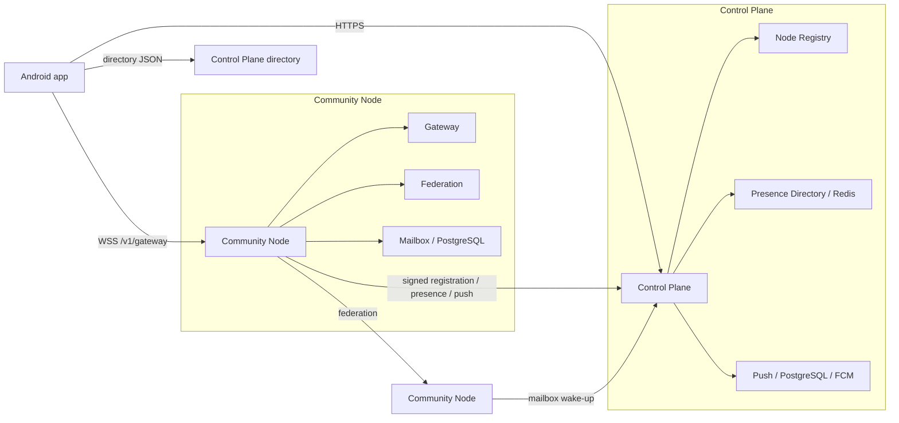

<div align="center">

# Sparrow

**End-to-end encrypted messaging built with Kotlin Multiplatform and a federated Kotlin server stack.**


</div>

## Project status

Sparrow is under active development. **Android is the usable client target.** The repository contains
iOS/Kotlin Multiplatform source sets and an Xcode host, but iOS is **not a supported or usable app target yet**:
important platform/runtime integrations are still missing, so feature parity with Android must not be assumed.

A complete release workflow now exists, but **there is currently no official tagged GitHub release with the
full downloadable package yet**. Until the first `v*` tag is published, build from source or use CI artifacts.

## What makes Sparrow different?

Sparrow combines client-side end-to-end encryption with a **federated, independently hostable transport
network**. Multiple Control Planes can advertise authorized Community Nodes, and clients can fail over between
nodes instead of depending permanently on one mandatory messaging server.

That is somewhat similar to Tor's community-relay philosophy, but Sparrow is **not an onion-routing anonymity
network**: a client uses one Community Node at a time and encrypted messages may federate to another recipient
node. The goal is infrastructure independence/resilience, not Tor-style source anonymity.

This also does **not** justify a blanket claim that Sparrow is cryptographically safer than Signal. Signal is a
much more mature and heavily scrutinized secure messenger. Sparrow's potential advantage is narrower: it can
reduce risks around **centralized routing infrastructure, single-operator outages, blocking, and mandatory trust in
one transport provider** while keeping normal message content encrypted end to end. WhatsApp also uses strong
end-to-end encryption; Sparrow's differentiator is the independently hostable/federated infrastructure model.

Read [What makes Sparrow different?](docs/why-sparrow.md) for the Tor/Signal/WhatsApp comparison, threat
boundaries, and the exact classes implementing discovery, failover, federation and encryption.

## What currently works on Android

The current codebase implements:

- onboarding and local identity creation;
- device-contact import and contact management;
- identity sharing/import, contact invitations, accept/decline/block, and QR/safety-number verification;
- direct chats with encrypted messages, persistent outbox, sent/delivered/read state, retry, typing, and unread state;
- group creation, invitations, membership activation, add/remove/promote/leave/admin-transfer flows;
- group messages with per-recipient delivery/read aggregation, typing, group security epochs, and member verification;
- signed Control Plane discovery, multiple Control Planes, health monitoring, node failover, cooldown diagnostics,
  and automatic reconnect;
- WebSocket foreground delivery, mailbox-backed offline delivery, and Android FCM wake-ups;
- Control Plane and Community Node launcher bundles, Docker deployment, health/readiness endpoints, metrics,
  request IDs, and smoke tests;
- incremental release-candidate packaging plus full tagged GitHub releases.

See [Current feature status](docs/features/current-features.md), [Chats](docs/features/chats.md), and [Transport](docs/features/transport.md) for details and
limitations.

## The system in one picture



The Control Plane is **discovery/control infrastructure**. Community Nodes carry client WebSocket traffic,
federate messages between nodes, and host recipient-selected mailboxes. Caddy is the public HTTP edge for both
packages.

## Fastest way to bring it to life

### 1. Install prerequisites

Windows:

- Android Studio with Android SDK;
- JDK 17 for normal local development;
- Docker Desktop with Docker Compose 2.24.4+;
- Git.

macOS:

- Android Studio with Android SDK;
- JDK 17;
- Docker Desktop;
- Git;
- Xcode only if you want to inspect/build the unfinished iOS host.

### 2. Configure the Control Plane directory

Create or edit the repository-root `local.properties`:

```properties
controlPlaneDirectoryUrl=https://gist.githubusercontent.com/cbgm/26bb9651e7d2d3fd464df02e8808387f/raw/522436a432e48b9f53f3210b76278e2217f126f8/gistfile1.txt
```

The response may be served as `text/plain` or `application/json`; Sparrow reads the body as text and parses
its JSON content. The document format is:

```json
{
  "controlPlanes": [
    "https://plane-a.example.com",
    "https://plane-b.example.com"
  ]
}
```

The value is compiled into common KMP code as `BuildKonfig.CONTROL_PLANE_DIRECTORY_URL`, so Android and future
future iOS builds use the same common build-time configuration path once the iOS runtime is completed.

### 3. Build the Android app

Windows CMD/PowerShell:

```text
gradlew.bat :androidApp:assembleDebug
```

macOS/Linux:

```bash
./gradlew :androidApp:assembleDebug
```

Or open the project in Android Studio and run `androidApp`.

### 4. Start a Control Plane

**Windows bundle:** generate or download the Control Plane bundle, extract it, then double-click:

```text
Start-SparrowControlPlane.cmd
```

The launcher starts Docker Desktop when necessary, creates runtime secrets, starts PostgreSQL/Redis/services,
and waits for readiness. When it is running, open:

```text
http://<control-plane-host>:8390/index
```

The `/index` page links to registry health, presence health, push health, and connected Community Nodes.

**macOS:** there is currently no macOS Control Plane GUI launcher bundle. For development, run the Control Plane
from source with Docker Compose; see [Local development](docs/development/local-development.md) and
[Control Plane operations](docs/server/control-plane.md).

### 5. Start a Community Node

Windows bundle:

```text
Start-SparrowNode.cmd
```

macOS bundle:

```text
Start-SparrowNode.command
```

or:

```bash
./start-sparrow-node.sh
```

The node asks for LAN/Public mode and the Control Plane directory URL. It can start with cached Control Plane
addresses while all planes are offline, and keeps retrying until a plane becomes reachable.

When running, open:

```text
http://<node-host>:8490/index
```

The node `/index` links to gateway health/connection count, gateway info, advertised Control Planes, federation
health/capabilities, and mailbox health.

### 6. Run the app

Use an Android emulator/device. The app loads the Control Plane directory in `AppViewModel`, verifies signed
node descriptors, selects a compatible node, establishes `/v1/gateway`, and automatically fails over when the
current node becomes unavailable.

## Project structure

```text
androidApp/                Thin Android application entry point and release build configuration
shared/                    Shared Compose app shell, AppViewModel, common DI, BuildKonfig value
startup/                   Startup UI/model
navigation/                Navigation graphs and destinations
core/                      Cross-cutting utilities
core/crypto/               Libsodium crypto implementations
core/protocol/             Transport-independent packets, codec, outbox contracts
core/ui/                   Shared Compose components/theme/navigation primitives
data/database/             Room database, DAOs, protocol outbox persistence
feature/identity/          Local identity lifecycle and sharing
feature/contacts/          Contacts, invitations, verification, identity exchange
feature/chats/             Direct + Group conversation/domain/data/UI paths
feature/messaging/         Incoming/outgoing orchestration between protocol, crypto and transport
feature/transport/         Control Plane/node discovery, WebSocket, routing, mailbox/push gateways
feature/settings/          User/developer/network settings
notification/              Android notification and background work integration
server/                    Control Plane, Community Node and shared server modules
build-logic/               Gradle convention/architecture/quality plugins
quality/detekt-rules/      Project-specific Detekt rules
docs/                      MkDocs engineering documentation
```

Direct and Group chat behavior is intentionally separated. Start with
[Chats architecture](docs/architecture/chats.md) before changing chat behavior.

## Technology stack in plain English

- **Kotlin Multiplatform:** shares domain/application/UI code across platform targets.
- **Compose Multiplatform + Material 3:** declarative UI.
- **Koin:** dependency injection.
- **Room + SQLite:** durable client storage and outbox state.
- **Ktor:** HTTP/WebSocket client and Kotlin server framework.
- **libsodium:** identity keys, sealed-box transport encryption, Ed25519 signatures, and group AEAD.
- **Docker + Docker Compose:** packages and runs the server services and their dependencies.
- **Caddy:** public reverse proxy/edge; exposes one operator-friendly address and routes requests internally.
- **PostgreSQL:** durable server data (registry, mailbox, push, federation queue).
- **Redis:** short-lived presence/routing data that can be rebuilt when clients reconnect.
- **Firebase Cloud Messaging:** Android wake-up notification path for offline delivery.
- **Micrometer/Prometheus:** server metrics.
- **Detekt + ktlint:** static analysis and formatting/quality checks.
- **BuildKonfig:** exposes the build-time Control Plane directory value to common KMP code.

Read [Technology stack](docs/technology-stack.md) for a beginner-friendly explanation.

## Build, quality and tests

```bash
./gradlew build
./gradlew qualityCheck
./gradlew allTests
```

Android device tests:

```bash
./gradlew connectedCheck
```

Generated architecture reference:

```bash
./gradlew architectureReport
./gradlew verifyArchitectureReport
```

Do not manually edit `docs/generated/`.

## Releases

Normal development uses feature branches and PRs into `develop`. `master` is the stable source for a release
line. Create release branches as `release/0.1`, `release/0.2`, and so on.

Every push to `release/**` runs change detection:

- app changes -> debug APK + signed/minified release APK;
- server-service changes -> only affected Docker images plus the corresponding launcher bundle;
- launcher/Caddy/Compose-only changes -> bundle only;
- docs-only changes -> no distributable package;
- the first commit of a release line and `v*` tags -> full build.

A tag such as `v0.1.0-alpha.1` on a commit belonging to a `release/**` branch creates the GitHub release. A full
tagged build contains individual assets plus one combined `sparrow-<version>-full.zip`.

There is **no official tagged release yet**, so this is the configured process rather than a currently published
download.

See [Release process](docs/development/release-process.md) for branch rules, repository variables, signing
secrets, Docker image tags, R8 mapping files, checksums, and the full ZIP layout.

## Documentation map

Start here:

- [Documentation home](docs/index.md)
- [Installation](docs/getting-started/installation.md)
- [First build](docs/getting-started/first-build.md)
- [Using the Android app](docs/getting-started/using-app.md)
- [Local development: Windows + macOS](docs/development/local-development.md)
- [Architecture](docs/architecture/overview.md)
- [How to extend the project](docs/development/extending.md)
- [Detailed messaging flow + UML](docs/features/message-transport-flow.md)
- [Security](docs/security/overview.md)
- [Server overview](docs/server/overview.md)
- [Release process](docs/development/release-process.md)
- [FAQ](docs/faq.md)

## License

Apache License 2.0. See the repository license file for the exact terms.
