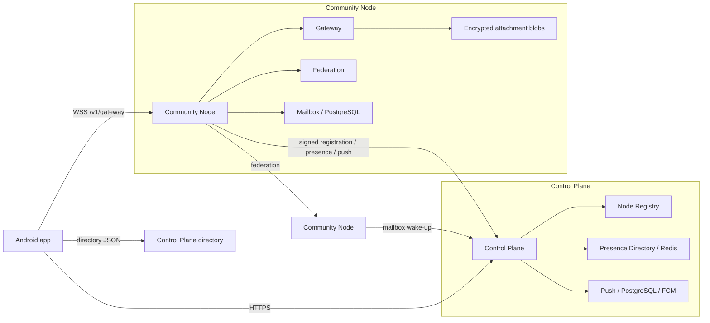

<div align="center">

# Sparrow

**End-to-end encrypted messaging built with Kotlin Multiplatform and a federated Kotlin server stack.**

[](https://cbgm.github.io/Sparrow/)


</div>

## Project status

Sparrow is under active development. **Android is the usable client target.** The repository contains
iOS/Kotlin Multiplatform source sets and an Xcode host, but iOS is **not a supported or usable app target yet**:
important platform/runtime integrations are still missing, so feature parity with Android must not be assumed.

A complete release workflow now exists, but **there is currently no official tagged GitHub release with the
full downloadable package yet**. Until the first `v*` tag is published, build from source or use CI artifacts.

## Demo Video

https://github.com/user-attachments/assets/cb4918f3-c53d-4353-aae0-15d689c7b85f

## New design update

https://github.com/user-attachments/assets/73a1d095-f11c-44ed-91a1-d02b783e4cd4

## What makes Sparrow different?

Sparrow combines client-side end-to-end encryption with a **federated, independently hostable transport
network**. Multiple Control Planes can advertise authorized Community Nodes, and clients can fail over between
nodes instead of depending permanently on one mandatory messaging server.

That is somewhat similar to Tor's community-relay philosophy, but Sparrow is **not an onion-routing anonymity
network**: a client uses one Community Node at a time and encrypted messages may federate to another recipient
node. The goal is infrastructure independence/resilience, not Tor-style source anonymity.

This also does **not** justify a blanket claim that Sparrow is cryptographically safer than Signal. Signal is a
much more mature and heavily scrutinized secure messenger. Sparrow's potential advantage is narrower: it can
reduce risks around **centralized routing infrastructure, single-operator outages, blocking, and mandatory trust in
one transport provider** while keeping normal message content encrypted end to end. WhatsApp also uses strong
end-to-end encryption; Sparrow's differentiator is the independently hostable/federated infrastructure model.

Read [What makes Sparrow different?](docs/why-sparrow.md) for the Tor/Signal/WhatsApp comparison, threat
boundaries, and the exact classes implementing discovery, failover, federation and encryption.

## What currently works on Android

The current source tree includes:

- local identity creation plus encrypted identity backup/export and restore of the original signing/encryption keys;
- explicit remote-identity replacement review, persistent approved reconnection state and retryable recovery after process/network interruption;
- contacts/device-contact import, verification, blocking and identity-peer/routing resolution;
- the generic `:feature:invite` lifecycle for Direct and Group invitations, separated from identity and membership state;
- Direct conversations with encryption/authorization gates, durable queued-until-authorized messages, retry, edit/delete/reactions, typing and delivery/read state;
- Group conversations with dedicated `:feature:membership` handshakes, welcome/activation, epoch security, admin promotion/removal/transfer/leave/delete and member routing;
- `:feature:conversationorchestration` as the explicit cross-feature workflow boundary (`ConversationFlowHandler`, result observers, recovery workers);
- `:feature:messaging` as generic durable protocol-outbox/incoming-envelope execution rather than business-feature orchestration;
- encrypted attachments for images, video, files, location, contacts and voice; attachment management/viewers and media/file export;
- voice recording/playback plus local Whisper-backed transcription and persisted attachment transcripts;
- link previews with client DB caching/prefetch and the `:server:link-preview` fetch/parse/validation service;
- one pinned Group message with admin-controlled pin/unpin and attachment-aware pinned-message rendering;
- auto-reply rules with active-rule and recipient-claim persistence;
- target-aware avatar observation plus reusable profile-picture selection/cropping in `:feature:avatar`;
- exact/optional on-device semantic message search and local message-safety analysis;
- signed Control Plane discovery, multiple Control Planes, node failover, WebSocket foreground delivery, mailbox-backed offline delivery and Android FCM wake-ups;
- unified server management for Control Plane + one or more Community Nodes, with a separately operated signed Control Plane Directory;
- Docker/Ktor server services, persistent registry/mailbox/federation/push state, observability and deployment tooling.

See [Current feature status](docs/features/current-features.md), [Runtime flows](docs/architecture/runtime-flows.md), [Identity recovery](docs/features/identity-recovery.md), [Invitations](docs/features/invitations.md), [Group membership](docs/features/group-membership.md), and the [current-code inventory](docs/generated/current-code-inventory.md).

## The system in one picture



The Control Plane is **discovery/control infrastructure**. Community Nodes carry client WebSocket traffic,
federate messages between nodes, and host recipient-selected mailboxes. Caddy is the public HTTP edge for both
packages.

## Fastest way to bring it to life

### 1. Install prerequisites

Windows:

- Android Studio with Android SDK;
- JDK 17 for normal local development;
- Docker Desktop with Docker Compose 2.24.4+;
- Git.

macOS:

- Android Studio with Android SDK;
- JDK 17;
- Docker Desktop;
- Git;
- Xcode only if you want to inspect/build the unfinished iOS host.

### 2. Configure the Control Plane directory

Create or edit the repository-root `local.properties`:

```properties
CONTROL_PLANE_DIRECTORY_URL=https://gist.githubusercontent.com/cbgm/26bb9651e7d2d3fd464df02e8808387f/raw/522436a432e48b9f53f3210b76278e2217f126f8/gistfile1.txt
CONTROL_PLANE_RELEASE_DIRECTORY_URL=https://gist.githubusercontent.com/cbgm/26bb9651e7d2d3fd464df02e8808387f/raw/522436a432e48b9f53f3210b76278e2217f126f8/gistfile1.txt
```

The response may be served as `text/plain` or `application/json`; Sparrow reads the body as text and parses
its JSON content. The document format is:

```json
{
  "controlPlanes": [
    "https://plane-a.example.com",
    "https://plane-b.example.com"
  ]
}
```

The value is compiled into common KMP code as `BuildKonfig.CONTROL_PLANE_DIRECTORY_URL`, so Android and future
future iOS builds use the same common build-time configuration path once the iOS runtime is completed.

### 3. Build the Android app

Windows CMD/PowerShell:

```text
gradlew.bat :androidApp:assembleDebug
```

macOS/Linux:

```bash
./gradlew :androidApp:assembleDebug
```

Or open the project in Android Studio and run `androidApp`.

### 4. Start the server runtime

The current public operator package is the **unified Sparrow server bundle**. From a Windows source checkout build it with:

```text
server\unified\Build-SparrowServer.cmd
```

This produces `dist/sparrow-server.zip`. Extract it into its own runtime directory and run `Start-SparrowServer.cmd`. The manager can install/start a **Control Plane**, **Community Node**, or **Combined** deployment. Node-only mode can manage multiple independent Community Node instances.

On macOS/Linux use the bundled `Start-SparrowServer.sh` / `Start-SparrowServer.command`, or run `server/control-plane/docker-compose.yml` and `server/community-node/docker-compose.yml` directly for source-level development.

`server/control-plane-directory` is a separate operator-only signed directory service and is deliberately **not** included in `sparrow-server.zip`.

See [Local development](docs/development/local-development.md) and [Server runtime, build and deployment](docs/server/runtime-build-deployment.md).

### 5. Verify the server

A LAN Control Plane normally exposes `/index` on port `8390`; a LAN Community Node normally exposes `/index` on port `8490`. These pages link to the relevant registry/presence/push and gateway/federation/mailbox diagnostics.

### 6. Run the app

Use an Android emulator/device. The app loads the Control Plane directory in `AppViewModel`, verifies signed
node descriptors, selects a compatible node, establishes `/v1/gateway`, and automatically fails over when the
current node becomes unavailable.

## Project structure

```text
androidApp/                       Android application entry point/release config
shared/                           Compose app shell, AppViewModel and common DI
startup/                          startup UI/model
navigation/                       navigation graphs, inbox/recovery routing
core/                             cross-cutting utilities
core/crypto/                      libsodium crypto implementations
core/embedding/                   local embedding runtime/model lifecycle
core/protocol/                    packets, codec, protocol outbox contracts
core/ui/                          reusable Compose UI/navigation primitives
data/database/                    Room DB, DAOs/entities, protocol outbox, migrations
data/datastore/                   settings/key-value persistence
feature/identity/                 identity lifecycle/exchange, backup/restore, recovery state
feature/invite/                   generic Direct/Group invitation lifecycle
feature/contacts/                 contact records, peer/routing resolution, blocking
feature/contactimport/            device/QR contact and identity import
feature/autoreply/                auto-reply rules and recipient claims
feature/avatar/                   avatar observation/cache and picture editing
feature/linkpreview/              link extraction/cache/prefetch/UI
feature/chats/                    Direct + Group conversation/message semantics/UI
feature/conversationorchestration/ cross-feature invite/identity/membership/chat workflows
feature/membership/               Group membership, welcome/activation, roles/security
feature/attachments/              encrypted attachment transfer/cache/storage/UI models
feature/media/                    gallery/camera/file access, media viewers/export
feature/voice/                    recording/playback/transcription
feature/messaging/                generic durable outbox + incoming envelope runners
feature/transport/                discovery/WebSocket/routing/mailbox/push gateways
feature/onboarding/               onboarding flows
feature/settings/                 settings/network/diagnostics UI
feature/search/                   exact + local semantic search
feature/safety/                   local message-safety analysis/UI
notification/                     Android notifications/background integration
server/                           Ktor server modules + Compose/operator tooling
server/control-plane-directory/   separate private operator directory service
quality/detekt-rules/             project-specific Detekt rules
docs/                             MkDocs engineering documentation
```

Direct and Group chat behavior is intentionally separated. Start with
[Chats architecture](docs/architecture/chats.md) before changing chat behavior.

## Technology stack in plain English

- **Kotlin Multiplatform:** shares domain/application/UI code across platform targets.
- **Compose Multiplatform + Material 3:** declarative UI.
- **Koin:** dependency injection.
- **Room + SQLite:** durable client storage and outbox state.
- **Ktor:** HTTP/WebSocket client and Kotlin server framework.
- **libsodium:** identity keys, sealed-box transport encryption, Ed25519 signatures, and group AEAD.
- **Docker + Docker Compose:** packages and runs the server services and their dependencies.
- **Caddy:** public reverse proxy/edge; exposes one operator-friendly address and routes requests internally.
- **PostgreSQL:** durable server data (registry, mailbox, push, federation queue).
- **Redis:** short-lived presence/routing data that can be rebuilt when clients reconnect.
- **Firebase Cloud Messaging:** Android wake-up notification path for offline delivery.
- **Micrometer/Prometheus:** server metrics.
- **Detekt + ktlint:** static analysis and formatting/quality checks.
- **MediaPipe Text Embedder:** on-device embeddings for optional semantic message search and message-safety analysis.
- **BuildKonfig:** exposes the build-time Control Plane directory value to common KMP code.

Read [Technology stack](docs/technology-stack.md) for a beginner-friendly explanation.

## Build, quality and tests

```bash
./gradlew build
./gradlew qualityCheck
./gradlew allTests
```

Android device tests:

```bash
./gradlew connectedCheck
```

Generated architecture reference:

```bash
./gradlew architectureReport
./gradlew verifyArchitectureReport
```

Do not manually edit `docs/generated/`.

## Releases

The documented Git branch flow is `develop -> master -> release/x.y -> tag`. The current source archive used for this documentation audit does not include `.github/workflows`, so exact current CI change-classification rules are not asserted here without those workflow files.

The current **verifiable server packaging path** is `server/unified/Build-SparrowServer.cmd`, which creates the single public `dist/sparrow-server.zip`. The private `server/control-plane-directory` installer/state must not be included in that public asset.

See [Release process](docs/development/release-process.md) for the source-verified packaging rules and release checklist.

## Documentation map

Start here:

- [Documentation home](docs/index.md)
- [Installation](docs/getting-started/installation.md)
- [First build](docs/getting-started/first-build.md)
- [Using the Android app](docs/getting-started/using-app.md)
- [Local development: Windows + macOS](docs/development/local-development.md)
- [Architecture](docs/architecture/overview.md)
- [How to extend the project](docs/development/extending.md)
- [Detailed messaging flow + UML](docs/features/message-transport-flow.md)
- [Current feature status](docs/features/current-features.md)
- [Attachments](docs/features/attachments.md)
- [Message search](docs/features/search.md)
- [Message safety](docs/features/message-safety.md)
- [Settings and diagnostics](docs/features/settings.md)
- [Security](docs/security/overview.md)
- [Server overview](docs/server/overview.md)
- [Release process](docs/development/release-process.md)
- [FAQ](docs/faq.md)

Copyright © 2026 Christian Bergmann. All Rights Reserved.

This software and its source code are proprietary and confidential.
Unauthorized copying, modification, distribution, sublicensing, or use
of this software, in whole or in part, is prohibited without prior
written permission from the copyright holder.
