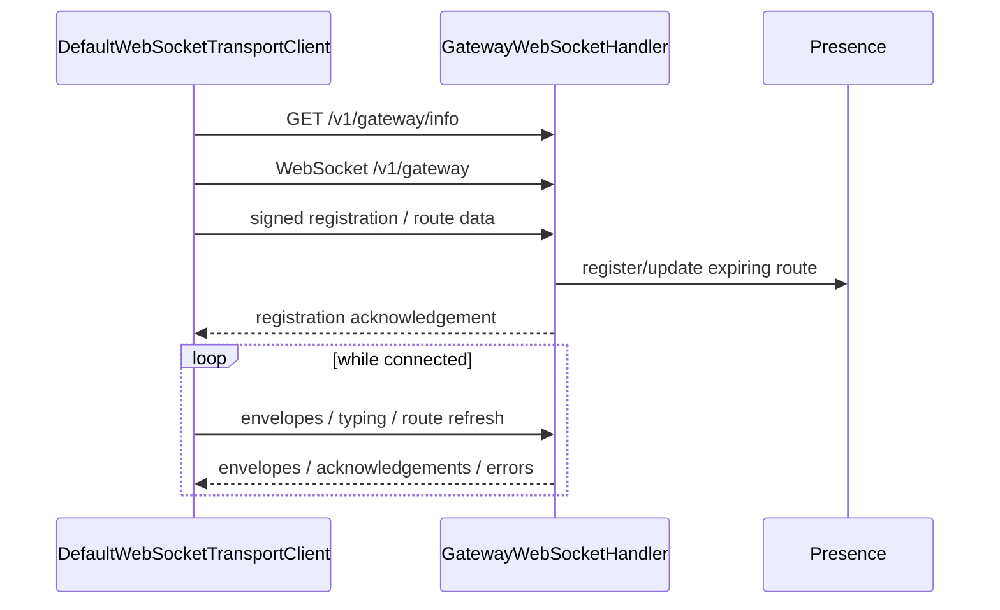

# WebSocket protocol overview

Clients connect to a selected verified Community Node at `/v1/gateway`.

## Reliability boundary

A successful WebSocket send is not the same as the recipient having read a message. Application delivery state is updated by explicit callbacks/receipts through the Direct or Group delivery state machines.

## Route refresh errors

The gateway may reject invalid/expired route refreshes. The client constructs refresh time from a synchronized server-time baseline plus monotonic elapsed time so refresh timestamps continue to advance during a long-lived connection.
