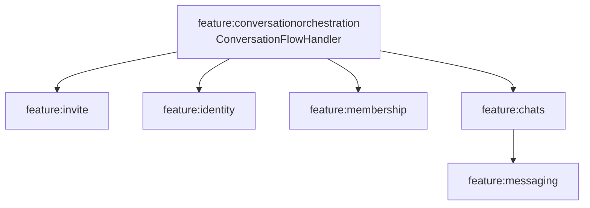

# Chats architecture: Direct, Group and orchestration boundaries

`:feature:chats` owns conversation/message behavior. It no longer owns the Group membership lifecycle or the generic invitation lifecycle.

## Current boundary



## Direct outgoing path

```text
DirectConversationViewModel
  -> Direct domain use case
  -> DirectMessageRepositoryImpl
  -> DirectOutgoingMessageProcessor
  -> ProtocolOutbox
  -> DefaultOutboxRunner / DefaultOutboxProcessor
  -> OutgoingPacketSender
```

`DirectOutgoingMessageProcessor` implements `send`, reactions, delete/edit, read receipts, retry, and the waiting-for-authorization queue. It delegates the authorization decision to `RequireDirectChatAuthorizationUseCase` instead of reading Identity internals itself.

Important methods:

- `send()`
- `queueUntilAuthorized()`
- `releaseWaitingForAuthorization()`
- `discardWaitingForAuthorization()`
- `retry()`
- `sendReadReceipts()`

## Direct incoming path

`IncomingPacketRouter` dispatches Direct chat packets to `DirectIncomingPacketProcessor` and explicit handlers. Identity/invitation packets are not treated as chat messages; they are routed into `ConversationFlowHandler` through the protocol/orchestration boundary.

## Direct authorization

A missing/invalid authorization does not cause plaintext fallback. Source material is persisted as waiting-for-authorization and released only after orchestration establishes fresh authorization. Explicit reconnect uses `ReconnectExistingConversationUseCase`/`ConversationFlowHandler.startExplicitReconnection()`.

## Group outgoing path

```text
GroupConversationViewModel
  -> Group domain use case
  -> GroupMessageRepositoryImpl
  -> GroupOutgoingMessageProcessor
  -> GetGroupTransportRoutingMembersUseCase (membership)
  -> current group security epoch / recipient keys
  -> ProtocolOutbox (one packet per active recipient)
```

`GroupOutgoingMessageProcessor` currently implements send/flush, reactions, edit/delete, retry and read receipts. It requires active membership and current recipients; removed/inactive members are not ordinary recipients.

## Group membership is not in Chats

Group membership/security moved to `:feature:membership`. Current key implementation types include:

- `GroupMembershipStateMachine`
- `GroupMembershipLock`
- `GroupMembershipPacketProtocol`
- `GroupSecurityManager`
- `GroupOwnerWelcomeDataSource`
- `GroupIncomingWelcomeDataSource`
- `GroupMembershipActivationDataSource`
- `GroupMemberPromotionDataSource`
- `GroupMemberRemovalDataSource`
- `GroupLeaveDataSource`
- `GroupMembershipDeletionDataSource`

Chats asks Membership through domain use cases (`GetGroupTransportRoutingMembersUseCase`, `AuthorizeGroupMetadataUseCase`, `GetGroupCurrentEpochUseCase`, etc.).

See [Group membership and group security](../features/group-membership.md).

## Group pins

Pins are chat-owned content metadata but use Membership for current admin authorization. `PinGroupMessageUseCase` and `UnpinGroupMessageUseCase` persist through `GroupPinRepositoryImpl`; `GroupPinBroadcaster` emits `GroupPinUpdatedPacket` to currently authorized members. See [Group pinned messages](../features/pinned-messages.md).

## Typed message content

Direct and Group both map chat-owned content representations across layers. Attachment storage/transfer remains in `:feature:attachments`; voice is an attachment-backed message feature in `:feature:voice`.

## Presentation/recomposition boundary

Direct and Group use separate `DirectConversationViewModel` and `GroupConversationViewModel` paths. Item-level child components/view models (for example voice message playback) should own fast-changing per-item state instead of forcing unrelated message rows to rebuild.
