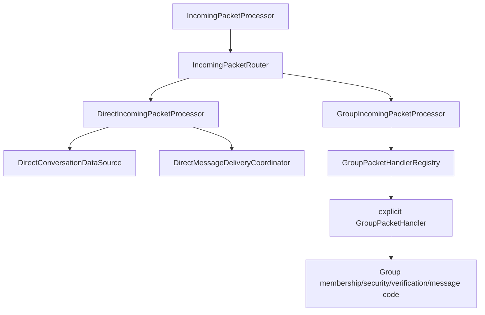
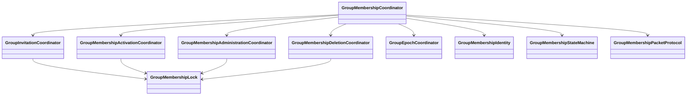

# Chats architecture: Direct and Group red line

Direct and Group conversations are intentionally separate feature paths. They share only infrastructure whose **meaning and lifecycle are actually shared**.

This is the central architecture guide to read before changing `:feature:chats`.

## Red line



Do not make Direct use Group repositories/state machines or Group use Direct repositories/state machines to “reuse” similarly named operations.

## Direct conversation path

Incoming:

```text
IncomingPacketProcessor
  -> IncomingPacketRouter
  -> DirectIncomingPacketProcessor
  -> DirectMessagePacketHandler / DirectReceiptPacketHandler
  -> DirectConversationDataSource / DirectMessageDeliveryCoordinator
```

Outgoing:

```text
DirectViewModel
  -> direct *UseCase
  -> DirectMessageRepository
  -> DirectMessageRepositoryImpl
  -> DirectOutgoingMessageProcessor
  -> ProtocolOutbox
```

Delivery:

```text
DirectOutboxDeliveryHandler
  -> DirectMessageDeliveryCoordinator
  -> DirectMessageDeliveryStateMachine
```

Typing:

```text
ObserveDirectTypingUseCase / SetDirectTypingUseCase
  -> DirectTypingRepository
  -> DirectTypingRepositoryImpl
```

## Direct authorization boundary

Direct messages that cannot currently be authorized are not pushed through the normal outbox immediately. `DirectViewModel` uses `QueueDirectMessageUntilAuthorizedUseCase`; `DirectOutgoingMessageProcessor` persists them as `WAITING_FOR_AUTHORIZATION`. `HandleAcceptedDirectInvitationUseCase` releases valid waiting messages, `HandleDeclinedDirectInvitationUseCase` discards them, and `DirectPendingAuthorizationMessagePolicy` expires them after two days.

This remains a Direct-chat rule; it must not be moved into Group membership state or shared transport code.

## Group conversation path

Incoming:

```text
IncomingPacketProcessor
  -> IncomingPacketRouter
  -> GroupIncomingPacketProcessor
  -> GroupPacketHandlerRegistry
  -> one explicit GroupPacketHandler
```

Handlers include the concrete group packet types such as `GroupInvitePacketHandler`, `GroupJoinRequestPacketHandler`, `GroupMemberActivatedPacketHandler`, `GroupMemberRemovedPacketHandler`, `GroupChatMessagePacketHandler`, verification snapshot handlers and `GroupReceiptPacketHandler`.

Outgoing:

```text
GroupViewModel
  -> group *UseCase
  -> GroupMessageRepository
  -> GroupMessageRepositoryImpl
  -> GroupOutgoingMessageProcessor
  -> ProtocolOutbox
```

Delivery:

```text
GroupOutboxDeliveryHandler
  -> GroupMessageDeliveryCoordinator
  -> GroupMessageDeliveryStateMachine
```

Typing:

```text
ObserveGroupMemberTypingUseCase / SetGroupTypingUseCase
  -> GroupTypingRepository
  -> GroupTypingRepositoryImpl
```

## Group membership lifecycle

`GroupMembershipCoordinator` is a small entry facade. Mutating membership behavior is split into focused coordinators:

- `GroupInvitationCoordinator` — creation, invitations, accept/decline and join requests;
- `GroupMembershipActivationCoordinator` — welcome/key distribution, ready/activation acknowledgements;
- `GroupMembershipAdministrationCoordinator` — promote, remove, leave and admin transfer;
- `GroupMembershipDeletionCoordinator` — local/remote group deletion lifecycle;
- `GroupMembershipIdentity` — contact identity pinning/acceptance used by membership flows;
- `GroupEpochCoordinator` — current member/role resolution and epoch payload construction;
- `GroupMembershipStateMachine` — explicit lifecycle transition rules;
- `GroupMembershipPacketProtocol` — group membership packet creation/verification/encoding.

All mutating membership coordinators share `GroupMembershipLock`, so splitting responsibilities does not split the serialization boundary.



There is **no orphaned-group state/mode** in the current code.

## Group security and history boundary

`GroupOutgoingMessageProcessor` selects recipients from the current group security epoch, encrypts the group message through `GroupSecurityManager`, stores one recipient delivery row per active recipient and queues one packet per active recipient.

A removed member is not kept in the recipient set merely because that contact was previously in the group. Re-invitation starts a new active membership period; old absence-period messages are not supposed to become ordinary backlog for that member.

## Typed message representation

Direct and Group messages share a typed chat-owned content representation. The layers are deliberately parallel:

```text
MessagePartDto  ->  MessagePart  ->  MessagePartUi
     data            domain           presentation
```

Current variants are text, image/video, file, location and contact. Data DTO variants use the `Dto` suffix; domain variants are unsuffixed; presentation variants use `Ui`. Mapper functions are named for their destination (`toMessagePartDto()`, `toMessagePart()`, `toMessagePartUi()`).

`:feature:attachments` remains the source owner for attachment blob preparation/transfer/loading/storage. The chats data boundary converts attachment source metadata into `MessagePartDto`; Direct/Group domain models do not expose the attachment feature's source `MessageAttachment` model.

Do not add parallel fields such as `locationAttachment` or `contactAttachment` to Direct/Group domain messages. Extend the typed part hierarchy when the conversation representation needs a new content kind.

## Shared edges

These are shared because the protocol/infrastructure is actually shared:

- `IncomingPacketProcessor` — transport/protocol decode boundary;
- `IncomingPacketRouter` — packet dispatch;
- `ReceiptIncomingPacketRouter` — shared receipt-format dispatch;
- `ChatOutboxDeliveryStateRouter` — shared outbox callback dispatch;
- `ConversationOverviewRepositoryImpl` — combines Direct/Group projections for the overview screen.

Shared routers contain dispatch only. Conversation-specific rules belong under `data/direct` or `data/group`.

## Package rules

- `domain/model/direct` and `domain/model/group` — conversation-specific domain state/models/state machines;
- `domain/repository/direct|group` — repository contracts only;
- `domain/usecase/direct|group` — one-purpose use cases;
- `data/**/repository` — repository implementations only;
- `data/**/incoming` — packet processors/routing;
- `data/**/incoming/handler` — explicit packet handlers;
- `data/**/outgoing` — outgoing orchestration;
- `data/**/delivery` — delivery callbacks/coordinators;
- `data/model` — shared chats DTO representations such as `MessagePartDto`;
- `data/**/mapper` — mappings named for their concrete destination type;
- `data/**/storage` — focused persistence helpers that are not repositories;
- `data/group/membership` — group membership coordinators/state machine/epoch helpers;
- `data/group/protocol` — group membership protocol construction/verification;
- `data/group/security` — group cryptographic state/operations;
- `data/group/verification` — verification synchronization.

General dependency rules still apply inside these paths: datasources do not call repositories; repositories do not call repositories/use cases; use cases do not call use cases. Keep small model/mapper/repository/usecase packages flat unless the number of files genuinely justifies another grouping level.

## Presentation

Direct presentation lives under the Direct screen path; Group presentation lives under the Group screen path. Shared Compose elements should be shared only if both conversation types genuinely render/use the same thing.

Previews remain in the same Kotlin file as the composable being previewed.
