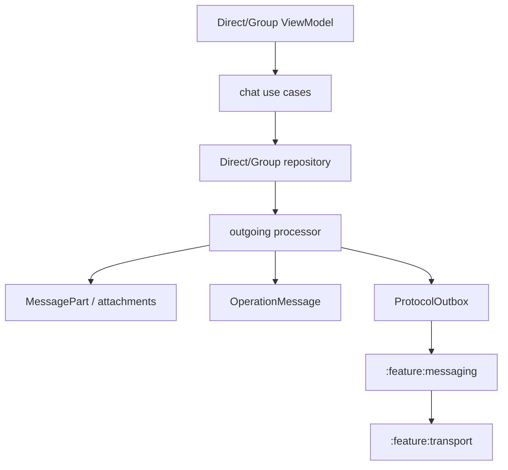

# Chats architecture

Direct and Group share primitives but intentionally keep separate business stacks.


```mermaid
flowchart TD
    UI[Direct/Group ViewModel] --> UC[chat use cases]
    UC --> REPO[Direct/Group repository]
    REPO --> PROC[outgoing processor]
    PROC --> PARTS[MessagePart / attachments]
    PROC --> OP[OperationMessage]
    PROC --> OUTBOX[ProtocolOutbox]
    OUTBOX --> MSG[:feature:messaging]
    MSG --> TX[:feature:transport]
```

## Why Direct and Group stay separate

Direct authorization/identity state differs from Group membership/epoch/admin/per-recipient state. Shared abstractions are used only where semantics are actually identical: message parts, operation protocol, attachment storage and durable transport infrastructure.

## Message content boundary

The canonical content hierarchy is in `:core:base`:

```text
MessagePartDto -> MessagePart -> MessagePartUi
```

`GroupMessageContent` serializes `List<MessagePartDto>` and allows polls. `GroupMessageContentCodec` uses the `sparrow-group-message-v2:` prefix and can decode legacy plaintext into a synthetic text part.

`:feature:attachments` persists blob-backed parts and structured payloads; Chats owns conversation/message behavior rather than redefining content models.

## Operations

`OperationMessage`/`MessageOperation` is the protocol path for edit/delete/reaction/poll updates. Direct supports Edit/Delete/Reaction. Group supports those plus PollVote/PollClose.

`GroupOutgoingMessageProcessor` applies local mutation and sends operations to current active recipients. Group incoming handling validates the sender/target/membership/admin conditions before mutating local state.

## Polls

Polls are ordinary group `MessagePart`s. `GroupConversationViewModel` observes finished polls from `:feature:polls`, sends them through `SendGroupMessageUseCase`, and handles vote/close UI events through `VoteInGroupPollUseCase` and `CloseGroupPollUseCase`.

## Delivery

Direct delivery state is message-oriented. Group delivery/read state is aggregated from `MessageRecipientStateEntity` rows for each active recipient. Retrying a group message targets failed recipients rather than creating a new logical message.

## Pins

`GroupPinRepositoryImpl` snapshots encoded `GroupMessageContent` with sender identity metadata. Pin synchronization is separate from message-history pagination. Poll pins can load nested image parts and forward live poll actions.
