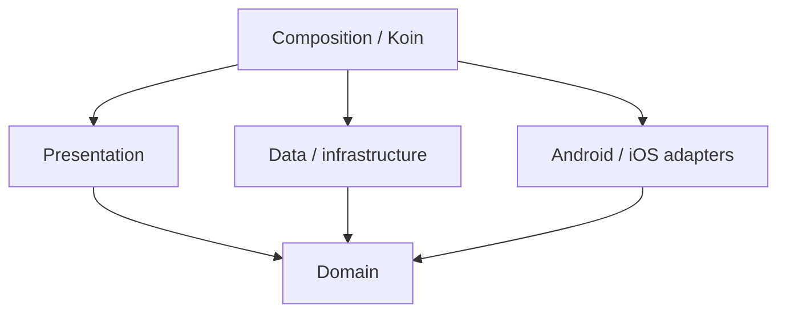

# Clean architecture

Sparrow uses Clean Architecture as a practical dependency rule, not as a requirement to create interfaces for everything.

## Core rule

Business decisions point inward toward domain concepts. Platform/database/network details stay outside them.



## Presentation

Contains:

- Compose routes/screens/components;
- UI state/events/effects;
- ViewModels;
- domain-to-UI mappers.

Presentation models use the `Ui` suffix. A mapper to a presentation model is named from its destination, for example:

```kotlin
fun Contact.toContactUi(): ContactUi
fun MessagePart.toMessagePartUi(): MessagePartUi
```

A ViewModel coordinates use cases and flows. It does not open Room, create Ktor clients, encrypt payloads, or call repository implementations directly.

## Domain

Contains:

- plain domain models and state machines;
- repository contracts;
- one-purpose use cases;
- domain validation/business rules.

Domain model names are unsuffixed by layer. A mapper into domain is named from the domain destination:

```kotlin
fun ContactDto.toContact(): Contact
fun MessagePartDto.toMessagePart(): MessagePart
```

Use cases may call one or more repository contracts, but **a use case must not call another use case**. If several operations need to be composed, create the appropriate higher-level caller/orchestrator rather than a use-case chain.

A domain type must remain platform independent. No Compose, Room, Ktor implementation, Android or iOS framework types belong in common domain packages.

## Data / infrastructure

Contains DTOs, mappers, datasources, repository implementations, persistence/protocol/network adapters and focused infrastructure helpers.

### DTO rule

Actual data-layer representation models use the `Dto` suffix. Examples:

```kotlin
data class DeveloperErrorDto(...)
data class FileBrowserEntryDto(...)
sealed interface MessagePartDto
```

Database persistence classes remain `...Entity`; protocol/wire contracts keep their explicit protocol names. Configuration/constants objects are not DTOs merely because they live under a data package.

A mapper into a data DTO is named from its destination:

```kotlin
fun Source.toContactDto(): ContactDto
fun Source.toMessagePartDto(): MessagePartDto
```

### Dependency rules inside data

- a datasource must not call a repository;
- a repository implementation must not call another repository;
- a repository implementation must not call a use case;
- repositories coordinate their own datasources/mappers and implement their domain contract;
- if a workflow genuinely spans repositories, composition belongs above the repositories.

## Mapper naming

Mapper function names are always based on the **destination type**, not generic layer words or the source type.

```kotlin
// data target
fun Source.toNameDto(): NameDto

// domain target
fun NameDto.toName(): Name

// presentation target
fun Name.toNameUi(): NameUi
```

Avoid generic names such as `toDomain()`, `toEntity()`, `toUi()`, `toUiState()`, `toUiModel()` or `toUiModels()` when there is a concrete destination type. Explicit entity/protocol destinations use their exact destination name, such as `toContactEntity()` or `toProtocolOutboxItem()`.

## Application orchestration

Some workflows are neither UI nor repositories. `:feature:messaging` uses application processing/runners to coordinate existing ports without turning transport into business logic. Similar focused coordinators are appropriate when a workflow spans multiple domain operations and cannot live in one repository.

## DI and composition

Koin modules connect contracts to implementations. Composition code may know both sides of a boundary; ordinary business code should not.

Do not introduce an interface only because “Clean Architecture uses interfaces.” Add an abstraction when there is a real boundary, multiple implementations, test seam or dependency-direction reason.

## Package/source-set rules

Typical feature structure:

```text
presentation/
domain/model/
domain/repository/
domain/usecase/
data/datasource/
data/model/
data/repository/
data/mapper/
device/
di/
```

Keep `model`, `mapper`, `repository`, `datasource`, `domain/model`, `domain/repository` and `domain/usecase` flat while the number of files is small. Add subpackages only when there is enough real complexity to justify them.

Platform-specific logic belongs under the top-level `device` responsibility in the appropriate platform source set. Do not put Android implementation code in `commonMain`, and do not create a second `data/device` hierarchy.

## Compose organization

Reusable components go in the appropriate `component` package. Group-only components stay with Group presentation; Direct-only components stay with Direct presentation; genuinely shared components may live in the common chat component package.

Previews remain **in the same Kotlin file as the composable they preview**. Business rules do not belong in composables.

## File size and cohesion

There is no arbitrary maximum-functions-per-file rule. Keep files focused on one responsibility and split when orchestration, mapping, persistence, protocol handling and UI concerns start accumulating in one place.
