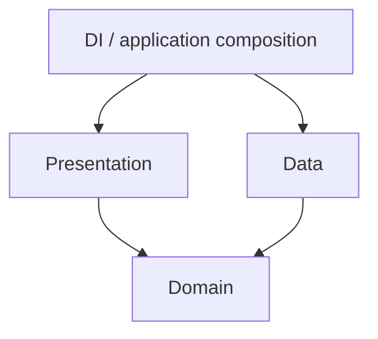

# Clean Architecture

## Overview

SecureChat follows the principles of Clean Architecture.

The objective is to separate business rules from implementation details so that the application remains maintainable, testable and platform independent as it grows.

Feature modules use presentation, domain, data and DI packages. Background features may also have an application package for orchestration that has no UI. Application-wide messaging orchestration lives in `:feature:messaging`, while `:feature:transport` contains transport mechanics only.

---

# Layer Overview



Domain is the center. Presentation and Data both depend on Domain abstractions; Domain never depends on either outer layer.

---

# Presentation Layer

The presentation layer contains everything related to the user interface.

Typical responsibilities include

- Compose UI
- Screens
- Routes
- UI State
- ViewModels
- UI Events
- Navigation Requests

The presentation layer is responsible only for presenting information and reacting to user interaction.

Business rules do not belong here.

---

# Domain Layer

The domain layer contains the application's business logic.

Typical responsibilities include

- UseCases
- Domain Models
- Repository Interfaces
- Business Rules
- Validation

The domain layer is completely independent of Android and Compose.

Whenever possible, domain code should compile for every supported platform without modification.

---

# Data Layer

The data layer implements the abstractions defined by the domain layer.

Typical responsibilities include

- Repository Implementations
- Room
- Ktor
- Local Storage
- Remote Data Sources
- Database Mapping
- DTO Mapping

Business decisions should never originate from the data layer.

---

# Application Layer

The optional application layer coordinates domain ports for background workflows that do not belong to a screen.

In `:feature:messaging`, it owns the incoming-gateway and outbox runners. It may depend on domain abstractions, but transport and persistence implementations remain in data or infrastructure modules.

---

# Presentation Package Structure

Presentation code follows one predictable layout:

```text
presentation/
├── component/   reusable and screen-specific Compose rendering
├── mapper/      domain-to-UI mapping
├── model/       UI state, events, effects and display models
├── platform/    presentation-only platform adapters
├── screen/      small public screen contracts and ViewModels
└── *Route.kt    state collection and navigation wiring
```

Large `*Screen.kt` files must stay focused on their public contract. Detailed rendering belongs under `presentation/component/<screen-name>`.

Each feature-owned UI component lives in its own Kotlin file and has a colocated `@Preview`.
Routes and state-collecting flows are orchestration boundaries and do not require previews.
Core UI is maintained independently and is not governed by the feature-preview rule.

---

# Dependency Rule

Source dependencies point inward:

- Presentation may depend on Domain.
- Data may depend on Domain.
- Domain may not depend on Presentation or Data.
- ViewModels invoke use cases instead of repositories or gateways directly.
- DI modules are composition roots and may connect implementations to domain ports.

Allowed

```
Presentation

↓

Domain
```

Allowed

```
Data

↓

Domain
```

Forbidden

```
Presentation

↓

Repository Implementation
```

Forbidden

```
Domain

↓

Room
```

Forbidden

```
Domain

↓

Compose
```

---

# Why This Structure?

Separating responsibilities provides several advantages.

- easier testing
- reusable business logic
- platform independence
- easier refactoring
- clear ownership

Changes in one layer should rarely affect the others.

---

# Presentation Responsibilities

Presentation should

- display state
- receive user input
- trigger UseCases
- observe flows
- render Compose

Presentation should not

- access databases
- perform encryption
- perform networking
- implement business rules

---

# ViewModels

ViewModels coordinate the presentation layer.

Typical responsibilities include

- exposing UI state
- launching UseCases
- transforming domain models
- handling user actions

ViewModels should not know

- Room
- SQL
- HTTP
- WebSockets
- cryptography implementations

Those belong elsewhere.

---

# UI State

Every screen should expose immutable UI state.

Typical flow

```
Repository

↓

UseCase

↓

ViewModel

↓

StateFlow

↓

Compose
```

Compose observes state.

Compose does not own business logic.

---

# Domain Responsibilities

The domain layer represents the business.

Examples

- send message
- create identity
- verify safety number
- import contact
- receive transport message

These operations should work independently of Android.

---

# UseCases

Each UseCase should represent one business operation.

Good examples

```
SendMessageUseCase

ImportContactUseCase

GenerateIdentityUseCase

VerifySafetyNumberUseCase
```

Avoid large "manager" classes that perform many unrelated tasks.

---

# Repository Interfaces

The domain layer defines repository interfaces.

Example

```
ContactRepository
```

The implementation belongs inside the data layer.

This allows

- testing
- platform independence
- implementation replacement

without changing business logic.

---

# Data Responsibilities

The data layer provides concrete implementations.

Examples

```
Room

↓

Repository

↓

Domain
```

or

```
WebSocket

↓

Repository

↓

Domain
```

The domain never knows which implementation is being used.

---

# Mapping

Mapping belongs in the data layer.

Examples

```
DTO

↓

Domain Model
```

```
Room Entity

↓

Domain Model
```

Presentation should never receive database entities directly.

---

# Dependency Injection

Koin connects the layers.

```
Presentation

↓

UseCase

↓

Repository Interface

↓

Repository Implementation
```

Only interfaces should cross architectural boundaries.

---

# Feature Modules

Each feature follows the same internal structure.

```
feature/

contacts/

presentation/

domain/

data/
```

Keeping every feature consistent reduces cognitive load.

---

# Testing

Each layer can be tested independently.

Presentation

- ViewModel tests
- UI tests

Domain

- UseCase tests
- business rule tests

Data

- repository tests
- database tests
- API tests

This separation improves reliability.

---

# Architecture Enforcement

SecureChat automatically validates architectural boundaries.

The build infrastructure checks

- forbidden dependencies
- layer violations
- ViewModel boundaries
- repository boundaries
- DAO access
- commonMain restrictions

Violations fail the build.

Architecture is therefore enforced automatically rather than relying solely on code reviews.

---

# Benefits

Following Clean Architecture provides

- maintainability
- scalability
- testability
- explicit dependencies
- reusable business logic
- easier platform support

As SecureChat grows, these benefits become increasingly important.

---

# Summary

Clean Architecture is one of the fundamental design principles of SecureChat.

Presentation focuses on the user.

Domain focuses on business.

Data focuses on implementation.

Keeping these responsibilities separate allows the project to evolve without accumulating unnecessary coupling between modules.
