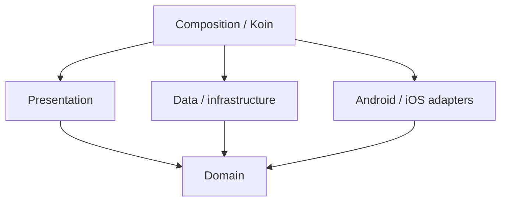

# Clean architecture

SecureChat uses Clean Architecture as a practical dependency rule, not as a requirement to create interfaces for everything.

## Core rule

Business decisions point inward toward domain concepts. Platform/database/network details stay outside them.

## Presentation

Contains:

- Compose routes/screens/components;
- UI state/events/effects;
- ViewModels;
- domain-to-UI mappers.

A ViewModel may coordinate use cases and flows. It should not open Room, create Ktor clients, encrypt payloads, or call a repository implementation directly.

## Domain

Contains:

- models and state machines;
- repository contracts;
- use cases;
- domain validation/business rules.

Examples from chats:

- `DirectMessageDeliveryStateMachine`;
- `GroupMessageDeliveryStateMachine`;
- `GroupMembershipStateMachine`;
- `SendDirectMessageUseCase`;
- `SendGroupMessageUseCase`;
- `GroupMembershipRepository`.

A domain type should be platform independent unless there is a compelling reason otherwise.

## Data / infrastructure

Contains implementations and orchestration close to persistence/protocol/network details.

Examples:

- `DirectMessageRepositoryImpl`;
- `GroupMembershipRepositoryImpl`;
- `DefaultProtocolOutbox`;
- `HttpControlPlaneDirectorySynchronizer`;
- `PostgresMailboxStore` on the server.

This layer may depend on Room/Ktor/libsodium/server storage clients, but it implements contracts expected by domain/application layers.

## Application orchestration

Some workflows are neither UI nor a repository. `:feature:messaging` uses an application layer for long-running processing:

- `DefaultOutboxRunner`;
- `DefaultOutboxProcessor`;
- `DefaultIncomingEnvelopeRunner`;
- `DefaultIncomingEnvelopeProcessor`.

These coordinate existing ports. They do not turn transport into business logic.

## DI and composition

Koin modules connect contracts to implementations. Composition code may know both sides of the boundary; ordinary business code should not.

Do not introduce an interface only because “Clean Architecture uses interfaces.” Add an abstraction when there is a real boundary, multiple implementations, test seam or dependency-direction reason.

## Compose organization

Presentation packages follow the feature structure already used by the project. Reusable components go in the appropriate `component` package; group-only components stay under the group screen/component area, and genuinely shared components stay in the top-level shared component area.

Previews remain **in the same Kotlin file as the composable they preview**.

## File size and cohesion

There is no arbitrary “maximum functions per file” rule. A file may contain many cohesive functions. Refactor when a function/file has mixed responsibilities, is too difficult to read, or code clearly belongs to another type/package—not merely because it has a particular function count.
