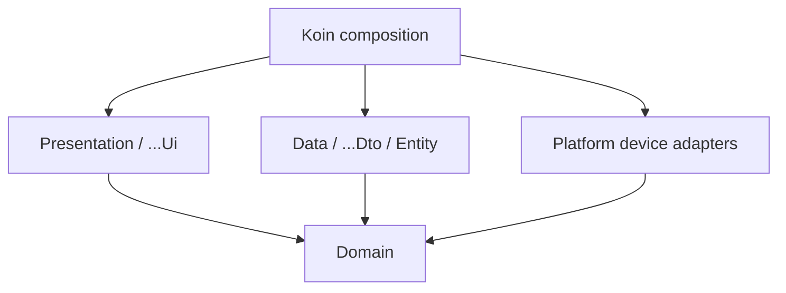

# Clean architecture

Sparrow uses Clean Architecture as a dependency rule, not as a reason to create abstractions without ownership.

## Layer naming

- data representations: `...Dto`
- domain models: no layer suffix
- presentation models: `...Ui`
- Room persistence: `...Entity`

Target-named mappers are preferred: `toPoll()`, `toPollUi()`, `toMessagePartEntity()`, not generic `toDomain()` / `toUi()` helpers.

## Shared message-part example

The current shared hierarchy lives in `:core:base`:

```text
core/messagepart/data/model/MessagePartDto.kt
core/messagepart/domain/model/MessagePart.kt
core/messagepart/ui/model/MessagePartUi.kt
```

That hierarchy contains text, image, video, file, voice, location, contact and poll variants. Features consume the shared type instead of defining parallel chat/attachment/poll hierarchies.


```mermaid
flowchart TD
    UI[Presentation / ...Ui] --> DOMAIN[Domain]
    DATA[Data / ...Dto / Entity] --> DOMAIN
    DEVICE[Platform device adapters] --> DOMAIN
    DI[Koin composition] --> UI
    DI --> DATA
    DI --> DEVICE
```

## Dependency rules

- presentation does not use DTOs or Room entities;
- common domain code has no Android/iOS/Compose/Room/Ktor implementation types;
- datasources do not call repositories;
- repository implementations do not call other repositories;
- repository implementations do not call use cases;
- cross-feature workflows belong in an explicit orchestration/runtime boundary;
- use cases should stay focused; do not hide broad orchestration in chains of unrelated use cases.

`:feature:conversationorchestration` is the explicit boundary for invitation/identity/membership/chat workflows. `:feature:messaging` is the generic durable outbox/incoming-envelope executor. Shared application startup orchestration lives under `shared/runtime/startup` and is exposed to `:startup` through the `StartupRunner` contract.

## Presentation rules

ViewModels own use-case coordination and presentation state. Composables render already-mapped UI models. Loading/caching/persistence should not be repaired ad hoc inside leaf composables.

For poll rendering, for example, `PollMessageUiState` owns its media preview, options, voter projections, closed state and remaining time. `PollMessageMedia` renders the prepared media state rather than inventing a second attachment-loading model.

Reusable components stay in component packages; screen composables use the `Route` suffix only for navigation/container entry points. Previews remain beside the composables they preview.

## Platform code

Platform-specific implementations belong in platform source sets (`androidMain`, `iosMain`) behind common contracts such as `AppLockAuthenticationLauncher`, phone-number hint launchers, device contact writers and media/device services.
