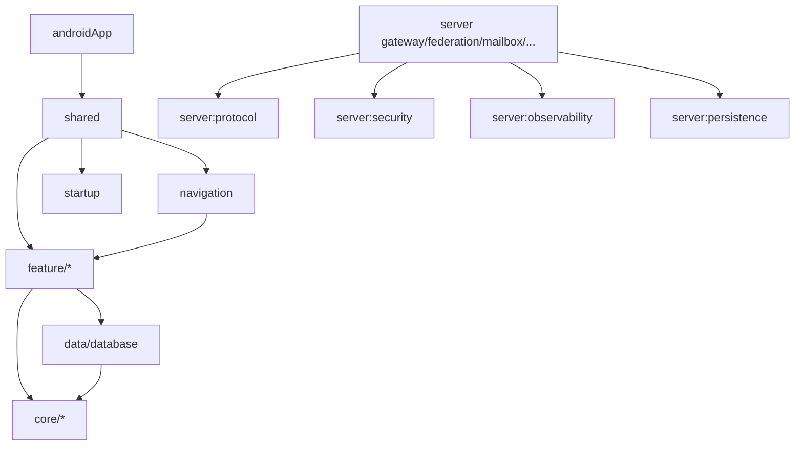

# Dependency rules

The project combines Gradle module boundaries, Clean Architecture conventions, Detekt and generated architecture reports to keep dependencies understandable.

## Current module families

```text
androidApp
shared
startup
navigation
notification
resources
core/*
data/*
feature/*
server/*
quality/*
```

The exact module list is generated from `settings.gradle.kts`; see [Generated architecture](../generated/index.md).

## Rules that matter in daily work

1. **Keep `androidApp` thin.** Platform implementations belong in the platform source set of the module that owns the responsibility.
2. **ViewModels use use cases.** They do not reach directly into repository implementations, DAOs, datasources or HTTP gateways.
3. **Use cases do not call use cases.** A use case may coordinate one or more repository contracts, but use-case chaining is not the orchestration model.
4. **Repositories do not call repositories or use cases.** A repository implementation owns its datasources/mappers; cross-repository workflows belong above repository implementations.
5. **Datasources do not call repositories.** Dependency direction never points back upward from datasource to repository.
6. **Domain is implementation-independent.** No Compose, Room, Ktor implementation or platform framework imports in common domain code.
7. **Data representation models are DTOs.** Actual data-layer models use `...Dto`; Room persistence models stay `...Entity`.
8. **Mapper names identify the destination.** Use `toNameDto()`, `toName()` and `toNameUi()` for data/domain/presentation targets.
9. **Presentation models end in `Ui`.** Do not use `UiModel`/`Model` for presentation state types when the type is a UI representation.
10. **Repository packages contain repositories.** Coordinators/state machines/mappers/storage helpers belong in packages named for their responsibility.
11. **Platform code stays out of `commonMain`.** Platform adapters live in `androidMain`/`iosMain` under the owning top-level responsibility such as `device`.
12. **Keep small architecture packages flat.** Do not create speculative nested categories inside model/mapper/repository/datasource/usecase packages.
13. **Direct and Group paths stay separate.** Similar method names are not enough reason to merge semantics.
14. **Attachment ownership stays explicit.** `:feature:attachments` owns attachment source/transfer/cache/storage; chats maps that boundary into its own `MessagePartDto`/`MessagePart`/`MessagePartUi` representations.
15. **Server applications are independent.** Gateway, federation, mailbox, push, registry and presence communicate through HTTP/protocol boundaries rather than service implementation imports.
16. **No dependency cycles.** A lower-level module must not reach upward just for convenience.
17. **Generated architecture docs are generated.** Run the task instead of editing `docs/generated/` by hand.

## Useful dependency picture



This diagram is deliberately simplified; use `./gradlew architectureReport` for the actual graph.

## Architecture report

```bash
./gradlew architectureReport
./gradlew verifyArchitectureReport
```

If you add/remove modules or change dependency topology, regenerate the report before committing. Pure model/mapper renames do not require a generated dependency-graph rewrite.
