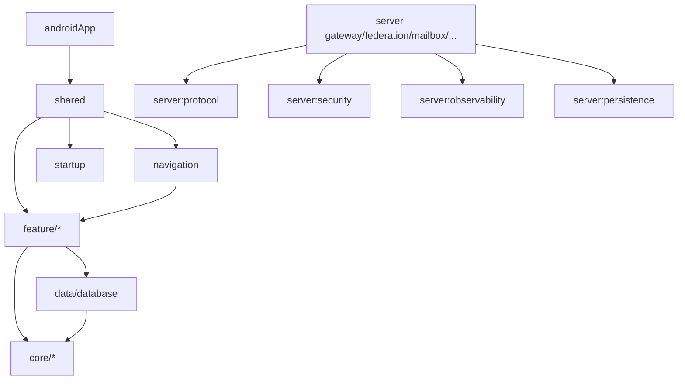

# Dependency rules

The project combines Gradle module boundaries, convention plugins, Detekt and generated architecture reports to keep dependencies understandable.

## Current module families

```text
androidApp
shared
startup
navigation
notification
resources
core/*
data/*
feature/*
server/*
quality/*
```

The exact module list is generated from `settings.gradle.kts`; see [Generated architecture](../generated/index.md).

## Rules that matter in daily work

1. **Keep `androidApp` thin.** Android-specific implementations belong in `androidMain` of the module that owns the responsibility.
2. **ViewModels use use cases.** They do not reach directly into repository implementations, DAOs or HTTP gateways.
3. **Domain is implementation-independent.** No Compose, Room, Ktor server/client or Android framework imports in domain packages.
4. **Repository packages contain repositories.** A coordinator/state machine/mapper belongs in a package named for what it does.
5. **Direct and Group paths stay separate.** Similar method names are not enough reason to merge semantics.
6. **Server applications are independent.** `gateway`, `federation`, `mailbox`, `push`, registry and presence communicate through HTTP/protocol modules rather than service implementation imports.
7. **No cycles.** A lower-level module must not reach upward just for convenience.
8. **Generated architecture docs are generated.** Run the task instead of editing `docs/generated/` by hand.

## Useful dependency picture



This diagram is deliberately simplified; use `./gradlew architectureReport` for the actual graph.

## Architecture report

```bash
./gradlew architectureReport
./gradlew verifyArchitectureReport
```

If you add/remove modules or change dependency topology, regenerate the report before committing.
