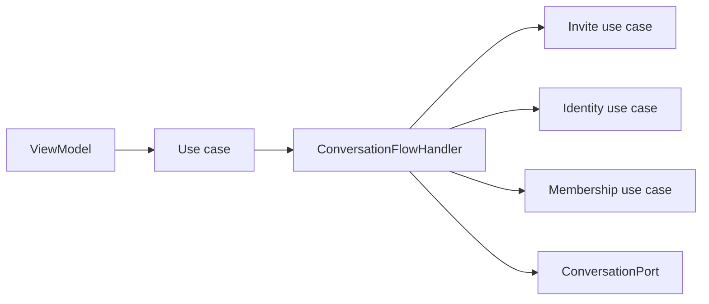

# Dependency rules

The current architecture is enforced primarily through Gradle module boundaries and the repository/datasource/use-case conventions below.

## Module families

```text
androidApp
shared
startup
navigation
notification
resources
core/*
data/*
feature/*
server/*
quality/*
```

## Current rules

1. **Keep `androidApp` thin.** Platform implementations belong in the owning feature/core module's platform source set.
2. **Presentation calls domain use cases.** ViewModels should not reach directly into DAOs, datasources or repository implementations.
3. **Use-case composition is allowed.** A use case may call another use case when it is the explicit workflow/orchestration boundary. `ConversationFlowHandler` and recovery/membership workflows rely on this.
4. **Repositories do not call unrelated repositories or use cases.** Repository implementations own their own datasources/mappers; cross-feature workflows belong above repositories.
5. **Datasources do not call repositories.** Datasources face storage/network/platform primitives.
6. **Feature ownership remains strict.** `:feature:invite` owns invitation lifecycle, `:feature:identity` identity/trust/recovery, `:feature:membership` Group membership/security, `:feature:chats` conversation/message semantics.
7. **Cross-feature workflows belong in `:feature:conversationorchestration`.** Do not move membership logic back into Chats or identity logic into Invite.
8. **`:feature:messaging` stays generic.** It executes the persisted outbox/incoming queue and must not decide Direct-vs-Group business rules.
9. **Domain is implementation-independent.** No Compose/Room/Ktor implementation/platform framework imports in common domain code.
10. **Representation suffixes are meaningful.** `...Entity` = persistence, `...Dto` = data representation, unsuffixed = domain, `...Ui` = presentation.
11. **Mapper names identify their destination** (`toXDto()`, `toX()`, `toXUi()`).
12. **Direct and Group paths stay separate** where their semantics differ.
13. **Attachment ownership stays explicit.** Attachments own blob/source/cache/transcript concerns; Chats maps them into message content representations.
14. **Server applications are independent.** Server services communicate through HTTP/protocol boundaries and shared low-level server modules, not by importing each other's application internals.
15. **No dependency cycles.** A lower-level module must not reach upward for convenience.

## Correct orchestration example



The orchestration layer may compose use cases because that is precisely its responsibility. What remains forbidden is hiding that coordination inside `InvitationRepositoryImpl`, `GroupMembershipRepositoryImpl`, a datasource, or a Room DAO.

## Generated reference

The generated module catalog is derived from the current Gradle/source tree. If the normal Gradle report is available, regenerate with:

```bash
./gradlew architectureReport
./gradlew verifyArchitectureReport
```
