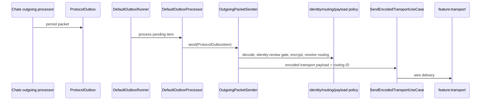
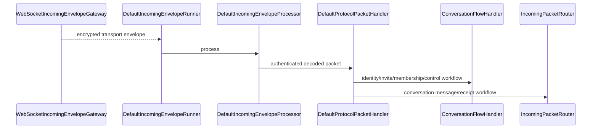

# Messaging boundary

Messaging crosses several modules, but the current code has a deliberate split between **generic queue execution** and **conversation-aware orchestration**.

| Concern | Owner | Representative classes |
|---|---|---|
| Packet contracts/codecs | `:core:protocol` | `SparrowPacket`, `KotlinxPacketCodec`, packet data classes |
| Persistent outbox contracts/state | `:core:protocol` | `ProtocolOutbox`, outbox state/event types |
| Persistent outbox storage | `:data:database` | `ProtocolOutboxEntity`, `ProtocolOutboxDao`, `ProtocolOutboxFailureEventEntity` |
| Generic outbox/incoming execution | `:feature:messaging` | `DefaultOutboxRunner`, `DefaultOutboxProcessor`, `DefaultIncomingEnvelopeRunner` |
| Cross-feature send/receive policy | `:feature:conversationorchestration` | `OutgoingPacketSender`, `OutgoingRecipientRoutingResolver`, `OutgoingTransportPayloadFactory`, `DefaultIncomingEnvelopeProcessor`, `ConversationFlowHandler` |
| Conversation semantics | `:feature:chats` | `DirectOutgoingMessageProcessor`, `GroupOutgoingMessageProcessor`, incoming handlers, delivery handlers |
| Invitation lifecycle | `:feature:invite` | `InvitationRepositoryImpl`, `InvitationLifecycleDataSource`, `InvitationResultObserver` (consumer in orchestration) |
| Identity/trust/recovery | `:feature:identity` | `IdentityExchangeDataSource`, pending identity changes, approved reconnection repositories/use cases |
| Group membership/security | `:feature:membership` | `GroupMembershipStateMachine`, `GroupSecurityManager`, membership use cases |
| Wire/discovery | `:feature:transport` | `DefaultTransportConnectionManager`, `DefaultWebSocketTransportClient`, mailbox/push/control-plane clients |

## Outgoing boundary

`OutgoingPacketSender` re-checks pending remote identity changes at the final transport boundary, preventing already-persisted Direct application packets from being sent against an old trust state while the user reviews replacement keys.

`OutgoingRecipientRoutingResolver` uses contact routing use cases plus `GroupRoutingResolver`; invitations use invitation/bootstrap routing while established Group packets resolve through current Group routing state.

## Incoming boundary

## Attachment/voice/link boundaries

Attachments own blob transfer/cache/storage and transcripts. Voice builds recording/playback/transcription on that attachment boundary. Link previews are fetched/cached separately from message encryption; the message contains the original text/URL, not trusted server-rendered HTML.

## Server boundary

Gateway/federation/mailbox/push route or store opaque encrypted application payloads. Conversation authorization, Group membership and identity replacement decisions are client concerns.
