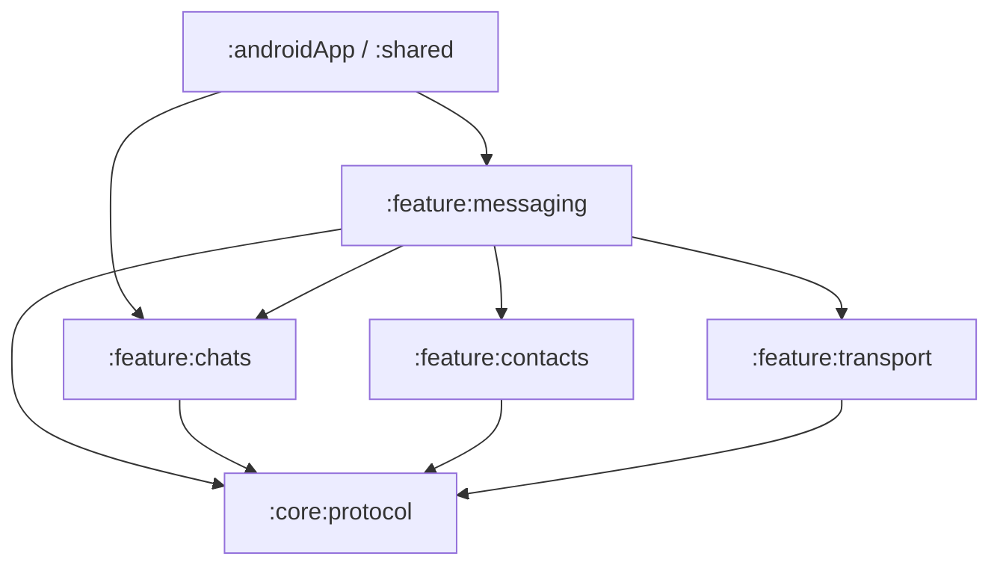

# Messaging Boundary

Messaging spans multiple modules, but each concern has one owner:

> `:feature:messaging` coordinates packet transport; `:feature:transport` moves opaque data; the
> feature that owns a packet decides what that packet means.

For the detailed direct/group runtime trace, see
[Conversation, Messaging, and Delivery Flow](../features/message-transport-flow.md).

## Ownership map

| Concern | Owner | Examples |
|---|---|---|
| Direct/group conversation behavior | `:feature:chats` | conversation repositories, group state machines, packet handlers |
| Contact/identity exchange behavior | `:feature:contacts` | invitation, verification, merge and incoming handlers |
| Packet contracts and persistent-outbox port | `:core:protocol` | `SecureChatPacket`, `PacketCodec`, `ProtocolOutbox`, `OutgoingWireSender` |
| Persistent outbox storage | `:data:database` | `DefaultProtocolOutbox`, Room DAOs |
| Send/receive orchestration | `:feature:messaging` | `DefaultOutboxRunner`, `DefaultOutboxProcessor`, `DefaultIncomingEnvelopeRunner` |
| Contact/group routing resolution | `:feature:messaging` | `ContactRoutingIdResolver`, `ContactByRoutingIdResolver`, `GroupRoutingIdResolver` |
| Gateway connection and wire frames | `:feature:transport` | `DefaultTransportConnectionManager`, `DefaultWebSocketTransportClient` |
| Wire sender | `:feature:transport` | `WebSocketOutgoingWireSender` |
| Server-side client edge/routing | `:server:gateway` | gateway WebSocket handler and connection registry |
| Cross-node forwarding | `:server:federation` | signed node-to-node envelope/typing routing |
| Offline ciphertext | `:server:mailbox` | capability-protected mailbox storage |
| Wake-ups/compatibility inbox | `:server:push` | push token and pending-envelope services |

## Dependency direction



Key rules:

- `:core:protocol` contains transport-independent contracts.
- `:feature:chats` and `:feature:contacts` own packet meaning.
- `:feature:transport` never loads conversations or decides packet policy.
- `:feature:messaging` may coordinate chats, contacts, crypto, protocol, database and transport.
- server application modules communicate through protocol/HTTP boundaries rather than importing one
  another's implementation packages.

## Outgoing boundary

```text
packet-owning feature
    ↓
ProtocolOutbox
    ↓
DefaultOutboxRunner
    ↓
DefaultOutboxProcessor
    ↓
routing + transport-payload policy
    ↓
OutgoingWireSender
    ↓
WebSocketOutgoingWireSender
    ↓
TransportEnvelope
    ↓
WebSocketTransportClient
```

Features do not send directly to the WebSocket.

## Incoming boundary

```text
WebSocketTransportClient.incomingEnvelopes
    ↓
WebSocketIncomingEnvelopeGateway
    ↓
DefaultIncomingEnvelopeRunner
    ↓
DefaultIncomingEnvelopeProcessor
    ↓
contact/group routing resolution + transport decoding
    ↓
packet dispatch
    ↓
feature-owned packet handler/state machine
```

The transport envelope is acknowledged only after application processing succeeds. That is a
reliability boundary, not recipient message-delivery state.

## `:feature:messaging` package layout

```text
feature/messaging/.../feature/messaging/
├── application/
│   ├── incoming/
│   ├── mailbox/
│   ├── outbox/
│   └── routing/
├── data/
│   ├── repository/
│   │   ├── direct/
│   │   └── group/
│   └── routing/
└── di/
```

Routing contracts live with the
application boundary they support; implementations live under `data/routing`.

## Placement rules

- Chat/group business rules → `:feature:chats`.
- Contact/identity-exchange business rules → `:feature:contacts`.
- Packet/outbox orchestration and routing resolution → `:feature:messaging`.
- Node discovery, routing-ID generation, WebSocket/gateway frames and network adapters →
  `:feature:transport`.
- Transport-independent packet/port contracts → `:core:protocol`.
- Room persistence → `:data:database`.
- Client-facing WebSocket routing on a node → `:server:gateway`.
- Cross-node delivery → `:server:federation`.

Do not put WebSocket clients in ViewModels, packet meaning in transport, or feature business rules in
server/gateway code.
