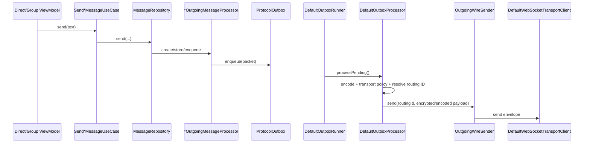
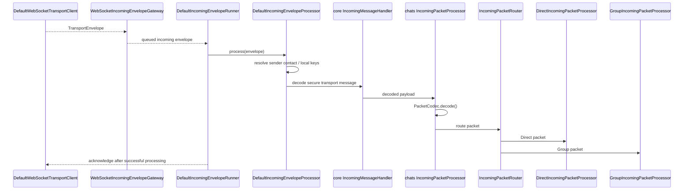

# Messaging boundary

Messaging crosses modules, but each module has a narrow job.

| Concern | Owner | Representative classes |
|---|---|---|
| Packet contracts | `:core:protocol` | `SecureChatPacket`, `PacketCodec`, packet data classes |
| Persistent outbox contract | `:core:protocol` | `ProtocolOutbox`, `OutboxProcessor`, `OutgoingWireSender` |
| Persistent outbox storage | `:data:database` | `DefaultProtocolOutbox` + Room DAOs |
| Conversation meaning | `:feature:chats` | Direct/Group repositories, handlers, state machines |
| Contact/identity packet meaning | `:feature:contacts` | invitation/identity handlers and use cases |
| Send/receive orchestration | `:feature:messaging` | `DefaultOutboxRunner`, `DefaultOutboxProcessor`, `DefaultIncomingEnvelopeRunner`, `DefaultIncomingEnvelopeProcessor` |
| Wire connection/discovery | `:feature:transport` | `DefaultTransportConnectionManager`, `DefaultWebSocketTransportClient`, discovery clients |
| Client edge | `:server:gateway` | `GatewayWebSocketHandler`, `GatewaySessionHandler`, `ConnectionRegistry` |
| Cross-node forwarding | `:server:federation` | `FederationRouter`, `FederationPeerRouter`, `OutboundEnvelopeRetryAgent` |
| Offline store | `:server:mailbox` | `configureMailboxRoutes()`, `MailboxStorage`, `PostgresMailboxStore` |
| Android wake-up | `:server:push` + `:notification` | `PushCoordinator`, `FirebasePushSender`, `SynchronizePendingMessages` |

## Outgoing boundary

`DefaultOutboxProcessor` deliberately does not know whether a message bubble is Direct or Group. It decodes the already-created packet, asks `OutgoingTransportPayloadFactory` how it must be protected, resolves a routing ID with `ContactRoutingIdResolver` or `GroupRoutingIdResolver`, and hands opaque bytes to the wire sender.

It processes recipient groups concurrently with a maximum of eight recipient groups at once, while preserving ordering within one recipient group.

## Incoming boundary

The transport layer treats packet bytes as opaque. Packet semantics are decided only after the client has decoded/decrypted them.

## Direct and Group callbacks

Shared receipts/outbox callbacks are dispatched by narrow routers:

- `ReceiptIncomingPacketRouter` → Direct or Group receipt handlers.
- `ChatOutboxDeliveryStateRouter` → Direct or Group delivery coordinator.

Those routers dispatch only. They do not contain Direct/Group lifecycle rules.
