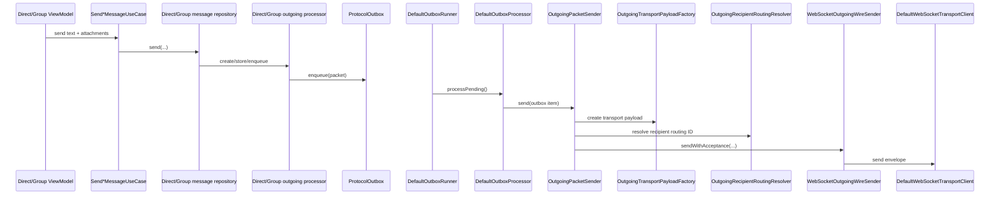
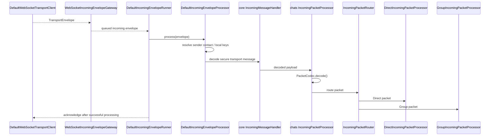

# Messaging boundary

Messaging crosses modules, but each module has a narrow job.

| Concern | Owner | Representative classes |
|---|---|---|
| Packet contracts | `:core:protocol` | `SparrowPacket`, `PacketCodec`, packet data classes |
| Persistent outbox contract | `:core:protocol` | `ProtocolOutbox`, `OutboxProcessor`, `OutgoingWireSender` |
| Persistent outbox storage | `:data:database` | `DefaultProtocolOutbox` + Room DAOs |
| Conversation meaning | `:feature:chats` | Direct/Group repositories, handlers, state machines, `MessagePartDto`/`MessagePart`/`MessagePartUi` |
| Attachment blob/cache/storage | `:feature:attachments` | `MessageAttachmentDataSource`, `BlobTransferDataSource`, attachment repositories |
| Media/file platform access | `:feature:media` | gallery/camera/file launchers, media viewer/open/export helpers |
| Contact/identity packet meaning | `:feature:contacts` | invitation/identity handlers and use cases |
| Send/receive orchestration | `:feature:messaging` | `DefaultOutboxRunner`, `DefaultOutboxProcessor`, `DefaultIncomingEnvelopeRunner`, `DefaultIncomingEnvelopeProcessor` |
| Wire connection/discovery | `:feature:transport` | `DefaultTransportConnectionManager`, `DefaultWebSocketTransportClient`, discovery clients |
| Client edge | `:server:gateway` | `GatewayWebSocketHandler`, `GatewaySessionHandler`, `ConnectionRegistry` |
| Cross-node forwarding | `:server:federation` | `FederationRouter`, `FederationPeerRouter`, `OutboundEnvelopeRetryAgent` |
| Offline store | `:server:mailbox` | `configureMailboxRoutes()`, `MailboxStorage`, `PostgresMailboxStore` |
| Android wake-up | `:server:push` + `:notification` | `PushCoordinator`, `FirebasePushSender`, `SynchronizePendingMessagesUseCase` |

## Attachment boundary

Attachment source/transfer/storage ownership is separate from conversation meaning. `:feature:attachments` prepares and uploads encrypted blobs and exposes source attachment metadata. `:feature:chats` converts that boundary into its own typed `MessagePartDto`/`MessagePart`/`MessagePartUi` representations.

This avoids leaking one generic attachment module model into Direct/Group domain state while still keeping blob behavior centralized. Image, video, file, location and contact all currently use this blob attachment path.

## Outgoing boundary

`DefaultOutboxProcessor` owns outbox state transitions/batching; it does not know Direct/Group conversation semantics and no longer performs packet protection/routing itself. `OutgoingPacketSender` decodes the application packet, asks `OutgoingTransportPayloadFactory` for transport protection, resolves the destination with `OutgoingRecipientRoutingResolver`, and hands the encoded transport payload to `OutgoingWireSender`/`WebSocketOutgoingWireSender`.

`OutgoingRecipientRoutingResolver` uses `ContactRoutingDataSource` and `GroupRoutingDataSource` according to the concrete packet type. The outbox processes recipient groups concurrently with a maximum of eight recipient groups at once, while preserving ordering within one recipient group.

## Incoming boundary

The transport layer treats packet bytes as opaque. Packet semantics are decided only after the client has decoded/decrypted them.

## Direct and Group callbacks

Shared receipts/outbox callbacks are dispatched by narrow routers:

- `ReceiptIncomingPacketRouter` → Direct or Group receipt handlers.
- `ChatOutboxDeliveryStateRouter` → Direct or Group delivery coordinator.

Those routers dispatch only. They do not contain Direct/Group lifecycle rules.
