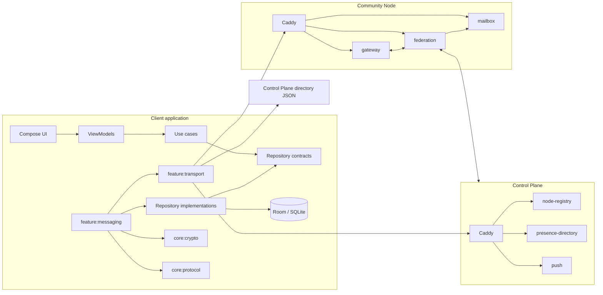
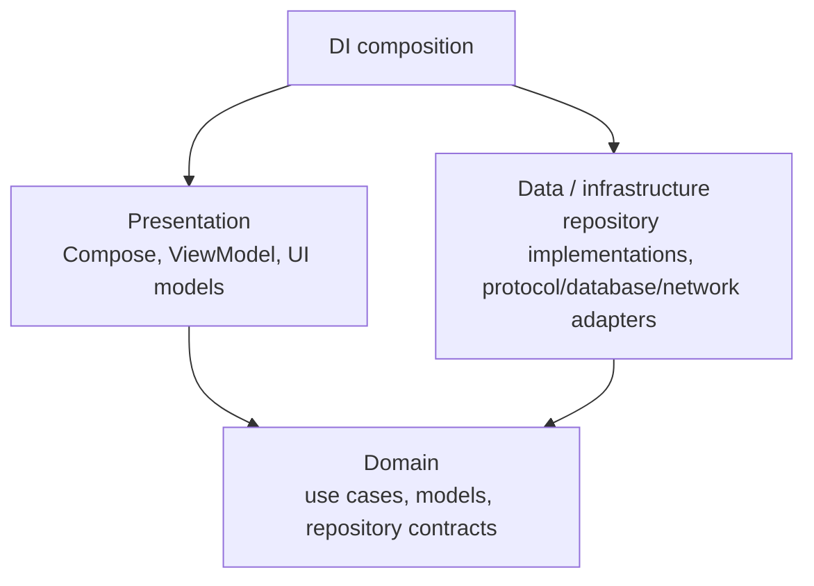
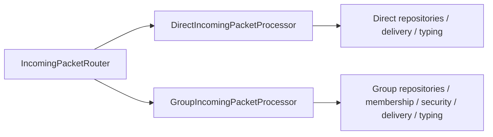

# Architecture overview

Sparrow is a Kotlin Multiplatform client plus a federated Kotlin server system. The code is intentionally split by responsibility rather than by deployment convenience.

## High-level view

## Application startup

The Android application entry point is deliberately thin. `SparrowApplication` initializes dependency injection; the shared application shell and startup orchestration live in `:shared`.

`AppViewModel` owns application startup and foreground runtime orchestration. Its startup path includes:

1. initialize the crypto runtime;
2. initialize language/settings;
3. initialize notification runtime/coordinators;
4. load and synchronize the configured Control Plane directory;
5. refresh Control Plane health and start periodic maintenance;
6. observe the local identity/routing registration target;
7. synchronize device contacts;
8. mark the application runtime ready.

Foreground runtime dependencies then coordinate `IncomingEnvelopeRunner`, `TransportConnectionManager`, `OutboxRunner`, mailbox synchronization and application visibility.

The build-time directory URL comes from `local.properties` as `controlPlaneDirectoryUrl` and is exposed to common KMP code through `BuildKonfig.CONTROL_PLANE_DIRECTORY_URL`.

## Layering inside a feature

Feature modules normally use these layers:

Important rules:

- ViewModels call use cases, not repository implementations.
- Use cases do not call other use cases.
- Repository implementations do not call other repositories or use cases.
- Datasources do not call repositories.
- Domain code does not depend on Compose, Room, Ktor or Android APIs.
- Data representation models use `...Dto`; domain models are unsuffixed; presentation representations use `...Ui`.
- Mapper functions are named for their destination: `toNameDto()`, `toName()`, `toNameUi()`.
- Platform-specific code belongs in the corresponding source set (`androidMain`, `iosMain`) of the owning module, under the owning top-level responsibility such as `device`.
- `androidApp` stays small.

## Messaging boundary

Messaging spans several modules but ownership is explicit:

- `:core:protocol` owns packet contracts and transport-independent outbox interfaces.
- `:feature:chats` owns direct/group conversation semantics.
- `:feature:contacts` owns contact invitation and identity-exchange semantics.
- `:feature:messaging` orchestrates persistent outgoing/incoming processing.
- `:feature:transport` owns Control Plane/node discovery, WebSocket mechanics, routing registration, mailbox/push HTTP gateways and diagnostics.
- server modules route and persist opaque envelopes; they do not own client conversation semantics.

See [Messaging boundary](messaging-boundary.md) and [Message transport flow](../features/message-transport-flow.md).

## Direct and Group are separate paths

A deliberate architectural constraint is that Direct and Group chat behavior is not hidden behind a generic “chat” implementation.

Shared code is allowed only when semantics are genuinely shared, such as packet decoding or the conversation-overview projection. See [Chats architecture](chats.md).

## Server architecture

The server is not one monolith. It has two deployable shapes:

- **Control Plane:** node registry, presence directory and push service behind Caddy.
- **Community Node:** gateway, federation and mailbox services behind Caddy.

Each JVM service is an independent Gradle module and communicates across HTTP/protocol contracts instead of importing another service application's implementation package.

See [Server overview](../server/overview.md).

## Platform status

Android is the usable client target. The project has KMP iOS source sets and an Xcode host, but major platform/runtime integrations are still incomplete. iOS should therefore be treated as architectural scaffolding, **not** a supported client with Android feature parity.
