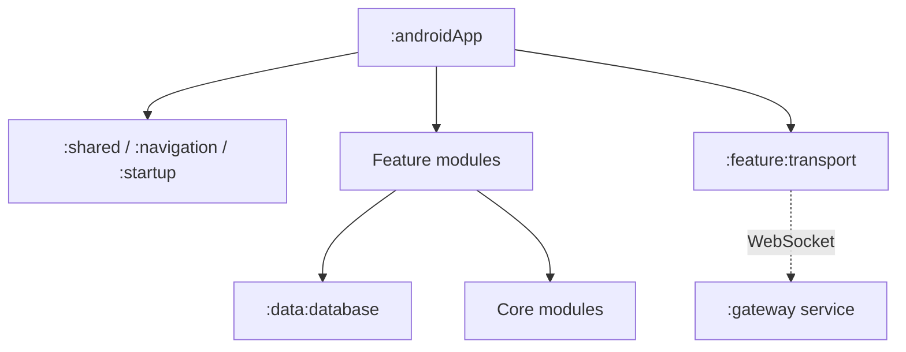

# Architecture Overview

SecureChat is a modular Kotlin Multiplatform application. Gradle modules define the coarse
boundaries; packages inside a feature separate presentation, domain rules, data adapters, and
application orchestration.

This page explains the intended responsibilities. The generated
[module architecture](../generated/architecture.md) is the source of truth for actual Gradle
dependencies.

For the production call chain from conversation UI through protocol, persistent outbox, transport,
receipts, and group activation, read
[Conversation, Messaging, and Delivery Flow](../features/message-transport-flow.md).

## Architectural shape



The arrows show compile-time dependencies, except for the dashed network connection. Feature
modules may depend on lower-level contracts and infrastructure, but core modules do not depend on
features.

## Module ownership

| Module | Primary responsibility |
|---|---|
| `:androidApp` | Android entry point, Koin assembly, and process-lifetime runtime startup |
| `:shared` | Shared Compose application shell |
| `:navigation` | App destinations, navigation graph, app shell, and `MainRoute` |
| `:startup` | Startup initialization result and startup UI |
| `:core` | Small cross-cutting utilities such as IDs, time, and the project-owned logging facade |
| `:core:crypto` | Transport encryption, decryption, key operations, and payload codec |
| `:core:protocol` | Transport-independent packet model, packet codec, handler and outbox contracts |
| `:core:ui` | Reusable Compose design components |
| `:data:database` | Room entities, DAOs, database wiring, and `DefaultProtocolOutbox` |
| `:feature:identity` | Local identity lifecycle, persistence ports, sharing, and setup UI |
| `:feature:contacts` | Contact domain, import/merge behavior, remote identity exchange, and contacts UI |
| `:feature:chats` | Conversations, messages, receipts, delivery state, packet handlers, and chat UI |
| `:feature:messaging` | Application-level send/receive orchestration connecting chats, contacts, crypto, and transport |
| `:feature:transport` | Routing IDs, connection lifecycle, WebSocket frames, and `OutgoingWireSender` |
| `:feature:contactimport` | Platform device-contact integration |
| `:feature:onboarding` | Onboarding flow |
| `:feature:settings` | Settings domain and UI |
| `:server:gateway` | Standalone Ktor WebSocket gateway; it routes opaque payloads and logs through SLF4J/Logback |
| `:quality:detekt-rules` | Project-specific static-analysis rules |

Empty grouping projects such as `:feature` and `:data` appear in the generated report but do not own
application behavior.

## Feature-internal layers

Features use only the layers they need:

| Package | Contains | May know about |
|---|---|---|
| `presentation` | Routes, screens, ViewModels, UI state, mappers, components | Domain use cases and UI models |
| `domain` | Models, repository/port interfaces, use cases, state machines | Kotlin and stable lower-level contracts |
| `data` | Repository implementations, mappers, protocol handlers, infrastructure adapters | Domain interfaces, database and core infrastructure |
| `application` | Long-running or multi-feature orchestration without UI | Ports from participating modules |
| `di` | Koin composition for that module | Concrete implementations and contracts being wired |

Not every feature needs every package. For example, `:feature:messaging` has no presentation layer,
while `:feature:transport` is an infrastructure feature and does not expose use cases or screens.

## Key runtime boundaries

### UI to domain

Screens send events to ViewModels. ViewModels call use cases such as `SendMessage`,
`CreateGroupConversation`, or `VerifyContact`. UI components do not call DAOs, WebSocket clients,
or crypto implementations.

### Domain to persistence

Feature repositories expose domain operations. Room types remain under `:data:database` and in the
data implementations that use them. Domain models do not contain Room annotations.

### Protocol to transport

`:core:protocol` defines `SecureChatPacket`, `PacketCodec`, `ProtocolOutbox`,
`ProtocolPacketHandler`, and `OutgoingWireSender`. It does not know about Ktor, Room, contacts, or
Compose.

`:feature:messaging` turns queued protocol packets into transport payloads and turns incoming gateway
envelopes back into protocol-handler calls. `:feature:transport` only moves gateway messages.
See [Messaging Boundary](messaging-boundary.md).

### Client to gateway

The client sends a `TransportEnvelope` whose `payload` is opaque to `:server:gateway`. The gateway may read the
routing fields (`envelopeId`, `senderId`, `recipientId`, and timestamp), but it does not decode the
SecureChat transport payload or protocol packet.

## Runtime composition

Koin modules are assembled in `SecureChatApplication`. Runtime services start only after a local
identity and phone number exist:

1. `IncomingEnvelopeRunner.start()` begins collecting incoming envelopes.
2. `TransportConnectionManager.start()` starts the reconnect loop.
3. `SecureChatApplication` observes `TransportConnectionState`.
4. On `Connected`, it calls `OutboxRunner.start()` to recover and drain the persistent outbox.

This process-lifetime coordination is an Android application concern. The implementation of each
runtime service remains in its owning feature.

## Logging boundary

Shared and application code logs through `SecureChatLogger` in `:core`. Its Kermit-backed
implementation selects the platform output without exposing Kermit to feature code. The standalone
gateway keeps its JVM-native SLF4J/Logback pipeline.

See [Logging](../development/logging.md) for levels, privacy rules, and the extension policy.

## Source-of-truth rule

The repository contains two kinds of architecture documentation:

- `docs/generated/` is produced by `./gradlew architectureReport` from the current Gradle project.
- Hand-written pages explain responsibility, rationale, and runtime behavior.

After changing modules or dependencies, run:

```bash
./gradlew architectureReport
./gradlew verifyArchitectureReport
```

Do not manually edit files under `docs/generated/`.
