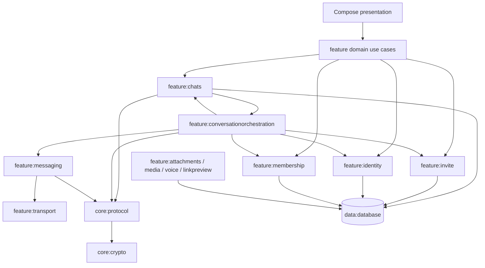
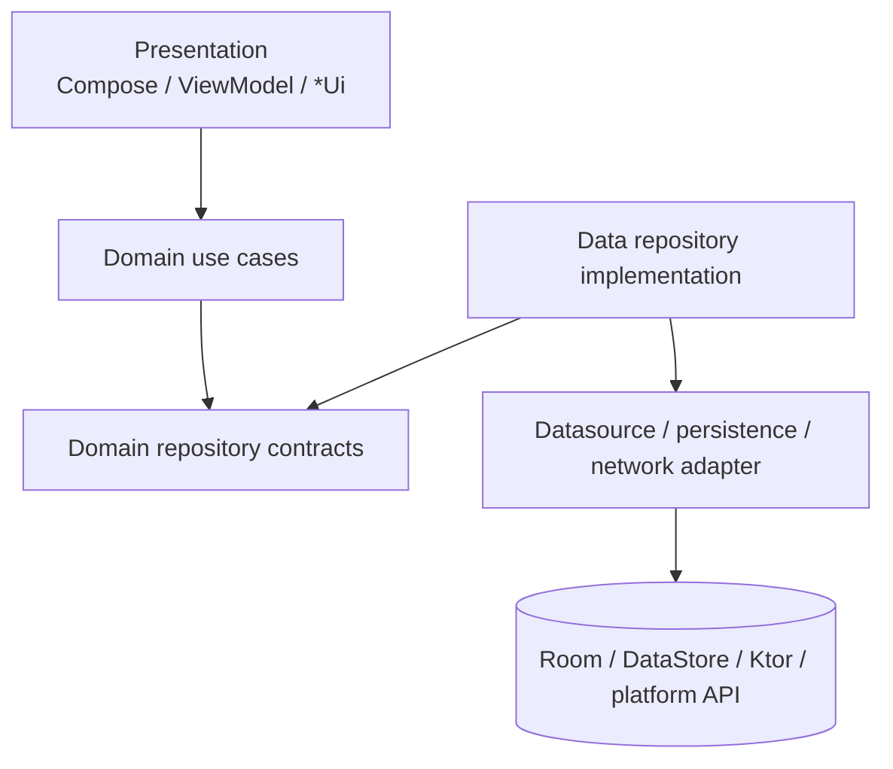
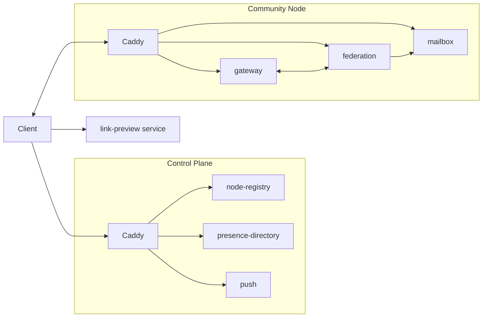

# Architecture overview

Sparrow is a Kotlin Multiplatform secure-messaging client plus a federated Kotlin/Ktor server system. The current codebase separates **feature ownership** from **cross-feature orchestration** so repositories do not become hidden coordinators.

## High-level client architecture

## Current ownership boundaries

| Module | Owns |
|---|---|
| `:feature:chats` | Direct/Group conversations, messages, reactions, edits/deletes, receipts, Group pins, chat UI |
| `:feature:invite` | Generic Direct/Group invitation lifecycle and invitation inbox UI |
| `:feature:identity` | Local identity, identity exchange/trust, backup/restore, pending remote identity changes, approved reconnections |
| `:feature:membership` | Group membership, roles, Group security epochs/keys, welcome/activation/admin/leave/delete membership lifecycle |
| `:feature:conversationorchestration` | Workflows that must coordinate chats + invite + identity + membership + transport |
| `:feature:messaging` | Generic durable outbox and incoming-envelope execution |
| `:feature:transport` | Control Plane discovery, Community Node selection, WebSocket/presence/mailbox/push transport |
| `:feature:attachments` | Attachment preparation/loading/cache/storage/transcripts |
| `:feature:voice` | Voice recording/playback/local transcription on top of attachments |
| `:feature:linkpreview` | Client link-preview cache/fetch/rendering |
| `:feature:autoreply` | Auto-reply configuration and per-contact claiming |

## Application startup

`SparrowApplication` initializes DI. `shared.presentation.AppViewModel` owns application startup and runtime coordination. It:

1. initializes crypto/settings/notification prerequisites;
2. restores and refreshes the signed Control Plane directory;
3. starts Control Plane health maintenance;
4. waits for local identity readiness;
5. starts orchestration observers (`InvitationResultObserver`, `MembershipResultObserver`, `MessagingTransportResultObserver`, `IdentityResultObserver`, `ContactBlockObserver`, `ApprovedIdentityReconnectionObserver`);
6. synchronizes device contacts when permission is available;
7. starts/stops foreground network runtime based on visibility.

Foreground runtime uses `IncomingEnvelopeRunner`, `TransportConnectionManager`, `OutboxRunner` and mailbox coordination.

See [Runtime orchestration and protocol flows](runtime-flows.md).

## Feature-internal layering

Current rules:

- ViewModels call use cases rather than DAOs/datasources/repository implementations.
- A domain use case **may compose other use cases** when that is the intended orchestration boundary. This is used heavily by `:feature:conversationorchestration` and some feature-level workflows.
- Repository implementations do not call unrelated repositories or use cases.
- Datasources do not call repositories.
- Cross-feature coordination belongs in orchestration/use-case composition, not repository chaining.
- Presentation uses `...Ui`; data transport/intermediate representations use `...Dto`; persistence uses `...Entity`.
- Platform code belongs in the owning module's platform source set.

## Direct vs Group

Direct and Group conversation semantics stay distinct. They may share truly generic infrastructure (packet decoding, persisted outbox, attachment loading, overview projection), but authorization, recipient selection, membership and Group epoch security are separate.

## Persistence

The Room database is currently schema version **53** and contains durable state for invitations, identity exchange/recovery, group membership/security, messages/attachments, protocol outbox, mailbox routes, link previews, search/safety and auto reply.

See [Persistence model](persistence.md).

## Server topology

The deployable runtime and unified installer are described in [Server runtime, build and deployment](../server/runtime-build-deployment.md).
