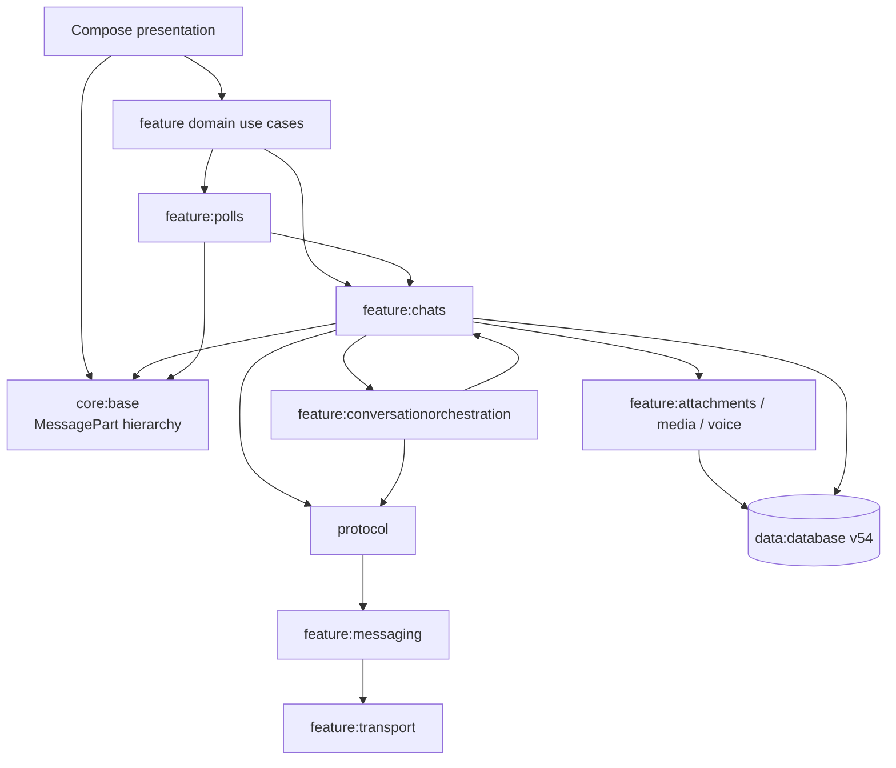
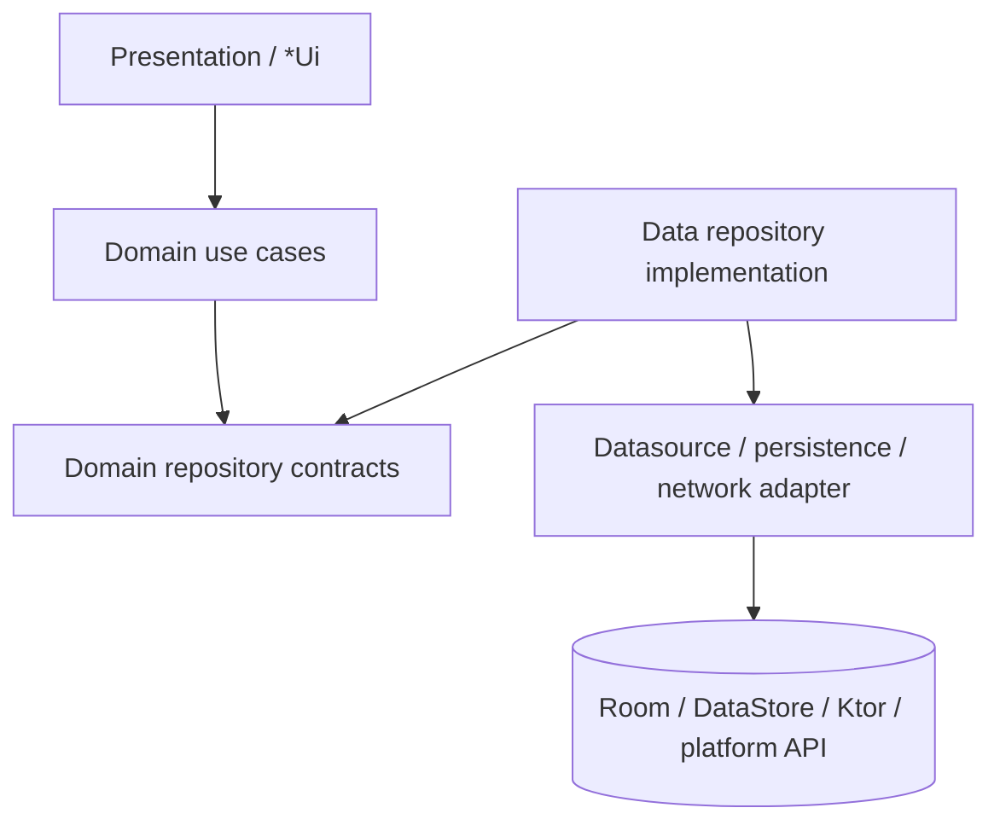

# Architecture overview

Sparrow is a Kotlin Multiplatform secure-messaging client plus a federated Kotlin/Ktor server system. The current codebase separates shared content models, feature ownership and explicit cross-feature orchestration.

## High-level client architecture

```mermaid
flowchart TD
    UI[Compose presentation]
    BASE[core:base
MessagePart hierarchy]
    UC[feature domain use cases]
    ORCH[feature:conversationorchestration]
    CHAT[feature:chats]
    POLL[feature:polls]
    ATT[feature:attachments / media / voice]
    MSG[feature:messaging]
    TR[feature:transport]
    PROTO[protocol]
    DB[(data:database v54)]

    UI --> UC
    UI --> BASE
    UC --> CHAT
    UC --> POLL
    CHAT --> BASE
    POLL --> BASE
    CHAT --> ORCH
    ORCH --> CHAT
    CHAT --> ATT
    ATT --> DB
    CHAT --> DB
    POLL --> CHAT
    CHAT --> PROTO
    ORCH --> PROTO
    PROTO --> MSG
    MSG --> TR
```

## Current ownership boundaries

| Module | Owns |
|---|---|
| `:core:base` | shared message-part data/domain/UI models and common domain primitives |
| `:protocol` | application packets/codecs and `OperationMessage` |
| `:feature:chats` | Direct/Group message semantics, operations, delivery/read state and pins |
| `:feature:polls` | poll creation and poll-specific presentation |
| `:feature:attachments` | encrypted blob transfer/cache/storage and attachment loading |
| `:feature:media` | media/file selection, rendering and export |
| `:feature:voice` | voice record/playback/transcription |
| `:feature:invite` | invitation lifecycle/inbox |
| `:feature:identity` | local/remote identity, trust, backup/recovery |
| `:feature:membership` | group membership/security/admin lifecycle |
| `:feature:conversationorchestration` | cross-feature identity/invite/membership/chat workflows |
| `:feature:messaging` | durable outbox/incoming-envelope execution |
| `:feature:transport` | discovery/WebSocket/presence/mailbox/push transport |
| `:feature:applock` | application-lock setting/authentication boundary |
| `:feature:notification` | app notifications/background synchronization |

## Startup/runtime split

Application startup no longer lives as one large `AppViewModel` procedure. `ApplicationStartupRunner` consumes a list of `StartupTask`s. Waiting tasks complete before main navigation; background tasks and `ForegroundRuntimeCoordinator` start after `StartupViewModel.completeStartup()` navigates to `AppRoute.Main`.

See [Startup architecture](startup.md).

## Feature-internal layering

```mermaid
flowchart TD
    P[Presentation / *Ui] --> U[Domain use cases]
    U --> R[Domain repository contracts]
    RI[Data repository implementation] --> R
    RI --> DS[Datasource / persistence / network adapter]
    DS --> EXT[(Room / DataStore / Ktor / platform API)]
```

Repositories do not call other repositories or use cases; datasources do not call repositories. Cross-feature workflows belong in explicit orchestration/runtime boundaries. Presentation receives presentation models rather than DTOs/entities.

## Direct vs Group

Direct and Group remain separate where authorization, recipients, membership, delivery aggregation and group epoch/admin semantics differ. They share `MessagePart`, `OperationMessage`, attachment infrastructure and durable transport execution.

## Persistence

Room schema is version **54**. Structured message-part payloads are stored in `MessagePartEntity.payload`; blob metadata/cache paths are in `MessageBlobEntity`. See [Persistence](persistence.md).

## Server topology

The Control Plane owns discovery/presence/push control functions. Community Nodes own client gateway, federation, mailbox and encrypted blob transport. Server details are documented under [Server & Operations](../server/overview.md).
