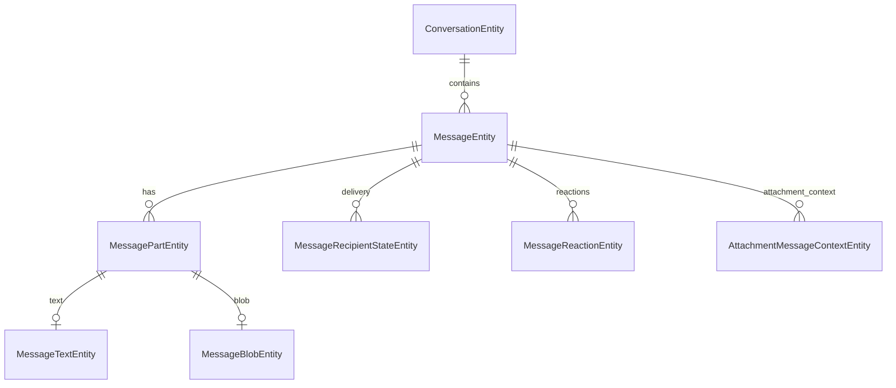

# Persistence

The Android client uses Room. The current `SparrowDatabase` schema version is **54**.

## Message storage

The current message schema separates message envelope/state, text, typed parts and blob metadata:



Key entities include `ConversationEntity`, `MessageEntity`, `MessagePartEntity`, `MessageTextEntity`, `MessageBlobEntity`, `MessageRecipientStateEntity`, `MessageReactionEntity`, `AttachmentMessageContextEntity`, `VoiceTranscriptEntity`, `GroupPinEntity`, membership/security tables, identity/recovery tables and the durable protocol outbox tables.

`MessagePartEntity` is the generic structural row:

```text
id
messageId
position
type
payload?
```

`MessageBlobEntity` owns blob-related fields such as MIME type, byte size, dimensions/duration, node/blob capabilities, AEAD key/nonce/hash, delete capability and `localFilePath`.

## Structured message-part payloads

Schema 54 stores structured part JSON directly in `MessagePartEntity.payload`. `MessagePartPayloadMigration53To54` copies legacy values from `message_structured.json` into that column and drops the legacy table.

`PollDto` is currently the structured payload user of this mechanism. Its nested images are persisted as separate image parts/blobs and are reattached by `MessagePartPersistenceMapper.withPersistedParts(...)`.

## Outbox

`ProtocolOutboxEntity` and `ProtocolOutboxFailureEventEntity` persist transport work independently of a screen. Feature code creates packets/operations; `:feature:messaging` runners process the durable outbox later. This is why outgoing work can survive temporary transport failure.

## Group state

Group persistence includes `GroupMembershipEntity`, `GroupSecurityStateEntity`, `GroupMemberKeyEntity`, `GroupVerificationPairEntity` and `GroupPinEntity`. Delivery/read aggregation is per recipient through `MessageRecipientStateEntity`.

## Identity and recovery

Identity/reconnection state is durable through `IdentityExchangeEntity`, `PendingRemoteIdentityChangeEntity`, `ApprovedIdentityReconnectionEntity`, contact public identity/routing tables and invitation state. Recovery is therefore not an in-memory navigation event.

## Local search/safety

`MessageSearchEmbeddingEntity` stores local search embeddings and `MessageSafetyAssessmentEntity` stores local safety-analysis output. These are client-side feature data and are not sent as message content.

## Schema source of truth

Use `data/database/src/commonMain/kotlin/com/cbgm/sparrow/data/database/SparrowDatabase.kt` and exported Room schemas under `data/database/schemas/` as the authoritative schema. Historical entity files can remain for migration code even when they are no longer registered in the current database.
