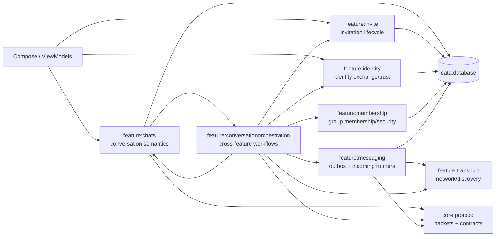
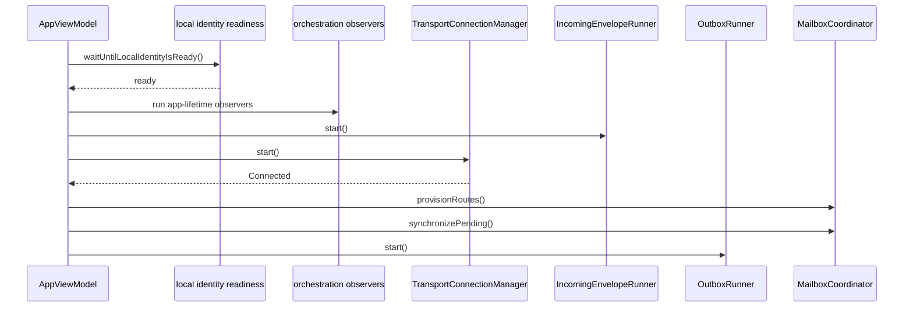
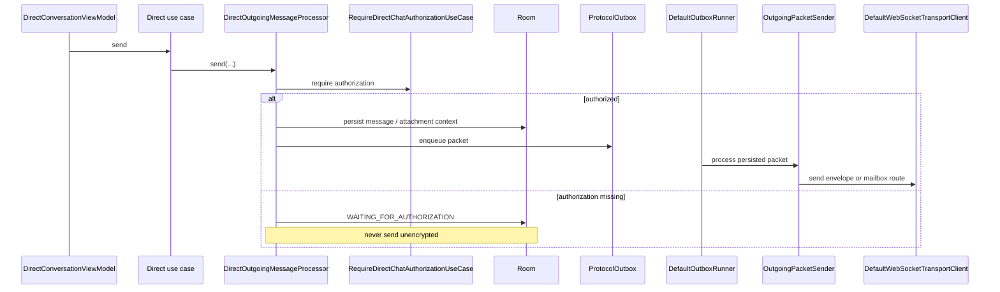
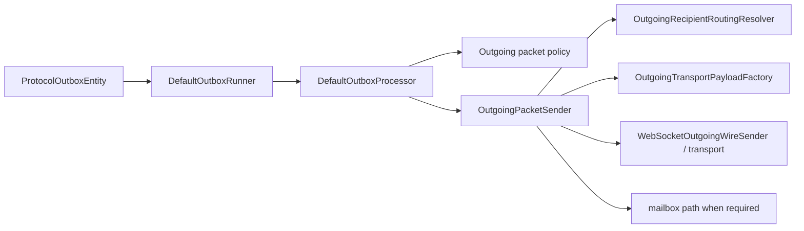
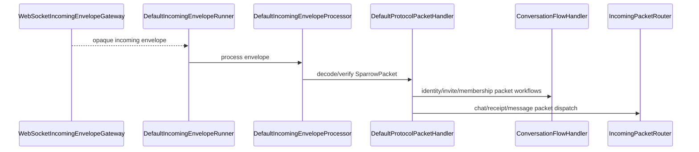

# Runtime orchestration and protocol flows

This page documents the **current runtime wiring in the source tree**. It is intentionally implementation-oriented: class names are the actual production classes in this snapshot.

## Ownership map

The important distinction is that `:feature:messaging` is not the application workflow layer. It provides generic persisted outbox/incoming execution. `:feature:conversationorchestration` owns decisions that require knowledge of several features at once.

## Startup and long-lived observers

`shared.presentation.AppViewModel` starts the application-lifetime coordinators after the local identity is ready:

- `InvitationResultObserver`
- `MembershipResultObserver`
- `MessagingTransportResultObserver`
- `IdentityResultObserver`
- `ContactBlockObserver`
- `ApprovedIdentityReconnectionObserver`
- `AttachmentConversationNameObserver`

Foreground sessions start `IncomingEnvelopeRunner`, `TransportConnectionManager`, `OutboxRunner`, mailbox provisioning/synchronization, and stop those foreground components again when the application leaves the foreground.

## Outgoing direct message

Primary classes:

- `DirectConversationViewModel`
- Direct chat domain use cases
- `DirectMessageRepositoryImpl`
- `DirectOutgoingMessageProcessor`
- `RequireDirectChatAuthorizationUseCase`
- `ProtocolOutbox`
- `DefaultOutboxRunner`
- `DefaultOutboxProcessor`
- `OutgoingPacketSender`
- `OutgoingRecipientRoutingResolver`
- `OutgoingTransportPayloadFactory`
- `DefaultWebSocketTransportClient`

`DirectOutgoingMessageProcessor.send()` persists the local message and only releases it to the protocol outbox after the direct authorization requirement is satisfied. `queueUntilAuthorized()` persists messages in the waiting-for-authorization state; `releaseWaitingForAuthorization()` releases them after a successful authorization workflow and `discardWaitingForAuthorization()` removes them when the authorization attempt is rejected/invalidated.

## Outgoing group message

Primary classes:

- `GroupConversationViewModel`
- group domain use cases
- `GroupMessageRepositoryImpl`
- `GroupOutgoingMessageProcessor`
- `GetGroupTransportRoutingMembersUseCase`
- `GroupSecurityManager`
- `ProtocolOutbox`

`GroupOutgoingMessageProcessor` obtains the current active routing members, encrypts for the current group security epoch, persists per-recipient delivery state and enqueues one packet for each current recipient. Removed/non-active members are not part of the current recipient set.

## Generic outbox

`:core:protocol` owns the transport-independent outbox contracts/state machine. `:feature:messaging` implements the runner/processor. `:feature:conversationorchestration` supplies policy and actual packet sending.

The outbox is persisted so process death does not silently lose protocol work. `ProtocolOutboxFailureEventEntity` records failure events added by the later database migrations.

## Incoming envelope

Primary classes:

- `WebSocketIncomingEnvelopeGateway`
- `DefaultIncomingEnvelopeRunner`
- `DefaultIncomingEnvelopeProcessor`
- `DefaultProtocolPacketHandler`
- `ConversationFlowHandler`
- `IncomingPacketRouter`
- Direct/Group packet handlers

## Invitation + identity + membership orchestration

`ConversationFlowHandler` is the central cross-feature workflow. Its current entry points include:

- `startDirectInvitation()`
- `startExplicitReconnection()`
- `acceptApprovedOriginalIdentityChange()`
- `requestReauthorization()`
- `recoverAuthorizedConversationFromExchange()`
- `startManualIdentitySetup()`
- `startGroupInvitations()`
- `recoverAcceptedDirectInvitation()`
- `recoverAcceptedGroupInvitation()`
- `onInvitationResult()`
- `onIdentityResult()`
- `onIdentityPacket()`
- `onMembershipPacket()`
- `onMembershipResult()`
- group administration/leave/delete functions
- `resumeApprovedGroupJoin()`

This is deliberately above the individual repositories. Invite does not call Membership; Membership does not call Identity; Chats does not own Membership. The orchestration layer composes their public domain APIs.

## Transport result callbacks

`MessagingTransportResultObserver` consumes generic transport/outbox results and routes them back to feature-specific state transitions. Delivery callbacks for actual chat message state remain in Chats (`DirectOutboxDeliveryHandler`, `GroupOutboxDeliveryHandler`).

## Hard invariants

- Application messages are never deliberately sent without the required encryption/authorization state.
- Server services route encrypted envelopes and do not interpret conversation semantics.
- Invite lifecycle and group membership lifecycle are separate domains.
- Identity replacement/recovery requires an explicit approved recovery state; ordinary connectivity loss is not approval.
- Cross-feature workflows belong in `:feature:conversationorchestration`, not in repositories calling repositories.
