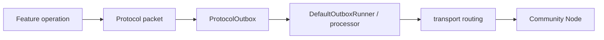

# Runtime flows

This page summarizes the current application-lifetime orchestration boundaries.

## Startup

Startup is driven by `ApplicationStartupRunner` and `StartupTask` instances. Only tasks marked `waitForCompletion` block navigation. After all waiting tasks finish and the identity result is resolved, `StartupViewModel` navigates to `AppRoute.Main` and calls `startPostNavigationRuntime()`.

See [Startup architecture](startup.md) for the exact task list and class flow.

## Foreground runtime

`ForegroundRuntimeCoordinator` starts after navigation rather than being hidden inside the startup screen. Transport/observer lifetimes therefore belong to application runtime, not Composable lifetime.

## Durable outgoing messaging

```mermaid
flowchart LR
    FEATURE[Feature operation] --> PACKET[Protocol packet]
    PACKET --> OUTBOX[ProtocolOutbox]
    OUTBOX --> RUNNER[DefaultOutboxRunner / processor]
    RUNNER --> ROUTE[transport routing]
    ROUTE --> NODE[Community Node]
```

Direct and Group feature processors own their business rules. `:feature:messaging` owns durable execution/retry; `:feature:transport` owns discovery/routing/WebSocket/mailbox/push transport.

## Message operations

Edits, deletes, reactions, poll votes and poll closes share `OperationMessage` / `MessageOperation`. Direct incoming handling accepts edit/delete/reaction and rejects poll operations. Group outgoing/incoming handling additionally supports `PollVote` and `PollClose`.

## Poll composer handoff

`CreatePollViewModel` finishes a `Poll` into `PollComposerRepository`. `GroupConversationViewModel` observes it, sends it as an ordinary group `MessagePart`, cleans temporary poll media after success and clears the finished poll handoff.

## Identity recovery

Approved reconnection retry is started by `StartApprovedIdentityReconnectionObserverStartupTask` after identity readiness. `ApprovedIdentityReconnectionObserver` and its worker persist/retry approved recovery independent of a particular chat screen.

## Attachment caching

Incoming messages can be persisted before their binary blobs finish downloading. `MessageAttachmentCacheCoordinator` / `MessageAttachmentDataSource` cache blob data and persist local paths. Room observations that render media must observe the relevant blob rows so the UI can move from loading to the real local file without reopening the app.
