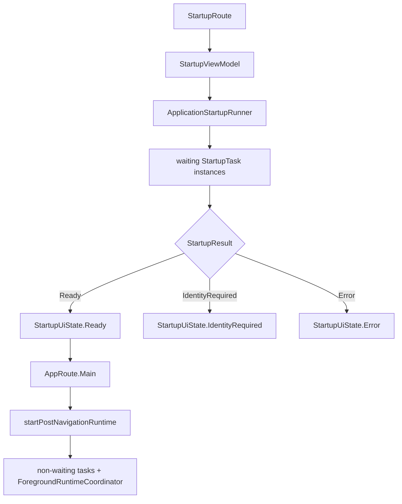

# Startup architecture

Startup is task-based. The UI is intentionally thin: `StartupViewModel` asks a `StartupRunner` for the minimum readiness result and navigates to the main app only when required startup tasks have finished.

## Contracts

`startup/domain/runner/StartupRunner` exposes:

```kotlin
suspend fun run(): StartupResult
fun startPostNavigationRuntime()
```

The shared runtime implements it with `ApplicationStartupRunner`. Individual work items implement `StartupTask`:

```kotlin
interface StartupTask {
    val name: String
    val waitForCompletion: Boolean
    val runOnMainThread: Boolean
    suspend fun run(): StartupTaskResult
}
```

Only tasks with `waitForCompletion == true` block startup navigation. `ApplicationStartupRunner.runWaitingTasks()` runs them concurrently, checks that every waiting task completed, logs `all startup waiting tasks finished`, and then derives the single identity result. Non-waiting tasks start only from `startPostNavigationRuntime()` after navigation to `AppRoute.Main`.

## Registered tasks

`createApplicationStartupTasks(...)` currently registers:

- `InitializeAppLanguageStartupTask`
- `InitializeCryptoRuntimeStartupTask`
- `LoadControlPlaneConfigurationStartupTask`
- `ResolveIdentityStatusStartupTask`
- `RestoreControlPlaneDirectoryStartupTask`
- `InitializeNotificationRuntimeStartupTask`
- `StartConversationNotificationCoordinatorStartupTask`
- `StartAttachmentConversationNameObserverStartupTask`
- `StartInvitationResultObserverStartupTask`
- `StartMembershipResultObserverStartupTask`
- `StartMessagingTransportResultObserverStartupTask`
- `StartDirectIdentityResultObserverStartupTask`
- `StartContactBlockObserverStartupTask`
- `StartApprovedIdentityReconnectionObserverStartupTask`
- `MaintainControlPlaneDirectoryStartupTask`
- `MaintainControlPlaneHealthStartupTask`
- `ObserveControlPlaneRegistrationTargetsStartupTask`
- `SynchronizeDeviceContactsStartupTask`
- `InitializeLocalIntelligenceStartupTask`

Identity-dependent background tasks derive from `IdentityReadyStartupTask`, so they can share the local readiness prerequisite without duplicating the identity check.

## UI flow



There is no reason for the startup UI to own runtime orchestration. `StartupViewModel` only exposes `StartupUiState`, handles retry/identity-created events and performs the final navigation.
