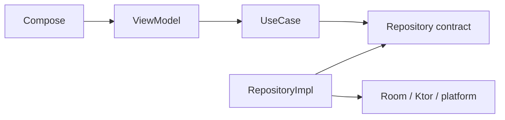

# Extending SecureChat

Use this page as a practical checklist when adding functionality.

## Add a normal client feature

1. Decide which existing feature module owns the behavior. Do not create a new module for one screen unless it has a real independent responsibility.
2. Add/extend domain models and a one-purpose `*UseCase`.
3. Add/extend a repository contract only if persistence/network behavior is needed.
4. Implement the repository in `data/repository` and keep Room/Ktor/platform details there.
5. Wire the implementation in the owning Koin module.
6. Make the ViewModel call the use case.
7. Add Compose UI/state/mappers.
8. Put required composable previews in the same file as their composable.
9. Add focused tests and run quality checks.



## Add Direct-chat behavior

Stay inside the Direct path where possible:

```text
domain/usecase/direct
domain/repository/direct
domain/model/direct
data/direct/...
presentation/direct/...
```

Use existing Direct components such as `DirectMessageRepositoryImpl`, `DirectIncomingPacketProcessor`, `DirectOutgoingMessageProcessor`, `DirectMessageDeliveryCoordinator` and `DirectMessageDeliveryStateMachine` rather than routing the change through Group code.

## Add Group behavior

First decide whether it is:

- message sending/delivery;
- membership/invitation/activation/admin;
- group security/epoch;
- verification;
- typing;
- presentation only.

Put it in the corresponding Group package/coordinator. Membership transitions belong around `GroupMembershipCoordinator` and its focused coordinators/state machine—not in a generic packet handler or Direct repository.

Read [Chats architecture](../architecture/chats.md) before changing this area.

## Add a new application packet

1. Define the packet in `:core:protocol` and update `PacketCodec` support as required.
2. Decide which feature owns its meaning.
3. Add an explicit incoming handler/route in that feature.
4. Define outgoing creation in that feature, enqueue through `ProtocolOutbox` rather than calling WebSocket directly.
5. Decide its transport policy/encryption requirements deliberately.
6. Add routing-ID handling in `:feature:messaging` only if the packet needs a special routing rule.
7. Add unit/integration tests for decode, policy, outgoing and incoming behavior.

Do not teach `:feature:transport` the business meaning of the packet.

## Add a server endpoint

1. Choose the owning service (`gateway`, `federation`, `mailbox`, registry, presence, push).
2. Put wire models in `server:protocol` only if they are genuinely shared across service/client boundaries.
3. Add authentication/replay/rate-limit handling appropriate to the endpoint.
4. Keep service persistence behind the service's store/database types.
5. Add readiness/metrics/logging where useful.
6. If the endpoint is operator-relevant, add a relative link to that deployment's `/index` page.
7. Update Caddy only if the path must be public; do not expose internal APIs unnecessarily.
8. Add server tests/smoke coverage.

## Add or change server configuration

Ask whether the value is:

- internal Docker wiring (keep it in Compose);
- operator configuration (launcher/conf/env);
- app/Community Node Control Plane discovery (directory JSON);
- secret (GitHub Secret/ignored secrets file, never source);
- build-time app value (`local.properties` -> BuildKonfig).

Avoid hardcoded deployment addresses in Kotlin/source configuration.

## Change module dependencies

Run:

```bash
./gradlew architectureReport
./gradlew verifyArchitectureReport
```

Review the generated graph before committing.

## Finish the change

```bash
./gradlew qualityCheck
./gradlew allTests
```

For Android platform changes also run device tests; for server changes run the relevant Docker smoke test.
