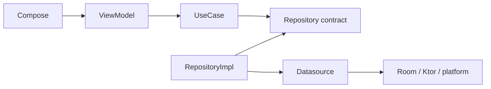

# Extending Sparrow

Use this page as a practical checklist when adding functionality.

## Add a normal client feature

1. Decide which existing feature module owns the behavior. Do not create a new module for one screen unless it has a real independent responsibility.
2. Add/extend unsuffixed domain models and a one-purpose `*UseCase`.
3. Add/extend a repository contract only if persistence/network behavior is needed.
4. Add data representations as `*Dto` and map them with `toNameDto()` / `toName()`.
5. Implement the repository in `data/repository`; repositories use their datasources/mappers and must not call repositories/use cases.
6. Keep datasources below repositories; a datasource never calls a repository.
7. Wire the implementation in the owning Koin module.
8. Make the ViewModel call use cases only.
9. Add presentation models as `*Ui` and map with `toNameUi()`.
10. Put required composable previews in the same file as their composable.
11. Add focused tests and run quality checks.



Use cases must not call other use cases. If a workflow spans repository boundaries, use the correct higher-level coordinator/caller rather than creating repository-to-repository or use-case-to-use-case dependencies.

## Add a data/domain/presentation model

Keep the naming symmetric:

```text
SomethingDto   data representation
Something      domain representation
SomethingUi    presentation representation
```

and mappings target the destination by name:

```kotlin
toSomethingDto()
toSomething()
toSomethingUi()
```

Room entities remain `SomethingEntity`; wire packets remain explicit protocol packet/content types.

## Add attachment/chat content

`:feature:attachments` owns attachment source data, blob transfer, cache, saved attachment storage and attachment management. `:feature:media` owns platform media/file access/rendering/export.

`:feature:chats` owns the chat representation:

```text
MessagePartDto -> MessagePart -> MessagePartUi
```

When adding a new attachment type, extend the attachment source/protocol behavior in the attachment-owning boundary, then map it into the typed chats part variants. Do not make Direct/Group messages expose the attachment module's source model directly, and do not introduce parallel top-level fields for every attachment kind.

## Add Direct-chat behavior

Stay inside the Direct path where possible:

```text
domain/usecase/direct
domain/repository/direct
domain/model/direct
data/direct/...
presentation/direct/...
```

Use existing Direct components rather than routing the change through Group code.

## Add Group behavior

First decide whether it is message sending/delivery, membership/invitation/activation/admin, group security/epoch, verification, typing or presentation only. Put it in the corresponding Group package/coordinator. Read [Chats architecture](../architecture/chats.md) before changing this area.

## Add platform behavior

Keep common contracts/models in `commonMain`. Put Android/iOS implementations in the owning module's `androidMain`/`iosMain` top-level `device` responsibility. Do not introduce Android APIs into common code or create a nested `data/device` package for convenience.

## Add a new application packet

1. Define the packet in `:core:protocol` and update `PacketCodec` support as required.
2. Decide which feature owns its meaning.
3. Add an explicit incoming handler/route in that feature.
4. Define outgoing creation in that feature, enqueue through `ProtocolOutbox` rather than calling WebSocket directly.
5. Decide its transport policy/encryption requirements deliberately.
6. Add routing-ID handling in `:feature:messaging` only if the packet needs a special routing rule.
7. Add unit/integration tests for decode, policy, outgoing and incoming behavior.

Do not teach `:feature:transport` the business meaning of the packet.

## Add a server endpoint

1. Choose the owning service (`gateway`, `federation`, `mailbox`, registry, presence, push).
2. Put wire models in `server:protocol` only if they are genuinely shared across service/client boundaries.
3. Add authentication/replay/rate-limit handling appropriate to the endpoint.
4. Keep service persistence behind the service's store/database types.
5. Add readiness/metrics/logging where useful.
6. If operator-relevant, add a relative link to that deployment's `/index` page.
7. Update Caddy only if the path must be public.
8. Add server tests/smoke coverage.

## Change module dependencies

```bash
./gradlew architectureReport
./gradlew verifyArchitectureReport
```

Review the generated graph before committing.

## Finish the change

```bash
./gradlew qualityCheck
./gradlew allTests
```

For Android platform changes also run device tests; for server changes run the relevant Docker smoke test.
