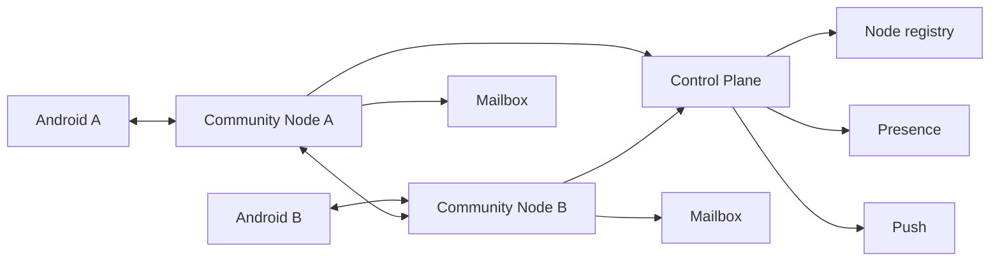

# Local development on Windows, macOS and Linux

This guide follows the **current** repository topology. For normal end-to-end testing use one Control Plane, one or more Community Nodes, and at least two Android app instances.

## 1. Configure client discovery

Repository-root `local.properties` can provide the build-time directory endpoints used by common KMP code. Keep the normal Android SDK entry as well.

```properties
CONTROL_PLANE_DIRECTORY_URL=https://<directory-host>/v1/control-planes
CONTROL_PLANE_RELEASE_DIRECTORY_URL=https://<release-directory-host>/v1/control-planes
```

The production discovery model is signed; do not model a new deployment as an unsigned hardcoded list of arbitrary nodes.

## 2. Build the Android client

Windows:

```powershell
.\gradlew.bat :androidApp:assembleDebug
```

macOS/Linux:

```bash
./gradlew :androidApp:assembleDebug
```

Android Studio can run the `androidApp` target directly.

## 3. Preferred server path: unified manager

The active release/runtime tooling is `server/unified`.

### Build a local unified bundle on Windows

From the repository root:

```text
server\unified\Build-SparrowServer.cmd
```

This builds:

```text
dist/sparrow-server.zip
```

Extract that ZIP into a dedicated runtime directory. On Windows run:

```text
Start-SparrowServer.cmd
```

The GUI can manage:

- **Control Plane only**;
- **Community Node only** (including multiple independent node instances);
- **Combined** Control Plane + Community Node.

The default fresh operator setup is Combined + LAN. **Install / Start** creates the normal generated runtime configuration, secrets, identities and named Docker volumes. On an existing intact runtime it validates ownership and updates selected backend images without intentionally rebuilding persistent identities/state.

### Linux/macOS unified CLI

The bundle provides `Start-SparrowServer.sh` and the macOS launcher `Start-SparrowServer.command`. Use the CLI help for exact commands; `install` is the equivalent of Windows **Install / Start**, while `start` is the no-pull lifecycle command. Node-only multi-instance management is available through the `nodes` command group.

## 4. Development directly from Compose

For source-level server work it is often faster to run the two production-shaped Compose projects directly.

### Control Plane

```bash
docker compose -f server/control-plane/docker-compose.yml up -d --build
docker compose -f server/control-plane/docker-compose.yml ps
```

The default LAN edge is normally reachable at:

```text
http://localhost:8390/index
```

Real FCM delivery requires an administrator-owned Firebase service-account configuration authorized for the Android Firebase project. The rest of the Control Plane can still be exercised without claiming a real push delivery succeeded.

### Community Node

A node must advertise addresses reachable by the app and other nodes. For a LAN source run, provide appropriate runtime endpoints and then:

```bash
docker compose -f server/community-node/docker-compose.yml up -d --build
docker compose -f server/community-node/docker-compose.yml ps
```

The default node edge is normally:

```text
http://<LAN_IP>:8490/index
```

Do not advertise `localhost` to an Android device or another host. Use the machine's reachable LAN/public address.

For multiple nodes, use separate Compose project names, ports, identities and volumes, or use the unified node manager/smoke tooling. Two processes sharing one node identity are not two independent Community Nodes.

## 5. What each server component is for



The Control Plane handles discovery/presence/push. Community Nodes handle client WebSockets, federation, encrypted mailbox envelopes and encrypted attachment blobs. Application messages are encrypted client-side before these transport layers.

## 6. Independent Control Plane Directory

`server/control-plane-directory` is a **separate operator-only service**, not something every developer/node must install and not part of the public `sparrow-server.zip`.

Use it only when testing the signed multi-Control-Plane discovery/registration layer itself. Its source includes private installer/admin tooling and persistent signing state. A public client should consume only its public signed endpoints, never its admin listener/token.

For ordinary local testing, a Combined unified installation can use its local Control Plane directly; a Node-only installation can be configured against an existing Control Plane. The signed independent directory is an optional advanced path.

## 7. Observe the system

Control Plane `/index` links to registry, presence, push and node information. Community Node `/index` links to gateway, Control Plane advertisement, federation and mailbox diagnostics.

Useful Docker commands:

```bash
docker compose -f server/control-plane/docker-compose.yml logs -f
docker compose -f server/community-node/docker-compose.yml logs -f
```

Android Developer Settings should show the verified discovery candidates/current node and transport state. Internal transport failures should go to diagnostics/error logging rather than replacing the user-facing online/offline status with raw TLS or routing exceptions.

## 8. Test important runtime cases

A useful local test matrix includes:

- two apps on one node;
- apps on two different Community Nodes (federation);
- recipient offline -> mailbox -> reconnect/fetch;
- Community Node loss -> client failover/reconnect;
- temporary Control Plane outage with cached verified discovery;
- invitation acceptance and Direct authorization;
- group invitation/welcome/activation;
- identity restore/reconnection and pending identity replacement review;
- encrypted attachment upload/download;
- local voice recording/playback/transcription;
- link preview server fetch + client DB cache.

For exact implementation flows, see [Runtime flows](../architecture/runtime-flows.md), [Identity recovery](../features/identity-recovery.md), [Invitations](../features/invitations.md), and [Server runtime/build/deployment](../server/runtime-build-deployment.md).
