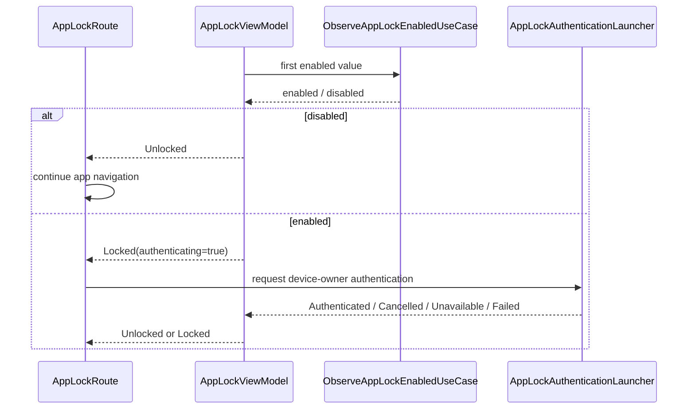

# App lock

`:feature:applock` provides the local application-lock boundary. The setting is exposed from Settings, while authentication is delegated to a platform `AppLockAuthenticationLauncher`.

## Main classes

- `AppLockRepository` / `AppLockRepositoryImpl` — persisted enabled/disabled setting.
- `ObserveAppLockEnabledUseCase` — observes the lock preference.
- `SetAppLockEnabledUseCase` — updates the preference.
- `AppLockViewModel` — resolves `Loading`, `Locked` or `Unlocked` presentation state.
- `AppLockRoute` — launches device-owner authentication and renders `AppLockScreen` while locked.
- `AppLockAuthenticationLauncher` — expect/actual platform authentication boundary.

Android uses the platform authentication implementation under `feature/applock/src/androidMain`; the common presentation layer does not depend on Android APIs.

## Runtime flow

If the user cancels, `AppLockViewModel` leaves the app locked and stops the active prompt. The lock screen can request authentication again. Authentication failures are logged through a class-local `SparrowLog` tag; they do not silently unlock the app.

## Settings integration

`SettingsViewModel` observes the app-lock preference. `SettingsScreen` requires device-owner authentication before applying a toggle change, using the same `AppLockAuthenticationLauncher` result model. This prevents enabling/disabling the lock without authenticating on supported devices.
