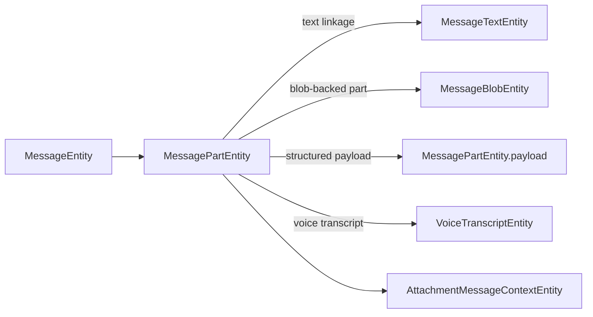

# Attachments and message parts

Sparrow now uses one shared message-part hierarchy in `:core:base`. Attachment transfer/storage lives in `:feature:attachments`, media selection/viewing lives in `:feature:media`, and chat messages carry `MessagePart` values rather than a second chat-specific attachment model.

## Shared hierarchy

`core/base/.../messagepart` defines aligned representations:

```text
MessagePartDto   data/protocol representation
MessagePart      domain representation
MessagePartUi    presentation representation
```

Current concrete parts are:

- `Text` / `TextDto` / `TextUi`
- `Image` / `ImageDto` / `ImageUi`
- `Video` / `VideoDto` / `VideoUi`
- `File` / `FileDto` / `FileUi`
- `Voice` / `VoiceDto` / `VoiceUi`
- `Location` / `LocationDto` / `LocationUi`
- `Contact` / `ContactDto` / `ContactUi`
- `Poll` / `PollDto` / `PollUi`

Image and video are distinct concrete types. The older combined `ImageVideo` chat model is no longer the source of truth.

## Ownership

`:feature:attachments` owns:

- `BlobTransferDataSource` — encrypted blob upload/download;
- `MessageAttachmentDataSource` — persistence/cache coordination;
- `MessageAttachmentFileDataSource` — local cache and saved-copy filesystem access;
- `LocalAttachmentDataSource` — conversation storage copies;
- `AttachmentContentDataSource` — resolves part content for presentation;
- `MessageAttachmentOperationsRepository` — persistence/update/delete operations used by chats;
- `MessageAttachmentRepository` — loading/storage/transcript-facing contract;
- `MessageAttachmentCacheCoordinator` — incoming cache coordination;
- storage/management screens and `AttachmentViewModel`.

`:feature:media` owns gallery/camera/file selection, `MediaItemUi`, viewers and export. `:feature:voice` owns recording/playback/transcription while reusing the shared `Voice` part and attachment persistence.

## Persistence

Message-part metadata is split by concern:



`MessagePartEntity` stores `id`, `messageId`, `position`, `type` and optional `payload`. `MessageBlobEntity` stores blob capabilities, crypto material, media metadata and `localFilePath`. Database schema version is **54**.

Migration `MessagePartPayloadMigration53To54` moved legacy `message_structured.json` into `message_parts.payload` and drops the `message_structured` table. The old entity source file remains only as historical/migration source; it is not registered in `SparrowDatabase` v54.

Poll persistence is special only in composition: `MessagePartPersistenceMapper.flattenForPersistence()` stores the `PollDto` plus each nested image as individual persisted parts. The poll JSON goes into `MessagePartEntity.payload`; nested image binary metadata goes through `MessageBlobEntity`.

## Cache and receiver refresh

Incoming blob data is cached locally and the DB stores the resolved local path in `MessageBlobEntity.localFilePath`. Presentation mapping must carry `localFilePath` / `thumbnailFilePath` forward into `ImageUi`, `VideoUi` and `MediaItemUi`; the renderer should not invent a second cache.

Room observations that render media must react to blob-path updates as well as part-row updates. This matters on the receiving side: the message can exist before the blob cache finishes, so a later `localFilePath` update must cause the mapped UI to refresh.

## Limits

`MessageAttachmentPolicy` is the domain source for size/count validation. Creation flows validate both per-part and total payload constraints before sending. Normal composer selection supports up to the configured attachment maximum; poll media is images-only and is validated against the same image/total limits.

## Location and contact

Location and contact are typed message parts. Their detailed payloads use attachment content encoding/loading, while presentation receives `LocationUi` / `ContactUi`. They are not modeled as generic nullable file fields.

## Saved media/files screens

`AttachmentStorageViewModel` exposes per-conversation storage summaries. `AttachmentManagementViewModel` drives the Media/Files management tabs using `ObserveLocalAttachmentsUseCase` and `DeleteLocalAttachmentsUseCase`.

The Media branch maps image/video parts to `MediaItemUi`; cache paths must be preserved by `MessagePartMediaMapper` so thumbnails do not remain in a permanent loading state.
