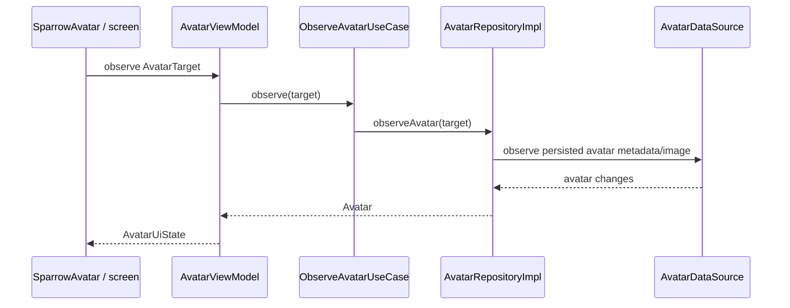
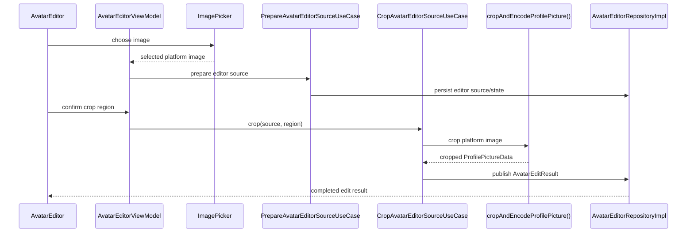

# Avatars and profile-picture editing

Sparrow keeps avatar loading and editing in the dedicated `:feature:avatar` module. Chat, contacts and group UI consume avatar presentation state instead of passing image `ByteArray` values through large composable trees.

## Module boundary

The active production module is `:feature:avatar`.

Important types:

- `AvatarTarget` identifies what is being rendered: the local user, another user, or a group.
- `AvatarRepository` / `AvatarRepositoryImpl` expose observable avatar state.
- `AvatarEditorRepository` / `AvatarEditorRepositoryImpl` own editor input/output state.
- `AvatarDataSource`, `LocalAvatarImageDataSource` and `LocalAvatarEditorDataSource` implement local data access.
- `ObserveAvatarUseCase` is the read-side domain entry point.
- `PrepareAvatarEditorSourceUseCase`, `CropAvatarEditorSourceUseCase`, `ConsumeAvatarEditResultUseCase` and `ClearAvatarEditorUseCase` implement the editor flow.
- `AvatarViewModel` maps repository state to `AvatarUiState`.
- `AvatarEditorViewModel` maps the edit workflow to `AvatarEditorUiState`.
- `SparrowAvatar` is the reusable presentation component.
- `ImagePicker` is the multiplatform picker abstraction; `cropAndEncodeProfilePicture()` (declared in `ProfilePictureCropper.kt`) is the expect/actual crop/encode boundary with Android/iOS implementations.

## Read flow

`AvatarRepositoryImpl` keeps target-scoped observable state and image caching so a timestamp or image change can update the relevant avatar without forcing callers to carry raw image bytes throughout higher-level UI state.

## Edit flow

The editor itself does not decide whether the resulting avatar belongs to identity, contact or group persistence. Its output is consumed by the owning feature, preserving the avatar module as a reusable image/editing boundary.

## Platform code

The common module declares `ImagePicker` and the expect function `cropAndEncodeProfilePicture()`. Platform implementations live in `androidMain` and `iosMain`, keeping picker/bitmap APIs out of common presentation/domain code.

## Why this module exists

The dedicated module prevents chat screens from owning avatar decoding/caching and keeps image selection/cropping separate from identity, contact and group business rules. This is especially important for recomposition: conversation list rows and message screens should observe only the avatar target they render rather than rebuilding broad screen state whenever one image changes.
