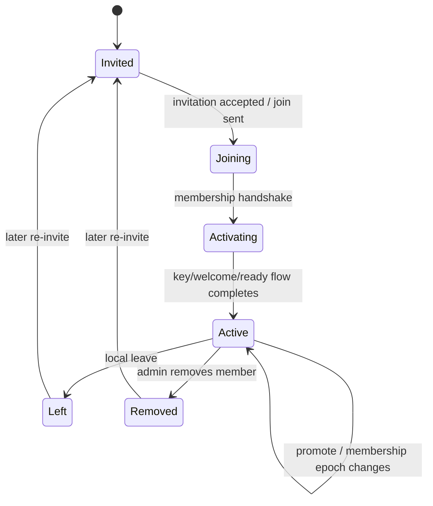

# Chats and current messaging features

Android currently implements separate Direct and Group conversation stacks.

## Direct chats

Current Direct-chat behavior includes:

- creating/keeping a conversation after invitation acceptance;
- end-to-end protected message payloads when identity state permits;
- persistent local outbox;
- queued/sending/sent/delivered/read state;
- retry of failed outgoing messages;
- unread/read handling;
- typing indicator;
- identity/security state surfaced in the UI;
- deletion/revocation flows kept separate from Group membership logic.

Core Direct classes:

- `DirectViewModel`
- `DirectConversationRepositoryImpl`
- `DirectMessageRepositoryImpl`
- `DirectOutgoingMessageProcessor`
- `DirectIncomingPacketProcessor`
- `DirectMessagePacketHandler`
- `DirectConversationStorage`
- `DirectMessageDeliveryCoordinator`
- `DirectMessageDeliveryStateMachine`
- `DirectTypingRepositoryImpl`

## Group chats

Current Group behavior includes:

- group creation;
- invitations and invitation acceptance/decline;
- membership activation/welcome flows;
- adding/removing members;
- multiple admins and member promotion;
- leave/admin-transfer requirements;
- member verification/snapshot synchronization;
- group security epochs/key distribution;
- per-active-recipient encrypted message fan-out;
- per-recipient delivered/read aggregation;
- Group typing indicators;
- keeping Direct and Group state machines/repos/UI paths independent.

Core Group classes:

- `GroupViewModel`
- `GroupConversationRepositoryImpl`
- `GroupMessageRepositoryImpl`
- `GroupMembershipRepositoryImpl`
- `GroupOutgoingMessageProcessor`
- `GroupIncomingPacketProcessor`
- `GroupPacketHandlerRegistry`
- `GroupMembershipCoordinator`
- `GroupInvitationCoordinator`
- `GroupMembershipActivationCoordinator`
- `GroupMembershipAdministrationCoordinator`
- `GroupMembershipDeletionCoordinator`
- `GroupEpochCoordinator`
- `GroupMembershipStateMachine`
- `GroupSecurityManager`
- `GroupMessageDeliveryCoordinator`
- `GroupMessageDeliveryStateMachine`
- `GroupTypingRepositoryImpl`

There is **no orphaned-group mode** in the current architecture.

## Membership lifecycle

This is a conceptual guide; the source of truth is `GroupMembershipStateMachine` plus the invitation/activation/admin coordinators.

## Per-recipient history/delivery

Group messages are associated with the current epoch recipients. The sender stores recipient delivery rows and sends one packet per recipient. This supports correct per-member delivery/read progress and prevents a simple “send to every contact ever associated with this group” model.

## Shared overview only

`ConversationOverviewRepositoryImpl` combines Direct and Group projections only for the overview/list. It is not evidence that Direct/Group repositories should be merged.

For the package-level red line, read [Chats architecture](../architecture/chats.md).
