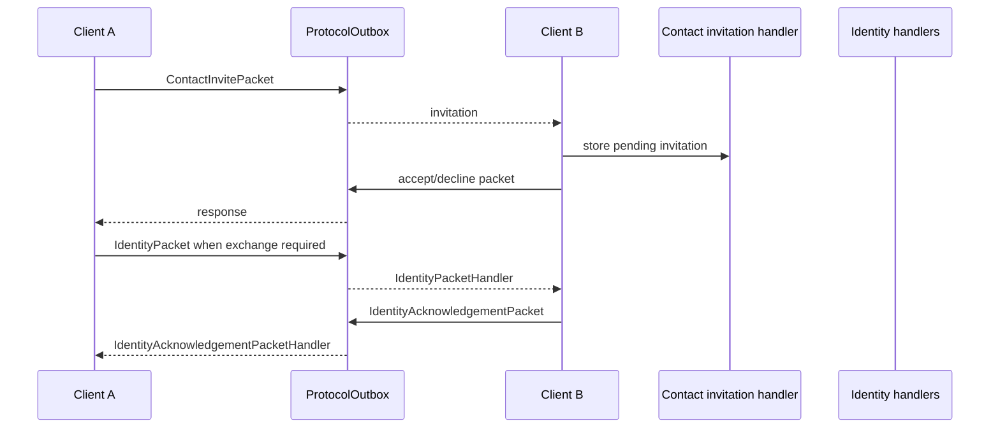

# Contacts and invitations

`:feature:contacts` owns SecureChat contacts, invitation state, identity exchange, verification and blocklist behavior. `:feature:contactimport` owns manual/QR import presentation and scanning.

## Current Android features

- import/link device contacts;
- normalize phone numbers and merge them with existing SecureChat contacts;
- manually import/share identities;
- send/receive contact invitations;
- accept, decline, decline+block;
- maintain a blocked-contact list;
- exchange current public identities;
- show identity/security state;
- verify contacts using safety numbers or QR flows.

## Important classes

Repositories:

- `ContactRepository` / `ContactRepositoryImpl`
- `IdentityInvitationRepository` / `IdentityInvitationRepositoryImpl`
- `IdentityExchangeRepository` / `IdentityExchangeRepositoryImpl`
- `ContactKeyExchangeRepository` / `ContactKeyExchangeRepositoryImpl`
- `ContactVerificationRepository` / `ContactVerificationRepositoryImpl`

Incoming handlers:

- `ContactInvitePacketHandler` / `ContactInviteAcceptedPacketHandler` / `ContactInviteDeclinedPacketHandler` / `ContactReadyPacketHandler`
- `IdentityPacketHandler`
- `IdentityAcknowledgementPacketHandler`
- `ContactVerificationReceiptPacketHandler`

Use cases include:

- `AcceptContactInvitationUseCase`
- `DeclineContactInvitationUseCase`
- `DeclineAndBlockContactInvitationUseCase`
- `BlockContactUseCase` / `UnblockContactUseCase`
- `EnsureIdentityExchangeStartedUseCase`
- `GetContactSafetyNumberUseCase`
- `VerifyContactUseCase`
- `ImportDeviceContactsUseCase`
- `ImportContactUseCase`

## Contact import/merge

`ContactMergeService` centralizes merge decisions so importing a device contact does not intentionally create duplicates for an already-known SecureChat identity/phone number.

## Invitation and identity exchange

The transport module carries these packets but does not decide invitation/verification state.

## Verification

`GetContactSafetyNumberUseCase` derives the current comparison value from local and remote public identity material. `VerifyContactUseCase` stores the explicit verification decision. If remote identity material changes, the old verification must not silently be treated as verification of the new identity.

QR verification is implemented through `:feature:contactimport`, including `VerifyContactByQrUseCase` and `VerifyContactQrViewModel`.
