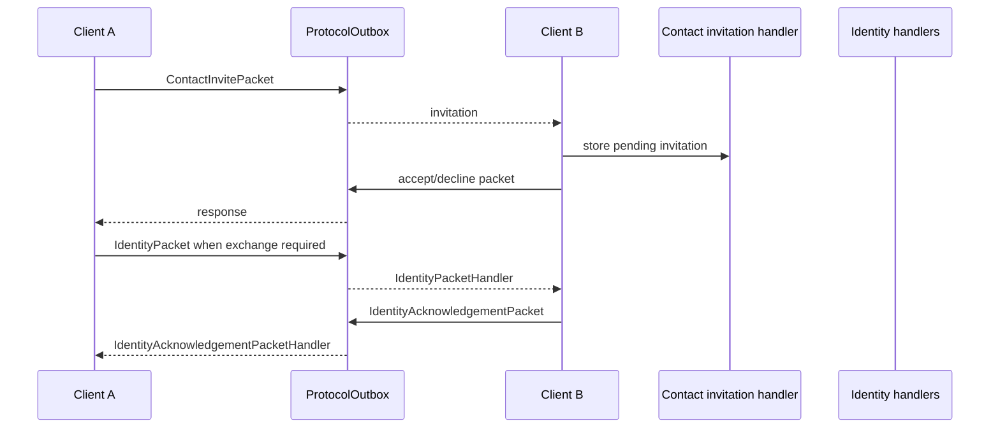

# Contacts and invitations

`:feature:contacts` owns Sparrow contacts, invitation state, identity exchange, verification and blocklist behavior. `:feature:contactimport` owns manual/QR import presentation and scanning.

## Current Android features

- import/link device contacts;
- normalize phone numbers and merge them with existing Sparrow contacts;
- manually import/share identities;
- send/receive contact invitations;
- accept, decline, decline+block;
- maintain a blocked-contact list;
- exchange current public identities;
- show identity/security state;
- verify contacts using safety numbers or QR flows.

## Important classes

Repositories:

- `ContactRepository` / `ContactRepositoryImpl`
- `IdentityInvitationRepository` / `IdentityInvitationRepositoryImpl`
- `IdentityExchangeRepository` / `IdentityExchangeRepositoryImpl`
- `ContactKeyExchangeRepository` / `ContactKeyExchangeRepositoryImpl`
- `ContactVerificationRepository` / `ContactVerificationRepositoryImpl`

Incoming handlers:

- `ContactInvitePacketHandler` / `ContactInviteAcceptedPacketHandler` / `ContactInviteDeclinedPacketHandler` / `ContactReadyPacketHandler`
- `IdentityPacketHandler`
- `IdentityAcknowledgementPacketHandler`
- `ContactVerificationReceiptPacketHandler`

Use cases include:

- `AcceptContactInvitationUseCase`
- `DeclineContactInvitationUseCase`
- `DeclineAndBlockContactInvitationUseCase`
- `BlockContactUseCase` / `UnblockContactUseCase`
- `EnsureIdentityExchangeStartedUseCase`
- `GetContactSafetyNumberUseCase`
- `VerifyContactUseCase`
- `ImportDeviceContactsUseCase`
- `ImportContactUseCase`

## Contact import/merge

`ContactRepositoryImpl` owns the current device-contact normalization/merge path. `ImportDeviceContactsUseCase` reads usable device contact/phone data and forwards import requests; the repository normalizes phone numbers and reuses an existing Sparrow contact when matching data is found instead of intentionally creating a duplicate.

## Invitation and identity exchange

The transport module carries these packets but does not decide invitation/verification state.

## Verification

`GetContactSafetyNumberUseCase` derives the current comparison value from local and remote public identity material. `VerifyContactUseCase` stores the explicit verification decision. If remote identity material changes, the old verification must not silently be treated as verification of the new identity.

QR verification is implemented through `:feature:contactimport`, including `VerifyContactByQrUseCase` and `VerifyContactQrViewModel`.

## Contact sharing as an attachment

The chat attachment action reuses the existing Contacts selection UI rather than introducing a separate contact picker. A selectable contact must have a phone number; one selected contact is encoded as a `CONTACT` attachment and sent immediately without requiring extra message text.

The received bubble shows the display name when available and the phone number. Tapping the loaded contact opens a confirmation flow before adding it to device contacts. Attachment blob transfer/storage ownership remains in `:feature:attachments`; the Contacts feature owns contact selection/contact-address-book behavior.
