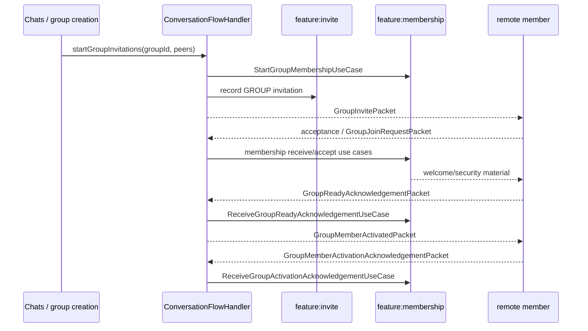

# Group membership and group security

`:feature:membership` owns Group membership lifecycle, member roles, epoch/security state, welcome/activation protocol and the membership result stream. It is intentionally separate from both `:feature:invite` and `:feature:chats`.

## Boundary

- Invite owns generic pending/declined/expired/failed invitation records.
- Membership owns whether a peer is an active/pending/removed Group member and the cryptographic epoch/member-key state.
- Chats owns conversation/message presentation and Group message semantics.
- `ConversationFlowHandler` coordinates the three.

## Main implementation classes

State/protocol/security:

- `GroupMembershipStateMachine`
- `GroupMembershipLock`
- `GroupMembershipPacketProtocol`
- `GroupMembershipPayloadEncoder`
- `GroupSecurityManager`
- `GroupWelcomeSecurity`
- `GroupActivationPolicy`
- `resolveInvitationUpdatedAt()` (in `GroupInvitationTimestampPolicy.kt`)

Repositories/datasources:

- `MembershipRepository` / `MembershipRepositoryImpl`
- `GroupMembershipRepository` / `GroupMembershipRepositoryImpl`
- `GroupSecurityRepository`
- `GroupMembershipStoreDataSource`
- `GroupSecurityStoreDataSource`
- `GroupEpochDataSource`
- `GroupEpochSecurityDataSource`
- `GroupMembershipLifecycleDataSource`
- `GroupOwnerWelcomeDataSource`
- `GroupIncomingWelcomeDataSource`
- `GroupMembershipActivationDataSource`
- `GroupIncomingActivationDataSource`
- `GroupReadyAcknowledgementDataSource`
- `GroupMembershipAdministrationDataSource`
- `GroupMemberPromotionDataSource`
- `GroupMemberRemovalDataSource`
- `GroupLeaveDataSource`
- `GroupMembershipDeletionDataSource`
- `GroupIncomingRemovalDataSource`
- `GroupIncomingDeletionDataSource`

## Group creation/invitation to activation

The detailed steps depend on which side is owner/member and whether identity review is required, but Group cryptographic activation always remains a Membership concern.

## Key use cases

Invitation/handshake:

- `StartGroupMembershipUseCase`
- `ReceiveIncomingGroupMembershipUseCase`
- `InspectIncomingGroupMembershipUseCase`
- `GetMembershipHandshakeUseCase`
- `AcceptGroupMembershipUseCase`
- `DeclineGroupMembershipUseCase`
- `ClearMembershipHandshakeUseCase`
- `DiscardSupersededMembershipsUseCase`

Welcome/activation:

- `AuthorizeIncomingGroupWelcomeUseCase`
- `OpenIncomingGroupWelcomeUseCase`
- `PersistIncomingGroupWelcomeUseCase`
- `CompleteIncomingGroupWelcomeUseCase`
- `SendGroupReadyAcknowledgementUseCase`
- `ReceiveGroupReadyAcknowledgementUseCase`
- `AuthorizeIncomingGroupActivationUseCase`
- `ApplyIncomingGroupActivationUseCase`
- `ReceiveGroupActivationAcknowledgementUseCase`
- `ConfirmGroupMembershipIdentityUseCase`

Administration:

- `ObserveGroupAdministrationUseCase`
- `PromoteGroupMemberUseCase`
- `RemoveGroupMemberUseCase`
- `TransferGroupAdminAndLeaveUseCase`
- `LeaveGroupUseCase`
- `GetGroupLeaveRequirementUseCase`
- `DeleteGroupMembershipUseCase`
- `MarkMembershipRemovedUseCase`

Message/metadata authorization:

- `GetGroupMessageMembershipAccessUseCase`
- `GetGroupTransportRoutingMembersUseCase`
- `ResolveGroupTransportEncryptionPublicKeyUseCase`
- `AuthorizeGroupMetadataUseCase`
- `GetGroupPinSenderSigningKeyUseCase`
- `GetGroupCurrentEpochUseCase`

## Membership result stream

`ObserveMembershipResultsUseCase` exposes durable domain results. `MembershipResultObserver` in `:feature:conversationorchestration` consumes them and calls `ConversationFlowHandler.onMembershipResult()`. This replaces cross-feature repository calls/coordinators.

## Admin leave

`GetGroupLeaveRequirementUseCase` decides whether a normal leave is possible or whether the last/required admin must transfer responsibility first. `TransferGroupAdminAndLeaveUseCase` performs the explicit transfer+leave path.

## Security epoch

`GroupSecurityManager` and the epoch datasources own current Group encryption state. Group message sending (`GroupOutgoingMessageProcessor`) asks Membership for the currently authorized recipients/encryption keys instead of embedding membership ownership inside Chats.
