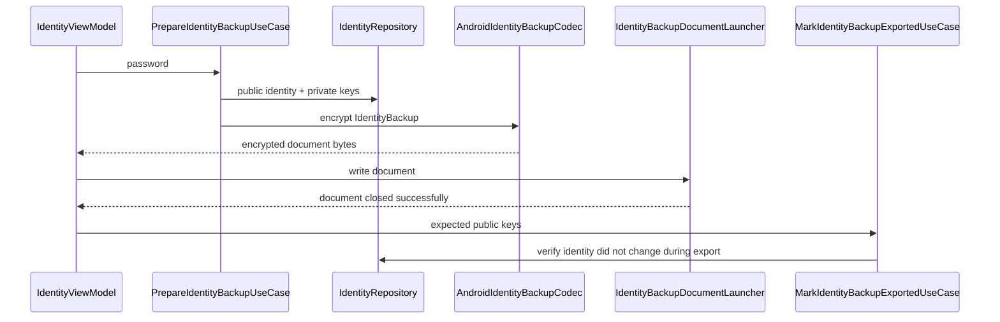
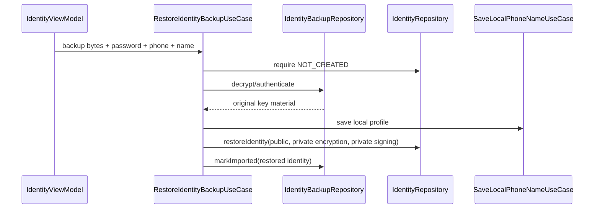
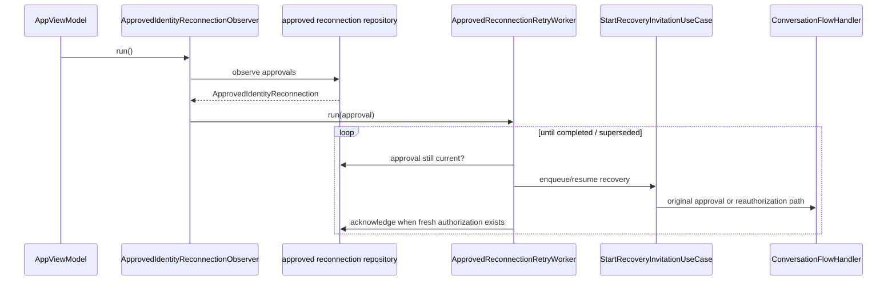

# Identity backup, recovery and reconnection

This page documents the current identity recovery implementation, including encrypted backup/restore, remote key replacement review, persistent approved reconnection, and retry after process/network interruptions.

## Four different concepts

Do not collapse these into one “recovery” action:

1. **Identity backup/export** — copy the current public identity plus both private keys into an encrypted backup document.
2. **Identity restore** — restore those exact cryptographic keys on a fresh local installation that has no identity yet.
3. **Remote identity replacement** — a contact now presents different keys; the old trust binding must not be silently overwritten.
4. **Conversation reconnection** — explicitly resume/re-authorize an existing peer relationship after an approved change or missing authorization.

## Identity backup

Production classes:

- `PrepareIdentityBackupUseCase`
- `MarkIdentityBackupExportedUseCase`
- `RestoreIdentityBackupUseCase`
- `GetIdentityBackupStatusUseCase`
- `IdentityBackupRepository`
- `IdentityBackupRepositoryImpl`
- `IdentityBackupCodec`
- `AndroidIdentityBackupCodec`
- `IdentityBackupStatusDataSource`
- `IdentityBackupDocumentLauncher`
- `IdentityBackupSection`
- `IdentityBackupPasswordDialog`
- `IdentityViewModel`

`IdentityBackup` contains `PublicIdentity`, the encryption private key and the signing private key. The model is explicitly documented in code as short-lived sensitive data and must never be logged or persisted unencrypted.

`PrepareIdentityBackupUseCase` requires a password of at least 12 characters, verifies the identity is `READY`, loads both private keys, encrypts through `IdentityBackupRepository`, and zeroes the in-memory private-key arrays in a `finally` block.

The backup status is keyed to the current signing+encryption public keys and is represented by `IdentityBackupStatus` (`NOT_BACKED_UP`, `EXPORTED`, `IMPORTED`).

## Restore after reinstall

`RestoreIdentityBackupUseCase` refuses to overwrite an existing local identity. It first decrypts/authenticates the backup, then saves the supplied local phone/name profile and calls `IdentityRepository.restoreIdentity(...)` with the original public identity and private keys. Restored private-key byte arrays are zeroed after use.

The backup restores identity key material; it is not a database backup of conversations/messages/membership rows.

## Incomplete identity recovery

`RecoverIncompleteIdentityUseCase` and `RecoverManualIdentityExchangeUseCase` recover interrupted identity setup/exchange state. `IdentityExchangeDataSource` persists the exchange state machine and contains replay helpers such as `recoverIncomingInviteReplay()`, `queueAcceptanceReplay()` and `queueReadyReplay()`.

## Detecting a changed remote identity

Relevant types:

- `PendingRemoteIdentityChange`
- `PendingRemoteIdentityChangeEntity`
- `PendingRemoteIdentityChangeDao`
- `PendingRemoteIdentityChangeDataSource`
- `PendingRemoteIdentityChangeRepository`
- `StagePendingRemoteIdentityChangeUseCase`
- `ApprovePendingRemoteIdentityChangeUseCase`
- `DeclinePendingRemoteIdentityChangeUseCase`
- `DismissPendingRemoteIdentityChangeUseCase`
- `ObservePendingRemoteIdentityChangesUseCase`
- `RemoteIdentityReplacementRequiredException`

When a packet would replace the key material bound to an existing peer, orchestration stages a `PendingRemoteIdentityChange` instead of silently accepting the replacement. This creates an explicit review point.

## Recovery inbox

`navigation.presentation.inbox.RecoveryInboxViewModel` observes pending identity changes and exposes the review actions in the application mailbox/inbox experience. `InvitationViewModel` receives the current recovery-request count so the inbox is not automatically closed while identity-review work remains.

This is intentionally adjacent to invitations in the UI but is a different persisted domain object.

## Approval becomes persistent reconnection work

Approving a pending key change creates an `ApprovedIdentityReconnection` persisted through:

- `ApprovedIdentityReconnectionEntity`
- `ApprovedIdentityReconnectionDao`
- `ApprovedIdentityReconnectionDataSource`
- `ApprovedIdentityReconnectionRepositoryImpl`
- `ObserveApprovedIdentityReconnectionsUseCase`
- `GetApprovedIdentityReconnectionUseCase`
- `AcknowledgeQueuedRecoveryInvitationUseCase`

Database migrations `PendingRemoteIdentityChangeMigration49To50`, `PendingRemoteIdentityChangeMigration50To51`, `ApprovedIdentityReconnectionMigration51To52` and `ApprovedIdentityOfferMigration52To53` show that this is durable state, not an in-memory UI event.

## App-lifetime retry

`AppViewModel` starts `ApprovedIdentityReconnectionObserver` after local identity readiness. The observer keeps one worker per approved peer and starts `ApprovedReconnectionRetryWorker`.

A transient Room observation failure is retried with capped exponential delay. The approved row remains until the recovery invitation has been queued/authorization becomes fresh, allowing recovery to survive process restart.

## `StartRecoveryInvitationUseCase`

This use case carefully distinguishes Direct recovery from Group membership recovery:

- If the approval maps to a `MembershipHandshake`, it resumes the Group path.
- A member-side Group offer remains in the mailbox for normal Group acceptance; it does not create a Direct invitation.
- An owner-side changed-key Group JOIN resumes through `ConversationFlowHandler.resumeApprovedGroupJoin()`.
- IDs with the `group-membership-` prefix are never converted into Direct recovery merely because the handshake disappeared.
- Direct recovery can create a conversation shell via `ConversationPort.getOrCreateConversation(peerId)`, but that shell alone does **not** grant transport authorization or flush queued messages.
- If the original invitation challenge/keys/timestamps are still complete and unexpired, `acceptApprovedOriginalIdentityChange()` resumes that exact flow.
- Otherwise `requestReauthorization(peerId)` starts a fresh authorization request.

## Explicit reconnection from an existing conversation

`ReconnectExistingConversationUseCase` delegates to `ConversationFlowHandler.startExplicitReconnection(peerId)`. This is the explicit “reconnect contact” path: the existing conversation can survive locally while authorization is renewed.

## Outgoing safety gate

Recovery approval does not bypass normal encryption requirements. `IdentityRecoveryOutboundGate`/the outgoing policy and `RequireDirectChatAuthorizationUseCase` prevent Direct application messages from being released until the required established identity/authorization state exists. `DirectOutgoingMessageProcessor` keeps waiting messages persisted until authorization is valid.

## Why a second normal invitation is a bug

An approved key replacement is supposed to resume the approved original identity/reconnection workflow. It is **not** supposed to generate an unrelated ordinary invitation after the conversation has already been established. The code therefore carries original invitation challenge/timestamps/key material in `ApprovedIdentityReconnection` and has explicit Group-vs-Direct guards in `StartRecoveryInvitationUseCase`.

## Local phone number

The current snapshot has `LocalIdentityProfileDataSource`, `GetLocalPhoneNumberUseCase`, `NormalizeLocalPhoneNumberUseCase`, `SaveLocalPhoneNameUseCase` and the initial identity/onboarding phone editor. It does **not** contain a completed post-creation phone-number migration/broadcast workflow that rewrites existing peer relationships. Documentation should not claim that such migration is implemented until dedicated production classes exist for it.
