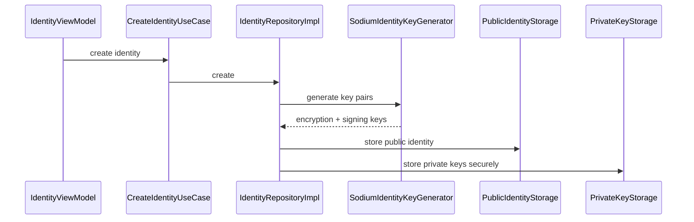

# Identity

`:feature:identity` owns the local cryptographic identity lifecycle and sharing UI.

## What an identity contains

The public identity contains the public encryption/signing keys and profile information required by the protocol. Private keys are kept local.

Key classes:

- `CreateIdentityUseCase`
- `IdentityRepositoryImpl`
- `SodiumIdentityKeyGenerator` in `:core:crypto`
- `PublicIdentityStorage` / `PrivateKeyStorage`
- `PublicIdentityStorageImpl`
- `AndroidPrivateKeyStorage`
- `IdentityLocalEncryptionKeyPairProvider`
- `IdentityLocalSigningKeyPairProvider`
- `CreateSharedIdentityUseCase`
- `DecodeSharedIdentityUseCase`

## Creation

Android private keys are wrapped using an Android Keystore AES key; see [Identity and key storage](../security/identity.md).

## Sharing/import

`ShareIdentityViewModel` and `CreateSharedIdentityUseCase` create the shareable payload/QR representation. Import/scanning lives in `:feature:contactimport`, which calls `ImportSharedIdentityUseCase` and contact-domain operations.

The imported payload is not automatically equivalent to “verified.” Verification is a separate user/security decision.

## iOS status

Some common identity code and limited iOS platform stubs exist, but the iOS application runtime is not currently usable. Do not interpret these source sets as completed iOS identity persistence/feature parity.
