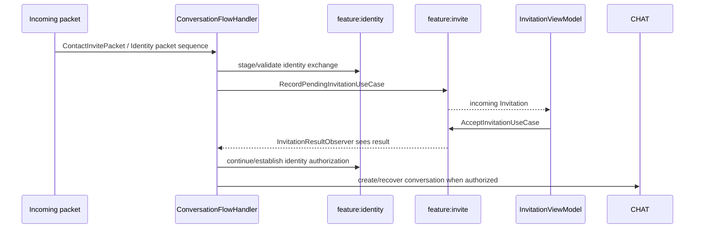
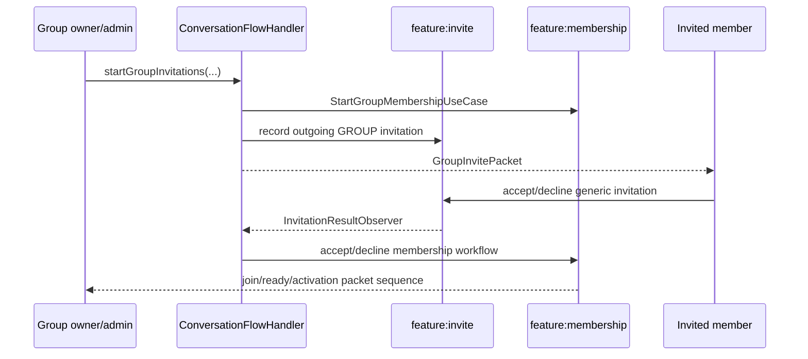

# Invitations

`:feature:invite` owns the **generic invitation lifecycle**. It does not implement Direct-chat cryptography or Group-membership activation itself.

## Domain model

`Invitation` stores:

- `invitationId`
- `payloadType: InvitationPayloadType` (`DIRECT`, `GROUP`)
- `payloadId`
- `peerId`
- display/secondary text snapshot
- `direction: InvitationDirection` (`INCOMING`, `OUTGOING`)
- `status: InvitationStatus` (`PENDING`, `DECLINED`, `EXPIRED`, `FAILED`)
- expiry/update timestamps
- unread-update state

Accepted invitations disappear from the normal pending list and are represented as result events rather than a permanent `ACCEPTED` row in `InvitationStatus`.

## Core classes

Domain/repository:

- `InvitationRepository`
- `InvitationRepositoryImpl`
- `InvitationLifecycleDataSource`
- `InvitationLifecycleRecord`
- `InvitationLifecycleStatus`
- `InvitationResult`
- `InvitationResultAction`
- `InvitationResponse`

Use cases:

- `ObserveInvitationsUseCase`
- `ObserveInvitationsContextUseCase`
- `ObservePendingInvitationsUseCase`
- `ObservePendingInvitationCountUseCase`
- `ObserveInvitationResultsUseCase`
- `ObserveInvitationLifecycleStatusUseCase`
- `RecordPendingInvitationUseCase`
- `ShouldRecordPendingInvitationUseCase`
- `ValidatePendingInvitationUseCase`
- `AcceptInvitationUseCase`
- `DeclineInvitationUseCase`
- `DeclineAndBlockInvitationUseCase`
- `HandleInvitationResponseUseCase`
- `InvalidatePendingInvitationUseCase`
- `MarkInvitationTransportFailedUseCase`
- `MarkInvitationsViewedUseCase`
- `DeleteDeclinedOutgoingInvitationUseCase`

Presentation:

- `InvitationRoute`
- `InvitationsScreen`
- `InvitationViewModel`
- `InvitationUi`, `InvitationUiState`, `InvitationUiEvent`, `InvitationEffect`

Outbox integration:

- `InvitationOutboxDeliveryHandler`

## Incoming Direct invitation

The application does not treat “invite accepted in the UI” as “message can now be sent.” Direct authorization is only released after the identity exchange reaches the required established state.

## Outgoing Direct invitation

`ConversationFlowHandler.startDirectInvitation(peerId)` decides whether an existing established exchange/conversation already satisfies the request or whether an explicit fresh invitation/identity flow is required. The actual pending invitation row belongs to `:feature:invite`; identity packets belong to `:feature:identity`/`:core:protocol`.

## Group invitation

Group invite UI lifecycle still uses `:feature:invite`, but accepting a group invitation is not the same operation as authorizing a Direct chat.

`MembershipHandshake` and membership state are owned by `:feature:membership`, not by the invitation table.

## Result observer and process restart

`InvitationResultObserver.run()` observes `ObserveInvitationResultsUseCase`. On its first emission it can replay still-relevant accepted results, using:

- `ConversationFlowHandler.recoverAcceptedDirectInvitation()`
- `ConversationFlowHandler.recoverAcceptedGroupInvitation()`

This is what makes an accepted invitation resilient to observer startup timing/process restart rather than relying on a one-shot UI callback.

## Inbox behavior

`InvitationViewModel` combines incoming/outgoing data with the selected tab, marks unread updates as viewed, and automatically closes the Incoming screen when there are neither incoming invitations nor recovery-review requests.

Recovery identity-change requests are displayed in the same mailbox/inbox surface, but they are **not ordinary `Invitation` rows**. See [Identity backup, recovery and reconnection](identity-recovery.md).
