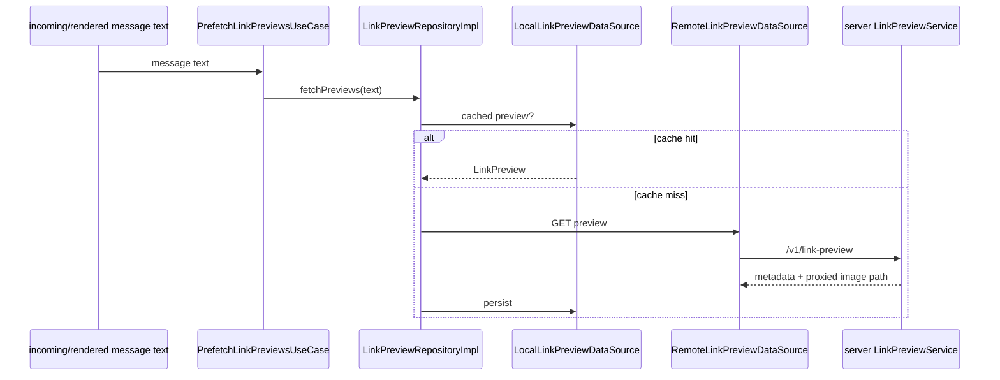

# Link previews

Link previews have a client feature module and a dedicated server service.

## Client classes

- `LinkPreviewRepository` / `LinkPreviewRepositoryImpl`
- `LocalLinkPreviewDataSource`
- `RemoteLinkPreviewDataSource`
- `GetLinkPreviewUseCase`
- `PrefetchLinkPreviewsUseCase`
- `LinkPreviewViewModel`
- `LinkPreview` Compose component
- `LinkPreviewUi`, `LinkPreviewUiState`, `TextContentPart`
- Room `LinkPreviewEntity` / `LinkPreviewDao`

`LinkPreviewRepositoryImpl.fetchPreviews(text)` extracts distinct HTTP(S) URLs in application scope and prefetches each preview. `getPreview(url)` is cache-first; legitimate previews without an image are cached too.

## Server classes

`:server:link-preview` contains:

- `Application.kt`
- `LinkPreviewService`
- `LinkPreviewFetcher`
- `LinkPreviewHtmlParser`
- `LinkPreviewUrlValidator`
- request/response models

`LinkPreviewService` keeps TTL caches for metadata and proxied image-source mappings. Image IDs are SHA-256 hashes of the source image URL; returned metadata uses `/v1/link-preview/images/<id>` rather than exposing the original image URL directly to the client.

