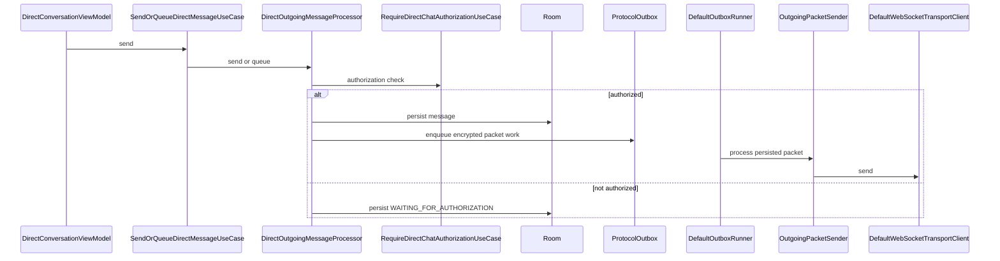
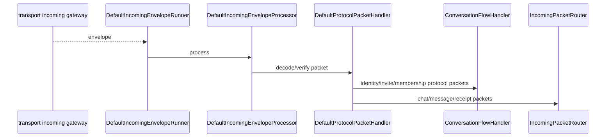
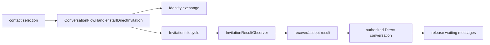

# Message, invitation and transport flow

This page connects the current client layers from UI to encrypted network delivery.

## Direct send

A queued Direct message is released with `DirectOutgoingMessageProcessor.releaseWaitingForAuthorization()` only after orchestration establishes fresh authorization. There is no plaintext fallback.

## Incoming delivery

## Direct invitation/authorization

The generic invitation row is owned by `:feature:invite`, the cryptographic exchange by `:feature:identity`, and the cross-feature sequence by `ConversationFlowHandler`/`InvitationResultObserver`.

Explicit recovery/reconnection is documented separately in [Identity recovery](identity-recovery.md).

## Group send

`GroupOutgoingMessageProcessor` validates active membership, obtains current routing members from Membership, encrypts for the current Group epoch and queues one packet per active recipient. Group security state is not inferred from the invitation table.

## Offline mailbox

When direct online routing is unavailable or policy selects mailbox delivery, `OutgoingPacketSender` uses the recipient mailbox route/capability resolved by orchestration/transport. Client mailbox lifecycle is implemented around `DefaultMailboxCoordinator`, `DefaultMailboxCapabilityLifecycle`, `MailboxRouteProvisioner`, `MailboxPendingSynchronizer` and `HttpMailboxGateway`.

The server `mailbox` service stores opaque encrypted envelopes behind recipient-selected capabilities. Push is a wake-up path, not decryption/interpretation by the server.

## Delivery/read receipts

Protocol receipts are routed back into Chats. Direct and Group maintain distinct recipient/delivery state logic (`DirectOutboxDeliveryHandler`, `GroupOutboxDeliveryHandler` and their data paths), while generic outbox execution remains in `:feature:messaging`.
