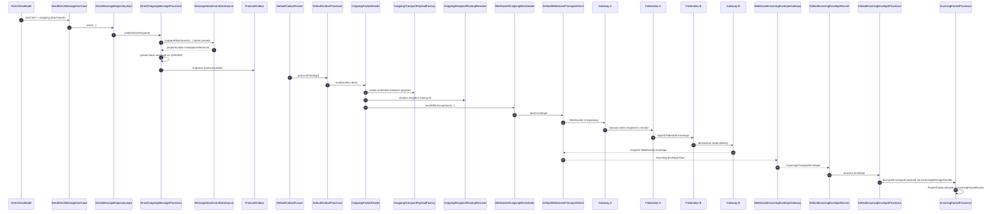
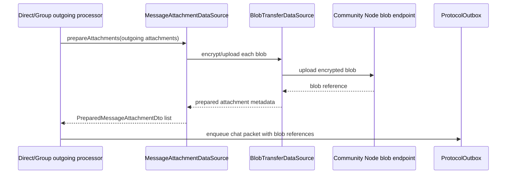
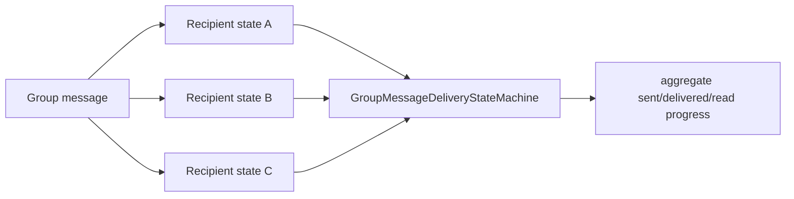
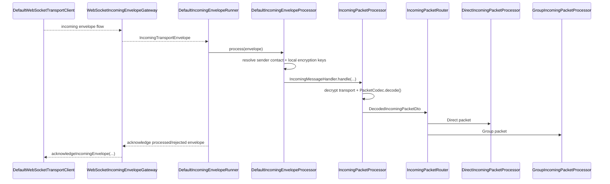
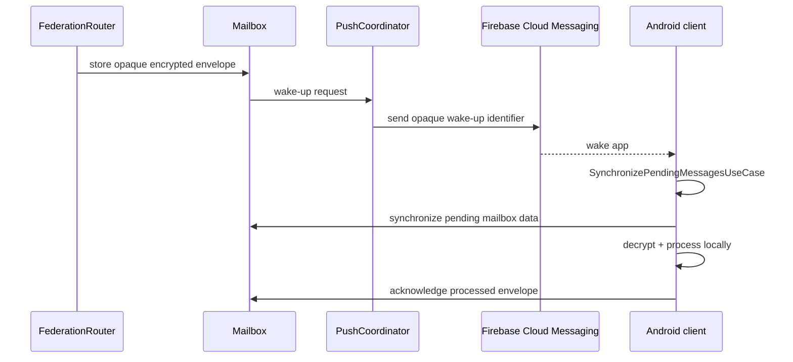

# Message transport flow

This page follows the current message path through the client and server classes that actually participate in delivery.

## Direct message: client A to client B



If both clients are reachable through the same Community Node, the server can deliver locally without the cross-node federation hop.

## Direct outgoing classes

The Direct conversation path remains deliberately separate from Group messaging:

```text
DirectViewModel
  -> SendDirectMessageUseCase
  -> DirectMessageRepository
  -> DirectMessageRepositoryImpl
  -> DirectOutgoingMessageProcessor
  -> ProtocolOutbox
```

`DirectOutgoingMessageProcessor` validates message content/authorization, prepares attachment blobs when present, persists the local outgoing message, creates the `ChatMessagePacket`, links its packet ID and queues it in `ProtocolOutbox`.

The shared outbox runtime then continues with:

```text
DefaultOutboxRunner
  -> DefaultOutboxProcessor
  -> OutgoingPacketSender
      -> OutgoingTransportPayloadFactory
      -> OutgoingRecipientRoutingResolver
      -> OutgoingWireSender / WebSocketOutgoingWireSender
  -> DefaultWebSocketTransportClient
```

`DefaultOutboxProcessor` owns persistent outbox state transitions and batching. `OutgoingPacketSender` decodes the already-created application packet, asks `OutgoingTransportPayloadFactory` for the required transport protection, resolves the destination with `OutgoingRecipientRoutingResolver`, then sends the encoded transport payload through `OutgoingWireSender`.

The outbox processes different recipient groups concurrently (up to eight recipient groups), while preserving ordering within one recipient group.

## Direct authorization / re-invitation

A Direct composer can be `READY`, `REINVITE_REQUIRED`, `REINVITE_PENDING` or `DISABLED`.

If authorization is missing but automatic re-invitation is allowed, `DirectViewModel` uses `QueueDirectMessageUntilAuthorizedUseCase` instead of sending the packet immediately. `DirectOutgoingMessageProcessor.queueUntilAuthorized(...)` prepares any attachments and persists the message with `WAITING_FOR_AUTHORIZATION`.

- acceptance calls `HandleAcceptedDirectInvitationUseCase`, which releases still-valid waiting messages back to `QUEUED` and enqueues their packets;
- decline calls `HandleDeclinedDirectInvitationUseCase`, which discards waiting messages;
- `DirectPendingAuthorizationMessagePolicy` expires waiting messages after two days.

Current-location and contact attachment actions use the same authorization behavior; they are sent as attachment-only messages with empty text.

## Attachment preparation and loading

When a Direct or Group message contains attachments, its outgoing processor asks `MessageAttachmentDataSource.prepareAttachments(...)` to prepare/upload them before the final chat packet is queued. The attachment feature owns the blob pipeline; chats receives prepared protocol attachment metadata/references.



Image, video, file, location and contact currently use this blob path. Incoming attachment metadata is stored with the message; bytes are loaded/cached through `:feature:attachments` when needed. Incoming image/video/file attachments can also get saved conversation copies, while location/contact blobs are excluded from the saved media/files tree.

## Group outgoing classes

Group messages intentionally use a separate conversation path:

```text
GroupViewModel
  -> SendGroupMessageUseCase
  -> GroupMessageRepository
  -> GroupMessageRepositoryImpl
  -> GroupOutgoingMessageProcessor
  -> ProtocolOutbox
```

`GroupOutgoingMessageProcessor`:

1. validates message content and active membership;
2. obtains current security-epoch recipients;
3. prepares attachment blobs when present;
4. encodes `GroupMessageContent` and encrypts it through `GroupSecurityManager`;
5. creates one `GroupChatMessagePacket` per active recipient;
6. stores one `MessageRecipientStateEntity` per recipient;
7. enqueues each packet separately.

This is why Group delivered/read state is derived from per-recipient state rather than Direct-chat state.



Only current active members are selected from the current security epoch. A removed member is not retained as a normal recipient merely because that contact belonged to the group previously.

## Transport protection and routing

`OutgoingTransportPayloadFactory` applies `OutgoingPacketTransportPolicy` and encrypts through `TransportMessageCipher` when the packet/contact state requires it. Some bootstrap/invitation packets must be routable before mutual identity material exists, so the policy explicitly handles those exceptions.

`OutgoingRecipientRoutingResolver` chooses bootstrap/direct/group routing based on the concrete `SparrowPacket`, using `ContactRoutingDataSource` and `GroupRoutingDataSource`.

`WebSocketOutgoingWireSender` then selects the local sender routing ID (`LocalRoutingIdProvider` or `LocalBootstrapRoutingIdProvider`), chooses a known recipient mailbox route when one is available, and sends either a normal `TransportEnvelope` or `FederatedEnvelope` through the WebSocket client.

## Incoming client boundary



`DefaultIncomingEnvelopeProcessor` also reconciles known contact routing after a successfully processed envelope. Permanently rejected envelopes are acknowledged and discarded; unknown-sender envelopes are not acknowledged by `DefaultIncomingEnvelopeRunner`.

## Offline recipient

When the recipient is not currently reachable through the live route, federation can use a recipient-selected mailbox route and store the encrypted/federated envelope in that mailbox. `MailboxPushNotifier` asks the push service for a wake-up. Android FCM wakes the app/background worker, and `SynchronizePendingMessagesUseCase` processes push pending envelopes and also asks `MailboxCoordinator` to synchronize mailbox-delivered envelopes.



Push remains a wake-up mechanism; the server does not need conversation plaintext to provide offline delivery.

## Receipts

`DeliveryReceiptPacket` and `ReadReceiptPacket` use shared protocol formats, but `ReceiptIncomingPacketRouter` dispatches them to Direct or Group-specific receipt handling. Group receipt processing updates recipient-specific state; Direct receipt processing updates Direct message state.

## Typing

Typing is ephemeral and intentionally separate from durable message delivery. The WebSocket/gateway/federation path can route typing events, but typing is not stored in message history or recovered from mailbox history.
