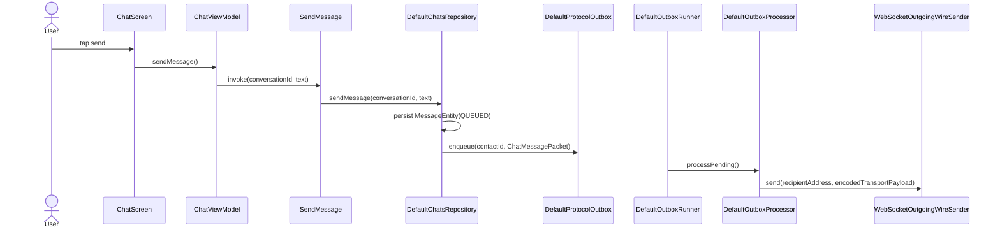
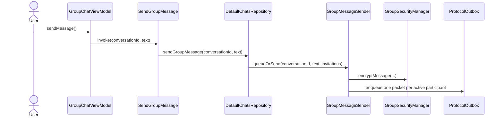

# Conversation, Messaging, and Delivery Flow

This document follows the production call chain for direct and group conversations. Class and
function names are the names used by the current source code.

For module ownership, read [Messaging Boundary](../architecture/messaging-boundary.md).

## Representations and ownership

| Representation | Important types | Owner |
|---|---|---|
| Conversation UI | `ChatUiState`, `ChatMessageUi`, `GroupVerificationSummaryUi` | `:feature:chats` |
| Persistent chat data | `ConversationEntity`, `MessageEntity`, `MessageRecipientStateEntity` | `:data:database` |
| Protocol work | `SecureChatPacket`, `ProtocolOutboxItem` | `:core:protocol` |
| Transport payload | `EncryptedTransportPayload`, `TransportEncryptionMode` | `:core:crypto` |
| Gateway frame | `TransportEnvelope`, `GatewayClientMessage`, `GatewayServerMessage` | `:feature:transport` |

A protocol packet describes meaning. A transport payload describes pairwise protection. A gateway
envelope describes routing. Group message content also has its own authenticated group encryption
inside the protocol packet.

## Opening conversations

### Direct conversation

The navigation path is:

```text
AppNavigation
  -> AppDestination.Chat
  -> ChatRoute
  -> koinViewModel<ChatViewModel>(conversationId, contactId, contactName)
  -> ChatScreen
```

`ChatViewModel.uiState` combines `ObserveConversation`, the current contact identity state, message
input, typing state, and errors. `ChatRoute` calls `ChatViewModel.markConversationRead()` when the
screen opens and whenever the observed incoming message IDs change.

### Group conversation

The navigation path is:

```text
AppNavigation
  -> AppDestination.GroupConversation
  -> GroupChatRoute
  -> koinViewModel<GroupChatViewModel>(conversationId)
  -> koinViewModel<GroupVerificationViewModel>(conversationId)
  -> ChatScreen
```

`GroupChatViewModel` observes the group conversation and invitation state.
`GroupVerificationViewModel` observes the authoritative group-wide verification snapshot.
`GroupChatRoute` merges the verification counts into the `ChatUiState` rendered by `ChatScreen`.

The group header opens:

```text
AppDestination.Details
  -> DetailsRoute
  -> GroupDetailsFlow
  -> GroupDetailsScreen
```

## Direct-chat authorization

Knowing a contact's public keys is not permission to send direct messages. In automatic invitation
mode, the latest `IdentityInvitationEntity` for the contact must be
`IdentityHandshakeState.MUTUAL_UNVERIFIED`. Verification is an additional authenticity signal; it
does not replace invitation acceptance.

`ChatViewModel.uiState` applies the presentation guard:

```text
IdentityInvitationService.observeState(contactId)
  -> IdentityInvitationCoordinator.observeState(contactId)
  -> IdentityInvitationDao.observeLatestForContact(contactId)
  -> ChatViewModel.isDirectChatAuthorized(...)
  -> ChatUiState.isMessageInputEnabled
  -> ChatScreen disables MessageInput and the send button
```

`DefaultChatsRepository.sendMessage()` independently applies the data-layer guard through
`IdentityInvitationService.requireDirectChatAuthorization(contactId)` before creating either a
`MessageEntity` or `ChatMessagePacket`. `ChatMessagePacketHandler.handle()` applies the same check
before persisting an incoming direct message. UI state therefore cannot bypass the authorization
rule. `DefaultChatsRepository.retryMessage()` also repeats this check for a direct message, so a
failed pre-decline packet cannot be retried after authorization is removed.

An unauthorized incoming `ChatMessagePacket` fails with
`DirectChatAuthorizationRequiredException`. `IncomingMessageProcessor` acknowledges and drops that
packet instead of storing an invalid-message placeholder, so it cannot recreate a conversation
that the local user deleted.

If `IdentityInvitationCoordinator.receiveDeclined()` verifies a
`ContactInviteDeclinedPacket`, it stores `DECLINED`. The inviter's open chat immediately becomes
read-only even when the two contacts still have mutual or verified public keys. Opening the contact
again calls `IdentityExchangeStarter.ensureStarted(contactId)`; `IdentityInvitationCoordinator.start()`
creates a new invitation because only the latest accepted invitation authorizes the chat.

## Direct outgoing message



Exact behavior:

1. `ChatScreen` invokes `ChatViewModel.sendMessage()`.
2. `ChatViewModel.sendMessage()` trims the current input, clears it, calls `stopTyping()`, and
   invokes `SendMessage`.
3. `SendMessage.invoke()` delegates to `ChatsRepository.sendMessage()`.
4. `DefaultChatsRepository.sendMessage()` validates that the conversation is direct and calls
   `IdentityInvitationService.requireDirectChatAuthorization(contactId)`.
5. Only after authorization succeeds does it load the contact and create one `ChatMessagePacket`
   and one visible `MessageEntity`.
6. `ChatDao.upsertMessage()` persists the visible row with `MessageDeliveryStatus.QUEUED`.
7. `ProtocolOutbox.enqueue(contactId, packet)` persists the packet independently of the live
   WebSocket.
8. If enqueueing fails, `MessageDeliveryStateCoordinator.applyPacketEvent()` applies
   `MessageDeliveryEvent.SEND_FAILED`.

The UI never sends directly to `WebSocketTransportClient`.

## Persistent outbox and wire send

`DefaultOutboxRunner.start()` collects `ProtocolOutbox.observePending()` and drains work through
`OutboxProcessor.processPending()`. Reconnect recovery calls `requeueInterrupted()` and
`retryFailed()` before draining.

For each `ProtocolOutboxItem`, `DefaultOutboxProcessor` calls:

```text
processPending(limit)
  -> processItem(item)
  -> ProtocolOutbox.markProcessing(item.id)
  -> OutboxDeliveryStateListener.onProcessing(item.packetId)
  -> prepareAndSend(item)
      -> GetContact(item.contactId)
      -> PacketCodec.decode(item.encodedPacket)
      -> DefaultOutgoingTransportPayloadFactory.create(...)
          -> DefaultOutgoingPacketTransportPolicy.resolve(packet, contact)
          -> TransportMessageCipher.encryptForRecipient(...) when encryption is available
      -> TransportPayloadCodec.encode(...)
      -> OutboxDeliveryStateListener.onPrepared(...)
      -> ContactRoutingIdResolver.resolve(item.contactId)
      -> OutgoingWireSender.send(...)
      -> ProtocolOutbox.markSent(item.id)
  -> OutboxDeliveryStateListener.onSent(item.packetId)
```

The production `OutgoingWireSender` is `WebSocketOutgoingWireSender`. Its `send()` creates a
`TransportEnvelope` and calls `WebSocketTransportClient.sendEnvelopeAndAwaitAcceptance()`.

`GatewayServerMessage.EnvelopeAccepted` means the gateway accepted the envelope. It does not mean that
the recipient stored the message.

## Direct incoming message

```text
DefaultWebSocketTransportClient.incomingEnvelopes
  -> WebSocketIncomingEnvelopeGateway.incomingEnvelopes
  -> DefaultIncomingEnvelopeRunner.processEnvelope()
  -> ContactByRoutingIdResolver.resolveContactId()
  -> IncomingMessageHandler.handle()
  -> IncomingMessageProcessor.handle()
  -> IncomingTransportMessageDecoder.decode()
  -> PacketCodec.decode()
  -> DefaultProtocolPacketHandler.handle()
  -> ChatMessagePacketHandler.handle()
```

`ChatMessagePacketHandler.handle()`:

1. validates the message text;
2. calls `IdentityInvitationService.requireDirectChatAuthorization(context.contactId)`;
3. resolves or creates the direct `ConversationEntity`;
4. creates the incoming `MessageEntity`;
5. calls `ChatDao.upsertIncomingChatMessage()`;
6. creates a deterministic `DeliveryReceiptPacket`;
7. calls `ProtocolOutbox.enqueue(context.contactId, receipt)`.

Only after the complete incoming handler returns does
`DefaultIncomingEnvelopeRunner.processEnvelope()` call
`WebSocketTransportClient.acknowledgeIncomingEnvelope(envelopeId)`. That acknowledgement allows
the gateway to delete its pending copy.

## Delivery and read receipts

There are three separate acknowledgements:

| Signal | Meaning |
|---|---|
| `GatewayServerMessage.EnvelopeAccepted` | The gateway accepted the outgoing envelope |
| `DeliveryReceiptPacket` | The recipient decoded and persisted the message |
| `GatewayClientMessage.AcknowledgeEnvelope` | The recipient finished local envelope processing |

`DeliveryReceiptPacketHandler.handle()` applies `MessageDeliveryEvent.DELIVERY_CONFIRMED` through
`MessageDeliveryStateCoordinator`.

For read receipts:

```text
ChatRoute or GroupChatRoute
  -> ViewModel.markConversationRead()
  -> MarkConversationRead.invoke()
  -> DefaultChatsRepository.markConversationRead()
  -> ChatDao.findMessagesAwaitingReadReceipt()
  -> ProtocolOutbox.enqueue(ReadReceiptPacket)
  -> ChatDao.markReadReceiptSent()
```

On the sender, `ReadReceiptPacketHandler.handle()` applies
`MessageDeliveryEvent.READ_CONFIRMED`.

## Deleting conversations

Deletion starts in the overview; it is not a navigation route:

```text
SwipeRevealDeleteContainer
  -> press the revealed delete IconButton
  -> ChatsScreen.onDeleteConversation(conversationId)
  -> ChatsRoute
  -> ChatsViewModel.deleteConversation(conversationId)
  -> DeleteConversation.invoke(conversationId)
  -> DefaultChatsRepository.deleteConversation(conversationId)
```

Dragging left only reveals the red action. It never deletes automatically; the user must press the
trash button.

### Direct conversation deletion

`DefaultChatsRepository.deleteConversation()` resolves the direct contact and calls
`IdentityInvitationService.revokeDirectChatAuthorization(contactId)` before deleting local data:

```text
DefaultChatsRepository.deleteConversation(conversationId)
  -> IdentityInvitationCoordinator.revokeDirectChatAuthorization(contactId)
  -> IdentityInvitationDao.findLatestForContact(contactId)
  -> IdentityInvitationPayloadEncoder.encodeDirectChatAuthorizationRevoked(...)
  -> DetachedSignatureCrypto.sign(...)
  -> ProtocolOutbox.enqueue(DirectChatAuthorizationRevokedPacket)
  -> IdentityInvitationDao.upsert(state = CONVERSATION_DELETED)
  -> ChatDao.deleteConversation(conversationId)
```

The packet is durably queued before `ChatDao.deleteConversation()` removes the deleting device's
conversation and messages. Its signature binds the packet ID, protocol version, invitation ID,
revocation timestamp, original invitation challenge, and revoker signing key.

On the other device:

```text
DirectChatAuthorizationRevokedPacketHandler.handle()
  -> IdentityInvitationCoordinator.receiveDirectChatAuthorizationRevoked(...)
  -> verify invitation/contact/challenge/signing key/signature
  -> IdentityInvitationDao.upsert(state = CONVERSATION_DELETED)
  -> ChatViewModel observes the new state
  -> ChatUiState.isMessageInputEnabled = false
```

The receiving device keeps its conversation and all message history. The deleting device loses
only its local history. When either person opens the direct chat again,
`IdentityExchangeStarter.ensureStarted(contactId)` creates a fresh `ContactInvitePacket`; neither
side can send until that new invitation reaches `MUTUAL_UNVERIFIED`. After acceptance,
`DirectConversationStore.getOrCreate(contactId)` gives the deleting device a new empty conversation,
while the other device continues the retained history.

### Participant deletes a group

`GroupInvitationCoordinator.deleteGroupConversation(groupId)` first preserves membership
semantics:

| Local invitation status | Packet queued before local hiding |
|---|---|
| `ACTIVE` | `leaveGroup()` → `GroupLeaveRequestPacket` |
| `AWAITING_ACCEPTANCE`, `JOIN_SENT`, `WAITING_FOR_ACTIVATION` | member-signed `GroupInviteDeclinedPacket` |
| `LEAVE_SENT` | no duplicate; the leave request is already queued |

After the control packet is durably enqueued,
`GroupInvitationCoordinator.deleteLocalGroupData()` calls
`ChatDao.hideGroupConversation()`, `GroupSecurityManager.deleteLocalGroup()`,
`GroupVerificationDao.deleteByGroupId()`, and `GroupInvitationDao.deleteByGroupId()`.

The owner receives either:

```text
GroupLeaveRequestPacketHandler.handle()
  -> GroupInvitationCoordinator.receiveLeaveRequest()
  -> removeMemberLocked(..., reason = MEMBER_LEFT)
  -> rotateAfterRemoval()
  -> GroupMembershipMessageFactory.memberLeft()
```

or:

```text
GroupInviteDeclinedPacketHandler.handle()
  -> GroupInvitationCoordinator.receiveDecline()
  -> status DECLINED for a pending invitation
     or removeMemberLocked(..., reason = MEMBER_LEFT) after welcome/activation
```

Thus remaining members receive the epoch update and see “X left the group” when the deleted
conversation represented installed membership.

### Owner deletes a group

The owner path is:

```text
GroupInvitationCoordinator.deleteOwnedGroupConversation()
  -> GroupInvitationManager.createConversationDeleted() per non-terminal invitation
  -> ProtocolOutbox.enqueue(contactId, GroupConversationDeletedPacket) per recipient
  -> deleteLocalGroupData()
```

Each packet is signed over `GroupProtocolPayloadEncoder.encodeConversationDeleted()`, including the
recipient's invitation ID and challenge. On a member:

```text
IncomingMessageProcessor
  -> GroupConversationDeletedPacketHandler.handle()
  -> GroupInvitationManager.verifyConversationDeleted()
  -> GroupSecurityManager.deleteLocalGroup()
  -> ChatDao.deleteConversationParticipants()
  -> GroupVerificationDao.deleteByGroupId()
  -> invitation status GROUP_DELETED
  -> GroupConversationState.DELETED
  -> GroupConversationDeletedHint
```

Members keep all visible messages and receive the “This group conversation was deleted” banner.
The composer stays disabled.

### Local group tombstone and stale packets

`ChatDao.hideGroupConversation()` clears local messages/participants and stores one hidden
`MessageEntity` with transport mode `SYSTEM_LOCAL_CONVERSATION_DELETED`. The overview query excludes
that conversation. `IncomingMessageProcessor.shouldIgnoreDeletedGroupPacket()` acknowledges but
does not dispatch stale group packets, preventing an old welcome, activation, or group message from
recreating the deleted conversation.

`GroupInvitationCoordinator.receiveInvite()` is the one reopening path. It first verifies the
owner signature. An invite whose `createdAtEpochMilliseconds` is not newer than the local deletion
marker is treated as a replay. A newer invite clears the marker and starts a clean local group
conversation.

## Group creation and per-member activation

The current implementation does not wait for every invited contact before activating the first
member. Each accepted member becomes active independently.

### Creating the invitations

```text
CreateGroupViewModel
  -> CreateGroupConversation.invoke()
  -> DefaultChatsRepository.createGroupConversation()
  -> GroupInvitationCoordinator.createGroup()
```

`GroupInvitationCoordinator.createGroup()`:

1. creates the local group `ConversationEntity`;
2. creates one `GroupInvitationEntity(INVITE_SENT)` per selected contact;
3. calls `GroupInvitationManager.createInvite()` for every contact;
4. calls `GroupVerificationCoordinator.initializeOwnedGroup(groupId)`;
5. calls `ProtocolOutbox.enqueue(contactId, GroupInvitePacket)` for every contact.

Every selected contact gets its own invitation and packet. Existing pairwise keys do not replace
explicit group consent.

### Receiving and accepting one invitation

```text
GroupInvitePacketHandler.handle()
  -> GroupInvitationCoordinator.receiveInvite()
  -> status AWAITING_ACCEPTANCE

GroupChatViewModel.acceptInvitation()
  -> AcceptGroupInvitation.invoke()
  -> DefaultChatsRepository.acceptGroupInvitation()
  -> GroupInvitationCoordinator.acceptInvitation()
  -> GroupInvitationManager.createJoinRequest()
  -> status JOIN_SENT
  -> ProtocolOutbox.enqueue(GroupJoinRequestPacket)
```

On the owner:

```text
GroupJoinRequestPacketHandler.handle()
  -> GroupInvitationCoordinator.receiveJoinRequest()
  -> storeMutualIdentity(...)
  -> status IDENTITY_READY
  -> activateGroupIfReady(groupId)
  -> distributeGroupKeyToMember(groupId, invitation)
  -> GroupSecurityManager.createOwnedGroup(...) for epoch 1
     or GroupSecurityManager.rotateOwnedGroup(...) for an existing group
  -> ProtocolOutbox.enqueue(GroupCreatedPacket) for every member in the target epoch
  -> status WELCOME_SENT
```

`activateGroupIfReady()` processes every invitation currently in `IDENTITY_READY`; it does not
require all invitations to reach that state.

### Installing the group key

On the accepted participant:

```text
GroupCreatedPacketHandler.handle()
  -> GroupSecurityManager.openWelcome()
  -> ContactKeyExchangeStore.markMutual()
  -> GroupSecurityManager.persistJoinedGroup()
  -> GroupInvitationManager.createReadyAcknowledgement()
  -> ProtocolOutbox.enqueue(GroupReadyAcknowledgementPacket)
  -> status WAITING_FOR_ACTIVATION
```

On the owner:

```text
GroupReadyAcknowledgementPacketHandler.handle()
  -> GroupInvitationCoordinator.receiveReadyAcknowledgement()
  -> GroupSecurityManager.verifyKeyConfirmation()
  -> status ACTIVE
  -> ChatDao.upsertConversationParticipant()
  -> GroupVerificationCoordinator.onOwnedMembershipChanged()
  -> flushQueuedIfGroupHasActiveMembers()
```

The owner also sends `GroupMemberActivatedPacket` messages so existing active members learn the new
member and the new member learns the active membership. The reciprocal acknowledgement chain is:

```text
GroupMemberActivatedPacketHandler.handle()
  -> ProtocolOutbox.enqueue(GroupMemberActivationAcknowledgementPacket)

GroupMemberActivationAcknowledgementPacketHandler.handle()
  -> GroupInvitationCoordinator.receiveMemberActivationAcknowledgement()
  -> enqueueMemberActivation(...) for the next activation round
```

Final activation packets update `ConversationParticipantEntity` and the epoch-specific
`GroupMemberKeyEntity`.

### Declining

```text
GroupChatViewModel.declineInvitation()
  -> DeclineGroupInvitation.invoke()
  -> DefaultChatsRepository.declineGroupInvitation()
  -> GroupInvitationCoordinator.declineInvitation()
  -> ProtocolOutbox.enqueue(GroupInviteDeclinedPacket)
  -> GroupInvitationDao.updateStatus(AWAITING_ACCEPTANCE -> DECLINED)
```

`GroupInviteDeclinedPacketHandler.handle()` calls `GroupInvitationCoordinator.receiveDecline()`,
which persists `DECLINED` and refreshes the owner verification snapshot.
The recipient does not call `ChatDao.deleteConversation()`: the conversation, participant history,
and messages remain intact and `GroupInvitationStateMapper.conversationState()` exposes the
read-only `DECLINED` state. Deleting the conversation and its cascaded data is reserved for an
explicit user deletion action.

The retained-history presentation path is:

```text
GroupInvitationDao.observeByGroupId()
  -> GroupInvitationStateMapper.conversationState() = DECLINED
  -> GroupChatViewModel.uiState(messages, groupState = DECLINED)
  -> ChatScreen
  -> GroupMembershipRemovedHint() when messages.isNotEmpty()
```

The invitation action banner is therefore removed after the decision, while the persistent
“You are no longer a member” hint stays above existing history. A declined invitation without any
messages does not show the history-specific hint.

### Adding members from group details

This stays inside the chats feature; it does not add an application navigation destination:

```text
GroupDetailsFlow
  -> AddGroupMembersScreen
  -> GroupVerificationViewModel.addSelectedMembers()
  -> AddGroupMembers.invoke(conversationId, contactIds)
  -> DefaultChatsRepository.addGroupMembers()
  -> GroupInvitationCoordinator.addMembers()
  -> GroupInvitationManager.createInvite()
  -> GroupInvitationDao.upsertAll(INVITE_SENT)
  -> ProtocolOutbox.enqueue(GroupInvitePacket)
```

The invitee follows the normal consent path. When its signed `GroupJoinRequestPacket` arrives,
`GroupInvitationCoordinator.distributeGroupKeyToMember()` builds the complete membership snapshot.
For an already active group it calls `GroupSecurityManager.rotateOwnedGroup()`, advances the epoch,
generates a fresh group key, and creates one recipient-specific `GroupCreatedPacket` for every
active member plus the joining member. Existing members therefore install the new epoch before
future group messages use it; the joining member never receives an older epoch key.

The deterministic welcome ID is
`GroupSecurityManager.welcomePacketId(groupId, invitationId, epoch)`. Binding the signed welcome
and `GroupReadyAcknowledgementPacket` to the exact invitation prevents a delayed welcome from a
previous membership from activating a later re-invitation. `GroupSecurityManager.openWelcome()`
accepts an epoch greater than 1 when the recipient has no local group state, because a member added
to an existing group must install the group's current epoch. `GroupCreatedPacketHandler.handle()`
first verifies the current invitation-bound welcome ID, owner identity, signature, and local
membership before that state is persisted.

`GroupInvitationCoordinator.receiveInvite()` calls
`GroupInvitationDao.replaceForGroupAndContact()` to atomically replace a terminal invitation for
the same `(groupId, ownerContactId)`. This is the re-invitation path after `REMOVED`, `DECLINED`,
`EXPIRED`, or `FAILED`; the unique Room index therefore cannot retain an old row that blocks the
new invite.

If the group already has timeline history, activation also creates a read-only membership event.
The owner records it when key possession is confirmed:

```text
GroupInvitationCoordinator.receiveReadyAcknowledgement()
  -> ChatDao.hasMessages(groupId)
  -> GroupInvitationDao.updateStatus(WELCOME_SENT -> ACTIVE)
  -> ChatDao.upsertConversationParticipant()
  -> GroupMembershipMessageFactory.memberAdded()
  -> ChatDao.upsertMessage()
  -> ChatDao.updateConversationTimestamp()
```

Existing members receive the same result from the signed epoch snapshot:

```text
GroupCreatedPacketHandler.handle()
  -> ChatDao.findConversationParticipants()
  -> ChatDao.hasMessages(groupId)
  -> compare previous and signed incoming participants
  -> GroupMembershipMessageFactory.memberAdded()
  -> ChatDao.replaceConversationParticipantsWithMessages()
```

`GroupCreatedPacketHandler` requires both existing participants and an existing message before it
creates “X was added to the group”. A new or rejoining device therefore does not manufacture an
“added” event for every member in its first local snapshot. Message IDs include the group, epoch,
and contact (or the invitation on the owner), so replayed packets remain idempotent.

### Removing members from group details

Removal is also an internal details screen, not a navigation route:

```text
GroupDetailsFlow
  -> RemoveGroupMemberScreen
  -> GroupVerificationViewModel.confirmMemberRemoval()
  -> RemoveGroupMember.invoke(conversationId, contactId)
  -> DefaultChatsRepository.removeGroupMember()
  -> GroupInvitationCoordinator.removeMember()
```

For an invitation whose key was never distributed, `removeMember()` sends a cancellation, changes
the persisted status to `REMOVED`, and removes it from the current verification/member projection.
For an active member or one whose welcome key is already queued, the secure path is:

```text
GroupInvitationCoordinator.rotateAfterRemoval()
  -> GroupSecurityManager.findOwnedGroupEpoch()
  -> GroupSecurityManager.rotateOwnedGroup()
  -> GroupSecurityDao.replaceCurrentEpoch()
  -> ProtocolOutbox.enqueue(GroupCreatedPacket) for every remaining member
  -> ProtocolOutbox.enqueue(GroupMemberRemovedPacket) for the removed member
  -> GroupInvitationDao.updateStatus(REMOVED)
  -> ChatDao.deleteConversationParticipant()
  -> GroupMembershipMessageFactory.memberRemoved()
  -> ChatDao.upsertMessage()
  -> GroupVerificationCoordinator.onOwnedMembershipChanged()
```

The removed contact is omitted from the new `GroupMemberKeyEntity` snapshot and receives no wrapped
new group key. Its device processes the notification through:

```text
GroupMemberRemovedPacketHandler.handle()
  -> GroupInvitationManager.verifyMemberRemoved()
  -> GroupSecurityManager.removeLocalMembership()
  -> GroupKeyStorage.deleteGroup()
  -> GroupSecurityDao.deleteGroup()
  -> GroupMembershipMessageFactory.localMembershipRemoved()
  -> ChatDao.applyLocalGroupRemoval()
  -> GroupInvitationDao.updateStatus(REMOVED)
  -> GroupVerificationDao.deleteByGroupId()
```

`GroupMessageSender` no longer creates recipient packets for it, and
`GroupSecurityManager.decryptMessage()` rejects its old-epoch messages. The conversation and
existing history remain visible, but `GroupInvitationStateMapper.conversationState()` returns
`REMOVED` when it sees both the terminal invitation and the local-removal system event,
`GroupChatViewModel` disables input, and `GroupMembershipRemovedHint` explains the read-only state.
The same packet uses epoch `0` to cancel a still-pending invitation.

An epoch-advancing removal is valid while the recipient is still `JOIN_SENT`. This handles a
removal that arrives before its queued welcome has been installed: the owner signature,
invitation ID/challenge, and removed signing identity are still verified, then any partial local
state is cleared. A later welcome is rejected because the invitation is already `REMOVED`.

Remaining members learn the removal from the next `GroupCreatedPacket`.
`GroupCreatedPacketHandler.handle()` compares the previous and incoming participant snapshots,
creates one `GroupMembershipMessageFactory.memberRemoved()` event for every removed contact, then
calls `ChatDao.replaceConversationParticipantsWithMessages()` so the membership snapshot and its
system messages are persisted in one Room transaction.

### Leaving a group as a member

Leaving is owned entirely by `:feature:chats`. `GroupDetailsFlow` switches to
`LeaveGroupScreen` through its private `DetailsContent.LeaveGroup` state; it does not introduce an
`AppDestination` or application navigation route.

The member-side call chain is:

```text
LeaveGroupAction
  -> GroupDetailsFlow
  -> LeaveGroupScreen
  -> GroupVerificationViewModel.leaveGroup()
  -> LeaveGroup.invoke(conversationId)
  -> DefaultChatsRepository.leaveGroup()
  -> GroupInvitationCoordinator.leaveGroup()
  -> GroupSecurityManager.findJoinedGroupEpoch()
  -> GroupInvitationManager.createLeaveRequest()
  -> GroupInvitationDao.updateStatus(ACTIVE -> LEAVE_SENT)
  -> ProtocolOutbox.enqueue(GroupLeaveRequestPacket)
```

`GroupLeaveRequestPacket` binds the invitation ID, group ID, current epoch, invitation challenge,
member signing key, and request timestamp to the member signature. The outgoing transport policy
requires `SEALED_BOX`, so the signed request is also encrypted to the group owner. If enqueueing
fails, `leaveGroup()` attempts the compare-and-set rollback `LEAVE_SENT -> ACTIVE`.

`LEAVE_SENT` maps to `GroupConversationState.LEAVING`. `GroupChatViewModel` disables message input,
`GroupMembershipLeavingHint` explains the pending operation, and a restarted details flow hides
the leave action through `GroupVerificationContext.isLeavePending`.

The owner-side call chain is:

```text
IncomingMessageProcessor.resolveConversationId()
  -> DefaultProtocolPacketHandler.handle()
  -> GroupLeaveRequestPacketHandler.handle()
  -> GroupInvitationCoordinator.receiveLeaveRequest()
  -> GroupInvitationManager.verifyLeaveRequest()
  -> GroupInvitationCoordinator.removeMemberLocked(reason = MEMBER_LEFT)
  -> GroupMembershipChangePayload(reason = MEMBER_LEFT, memberSigningPublicKey)
  -> GroupInvitationCoordinator.rotateAfterRemoval(membershipChange)
  -> GroupSecurityManager.rotateOwnedGroup(membershipChange)
  -> ProtocolOutbox.enqueue(GroupCreatedPacket) for every remaining member
  -> ProtocolOutbox.enqueue(GroupMemberRemovedPacket) for the leaving member
  -> GroupMembershipMessageFactory.memberLeft()
```

The owner accepts the request only for the stored active invitation/contact and a non-future group
epoch. This allows an already signed request to survive an unrelated concurrent epoch rotation,
while a request for an epoch the owner has never created is rejected. Duplicate delivery after the
owner has already marked the invitation `REMOVED` succeeds without rotating again.

The leaving device handles the final owner-signed packet through the existing
`GroupMemberRemovedPacketHandler`. A `LEAVE_SENT` invitation is an allowed source state; the
handler clears the group keys/security and verification rows, changes the invitation to `REMOVED`,
retains the conversation history, and persists
`GroupMembershipMessageFactory.localMembershipLeft()`. The final chat state is the same read-only
`GroupConversationState.REMOVED`, but its timeline says “You left this group” rather than reporting
an admin removal.

For remaining devices, `GroupCreatedPacket.membershipChange` is part of the owner-signed welcome
payload. `GroupCreatedPacketHandler.handle()` matches its `memberSigningPublicKey` against the
previous epoch's `GroupMemberKeyEntity` before replacing that epoch. The matching removed contact
is rendered through `GroupMembershipMessageFactory.memberLeft()` as “X left the group”; unmatched
snapshot removals remain the generic admin-removal event. Tying the reason to a signing key also
keeps the result correct if a device skips an intermediate epoch containing another removal.

## Group outgoing message



`GroupMessageSender.queueOrSend()` rejects an incoming invitation that this device has not
finished accepting and a recipient-side `REMOVED` membership. On the owner:

- no active `ConversationParticipantEntity` rows: persist the visible message as `QUEUED`;
- at least one active participant: call `flushQueuedNow()` and `encryptAndEnqueue(message)`.

Pending or declined invitations do not block sends to active participants.

`GroupMessageSender.encryptAndEnqueue()`:

1. loads active participants with `ChatDao.findConversationParticipants()`;
2. calls `GroupSecurityManager.encryptMessage()` once;
3. creates one `GroupChatMessagePacket` per active participant;
4. reuses the authenticated nonce, ciphertext, and sender signature;
5. gives each recipient packet a deterministic recipient-specific `packetId`;
6. creates one `MessageRecipientStateEntity` per participant;
7. calls `ChatDao.upsertOutgoingGroupMessage()`;
8. calls `ProtocolOutbox.enqueue(participant.contactId, packet)` for every active participant.

The visible group delivery status is aggregated from all recipient rows by
`MessageDeliveryStateMachine.aggregate()`.

## Group incoming message

The common incoming pipeline resolves `GroupChatMessagePacket.groupId` as the conversation ID and
dispatches to `GroupChatMessagePacketHandler.handle()`.

The handler:

1. verifies that the group conversation exists;
2. detects duplicate/conflicting `messageId` values;
3. calls `GroupSecurityManager.decryptMessage(packet, senderContactId)`;
4. persists `MessageEntity` with transport mode `GROUP_E2EE`;
5. updates the conversation timestamp;
6. enqueues a deterministic recipient-specific `DeliveryReceiptPacket`.

`GroupSecurityManager.decryptMessage()` validates membership, epoch, signature, associated data,
and XChaCha20-Poly1305 authentication before plaintext reaches Room.

## Transport encryption policy

`DefaultOutgoingPacketTransportPolicy.resolve()` owns packet-specific outer-transport requirements
and identity-snapshot validation. `DefaultOutgoingTransportPayloadFactory.create()` applies that
decision and creates the encrypted or plaintext transport payload:

| Condition | Outer mode |
|---|---|
| No usable mutual contact identity | `PLAINTEXT` when the packet permits it |
| Mutual contact identity | `SEALED_BOX` |
| Packet `requiresEncryption()` but no mutual identity | Fail the outbox item |

`GroupCreatedPacket`, member activation packets, group verification packets,
`ContactReadyPacket`, and `ContactVerificationReceiptPacket` require encrypted pairwise transport.

`GroupChatMessagePacket` may use plaintext outer transport because its message content is already
authenticated group ciphertext. Its stored message mode remains `GROUP_E2EE`.

Keeping this policy outside `DefaultOutboxProcessor` means adding a protected packet does not
change outbox state transitions, routing addressing, or wire sending.

## Direct identity verification

Manual safety-number verification:

```text
DetailsRoute
  -> ContactDetailsFlow
  -> ContactDetailsViewModel.confirmVerification()
  -> VerifyContact.invoke()
```

QR verification:

```text
AppDestination.VerifyIdentityQr(groupId = null)
  -> VerifyIdentityQrRoute
  -> ContactQrVerificationFlow
  -> VerifyContactQrViewModel.onQrCodeScanned()
  -> VerifyContactByQr.invoke()
```

Both paths verify the contact identity. They do not create a second conversation.

## Group verification

Group verification belongs to `(groupId, invitationId)`, not to the global contact verification
flag.

The UI path is:

```text
GroupDetailsFlow
  -> GroupVerificationViewModel.selectMember()
  -> IdentityVerificationScreen
  -> GroupVerificationViewModel.verifySelectedMember()
  -> VerifyGroupMember.invoke()
  -> GroupVerificationCoordinator.verify()
```

The QR path uses the same domain operation:

```text
AppDestination.VerifyIdentityQr(groupId != null)
  -> VerifyIdentityQrRoute
  -> GroupMemberQrVerificationFlow
  -> GroupMemberQrVerificationViewModel.scan()
  -> GroupMemberQrVerificationViewModel.confirm()
  -> VerifyGroupMember.invoke()
```

Owner and participant behavior:

- owner: `verifyParticipantAsOwnerLocked()` updates the owner row and broadcasts a signed snapshot;
- participant: `verifyOwnerAsParticipantLocked()` enqueues `GroupVerificationReceiptPacket`;
- owner receipt: `GroupVerificationReceiptPacketHandler` calls `receiveReceipt()` and broadcasts a
  new snapshot;
- participant synchronization:
  `GroupVerificationSnapshotRequestPacketHandler` calls `receiveSnapshotRequest()`;
- snapshot consumption:
  `GroupVerificationSnapshotPacketHandler` calls `receiveSnapshot()`.

All active members therefore render the same owner-authoritative verification counters.

## Typing

Typing is deliberately not persisted:

```text
ChatViewModel.onMessageTextChanged()
  -> SetTypingIndicator.invoke()
  -> TypingIndicatorGateway

GroupChatViewModel.onMessageTextChanged()
  -> SetTypingIndicator.invoke() once per active participant
```

Incoming typing comes through `WebSocketTransportClient.incomingTypingEvents` and
`ObserveTypingIndicator`. Timeouts in the ViewModels clear stale indicators.

## Retry behavior

`ChatViewModel.retryMessage()` and `GroupChatViewModel.retryMessage()` call `RetryMessage`.
`DefaultChatsRepository.retryMessage()`:

- retries the single linked outbox row for a direct message;
- retries only failed `MessageRecipientStateEntity` rows for a group message;
- applies `MessageDeliveryEvent.RETRY_REQUESTED` through
  `MessageDeliveryStateCoordinator`.

## How to add a protocol packet

Use this checklist when extending the wire protocol:

1. Add the `SecureChatPacket` implementation and a unique `@SerialName`.
2. Add codec round-trip and invalid-input tests.
3. Implement `TypedProtocolPacketHandler` in the feature that owns the packet's meaning.
4. Register the handler in that feature's Koin module.
5. Create and persist the feature state before calling `ProtocolOutbox.enqueue()`.
6. If the packet requires encrypted outer transport or binds a recipient identity snapshot, add
   that rule to `DefaultOutgoingPacketTransportPolicy` and test it. Do not add the rule to
   `DefaultOutboxProcessor`.
7. Make the incoming handler idempotent because gateway delivery may repeat.
8. Update the packet catalog in [Protocol](../api/protocol.md) and the relevant flow on this page.

## How to add another wire transport

The application workflow is transport-neutral at its extension points:

1. Implement `OutgoingWireSender` for outgoing opaque payloads.
2. Implement `IncomingEnvelopeGateway` for incoming opaque envelopes and acknowledgements.
3. Bind both implementations in DI.
4. Supply a `TypingIndicatorGateway` implementation if the transport supports transient typing.

`DefaultOutboxProcessor` and `DefaultIncomingEnvelopeRunner` do not need to change.

## Invariants

- Persist visible outgoing state before enqueueing protocol work.
- Never send from a screen, route, ViewModel, or packet handler directly to the WebSocket.
- Treat `packetId` as the outbox idempotency key.
- Treat `messageId` as the visible message identity.
- Keep group delivery state per recipient.
- Send group content only to active participants; pending invitations do not block them.
- Require `SEALED_BOX` for group key, activation, and verification control packets.
- A successful invitation handshake establishes mutual keys but does not prove real-world identity.
- Direct verification and group verification are separate security decisions.
