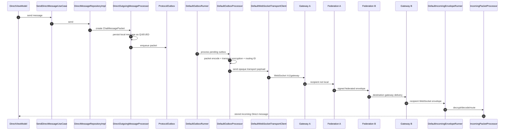
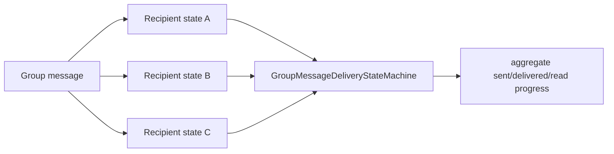
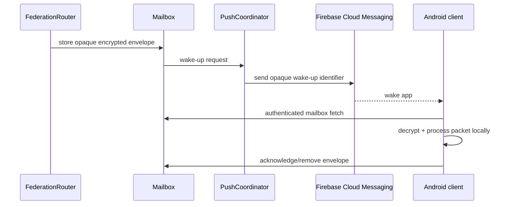

# Message transport flow

This page follows a message through the actual classes in the current codebase.

## Direct message: client A to client B



If both clients are on the same Community Node, federation can deliver locally without the cross-node hop.

## Direct outgoing classes

The Direct path is:

```text
DirectViewModel
  -> SendDirectMessageUseCase
  -> DirectMessageRepository
  -> DirectMessageRepositoryImpl
  -> DirectOutgoingMessageProcessor
  -> ProtocolOutbox
```

`DirectOutgoingMessageProcessor` creates a `ChatMessagePacket`, persists the local message, and queues the packet. Delivery transitions later pass through `DirectMessageDeliveryCoordinator` and `DirectMessageDeliveryStateMachine`.

## Group outgoing classes

Group messages intentionally use a separate path:

```text
GroupViewModel
  -> SendGroupMessageUseCase
  -> GroupMessageRepository
  -> GroupMessageRepositoryImpl
  -> GroupOutgoingMessageProcessor
  -> ProtocolOutbox
```

`GroupOutgoingMessageProcessor`:

1. verifies the local membership is active;
2. obtains the current security epoch and active recipients;
3. encrypts the group payload through `GroupSecurityManager`/`SodiumGroupCrypto`;
4. creates one `GroupChatMessagePacket` per active recipient;
5. stores one `MessageRecipientStateEntity` per recipient;
6. enqueues each packet separately.

This is why Group delivered/read state is derived from per-recipient state rather than Direct-chat state.



Only current active members are selected from the current security epoch. A removed member is not simply kept as a normal recipient and later given missed history.

## Transport protection before the wire

`DefaultOutboxProcessor` asks `OutgoingTransportPayloadFactory` for a transport payload. The default implementation applies `OutgoingPacketTransportPolicy` and, where required, encrypts through `TransportMessageCipher`.

Some bootstrap/invitation packets must be deliverable before the peers have enough identity material for the normal encrypted channel; the policy explicitly defines those exceptions. Normal message/security/verification traffic uses the strongest applicable identity/group transport path.

## Offline recipient

When the recipient is not currently connected, federation can store the **encrypted/federated envelope** in the recipient-selected mailbox. `MailboxPushNotifier` asks the push service for a wake-up. On Android, FCM wakes the app/background worker, which retrieves/processes/acknowledges the pending mailbox envelope.



The mailbox server does not need conversation plaintext to provide offline delivery.

## Receipts

`DeliveryReceiptPacket` and `ReadReceiptPacket` use the shared protocol format, but `ReceiptIncomingPacketRouter` sends them to Direct or Group-specific receipt handling. Group receipt processing updates the recipient-specific state; Direct receipt processing updates the Direct message state.

## Typing

Typing is ephemeral and is intentionally not the same as durable message delivery. The WebSocket/gateway/federation path may route typing events between nodes, but they are not normal chat messages, are not stored in the message history, and are not delivered from mailbox history.
