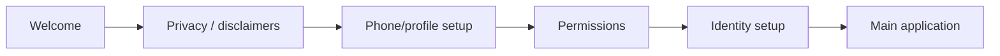

# Onboarding

`:feature:onboarding` owns the first-run UI. The current pages are implemented by:

- `WelcomePage`
- `PrivacyPage`
- `PhonePage`
- `PermissionsPage`

`OnboardingViewModel` coordinates the flow through use cases/platform ports rather than putting persistence or Android APIs directly into the composables.

## Typical first-run sequence

The exact navigation condition is driven by startup/identity/onboarding state, so this diagram is conceptual rather than a persisted protocol state machine.

## Platform notes

Android has the usable permission/phone/contact integrations. The KMP project contains iOS source sets, but iOS is not currently a usable client and should not be documented as having completed onboarding parity.
