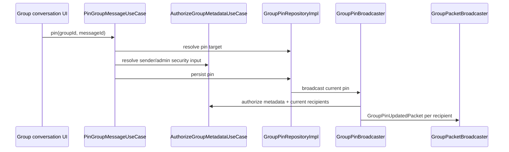

# Group pinned messages

Sparrow supports one synchronized Group pin state through Chats, with authorization supplied by Membership.

## Classes

- `GroupPin`, `GroupPinTarget`
- `GroupPinRepository` / `GroupPinRepositoryImpl`
- `GroupPinDataSource`
- `GroupPinBroadcaster`
- `GroupPinPacketProtocol`
- `PinGroupMessageUseCase`
- `UnpinGroupMessageUseCase`
- `LoadGroupPinnedAttachmentUseCase`
- `GroupPinUpdatedPacket`
- `GroupPinUpdatedPacketHandler`
- `GroupPinEntity`, `GroupPinDao`
- `GroupPinnedMessage` presentation component

## Pin flow

`PinGroupMessageUseCase` resolves the signing identity of the message sender using `GetGroupPinSenderSigningKeyUseCase` and, when required, `GetRemoteIdentityUseCase`. Chats' repository never reaches into Membership/Identity repositories directly.

`GroupPinBroadcaster` calls `AuthorizeGroupMetadataUseCase.send(...)` to require current admin authorization and obtain the current epoch/recipient set. It signs/builds a `GroupPinUpdatedPacket` through `GroupPinPacketProtocol` and sends it through `GroupPacketBroadcaster` to active recipients.

