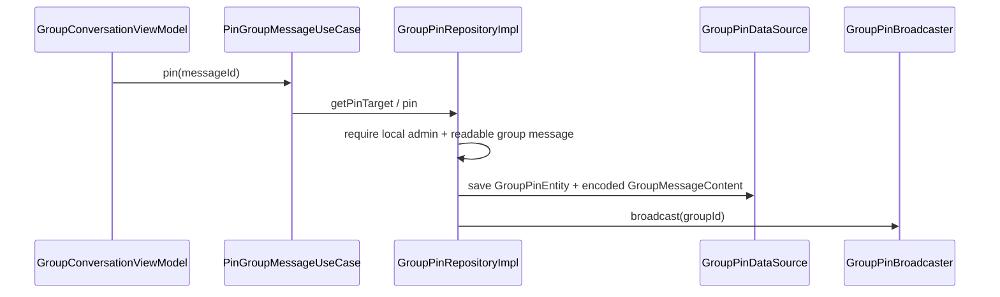

# Pinned group messages

Groups support one current pinned user message. Pinning is admin-controlled and persists a snapshot so the pin can be rendered even when the original history page is not loaded.

## Main classes

- `GroupPin` / `GroupPinTarget`
- `GroupPinRepository` / `GroupPinRepositoryImpl`
- `GroupPinDataSource`
- `GroupPinBroadcaster`
- `PinGroupMessageUseCase`
- `UnpinGroupMessageUseCase`
- `LoadGroupPinnedAttachmentUseCase`
- `GroupPinUpdatedPacketHandler`
- `GroupPinnedMessage`

## Snapshot model

`GroupPinRepositoryImpl.pin(...)` validates that the target is a readable group user message, resolves the sender signing key, builds `GroupMessageContent` from text plus message parts, stores the pin and broadcasts the new state.

```mermaid
sequenceDiagram
    participant UI as GroupConversationViewModel
    participant UC as PinGroupMessageUseCase
    participant R as GroupPinRepositoryImpl
    participant DB as GroupPinDataSource
    participant B as GroupPinBroadcaster

    UI->>UC: pin(messageId)
    UC->>R: getPinTarget / pin
    R->>R: require local admin + readable group message
    R->>DB: save GroupPinEntity + encoded GroupMessageContent
    R->>B: broadcast(groupId)
```

`GroupPinEntity` stores the message ID, sent/pinned/change timestamps, sender identity metadata and encoded message content. Unpinning writes an unpinned state with a monotonically increasing `changedAtEpochMilliseconds` and broadcasts it.

## Attachments

Pinned attachment loading uses the same message-part/blob infrastructure. `GroupPinRepositoryImpl.findPinnedAttachment(...)` searches top-level snapshot parts and nested `PollDto.images`, then `loadDetachedBytes(...)` resolves the encrypted blob.

The filesystem cache does **not** need separate `writePinned`/`readPinned` APIs; “pinned” is a source context, not a different kind of attachment file.

## Polls

Pinned polls are rendered through the normal `PollMessageContent`. `GroupPinnedMessage` forwards vote and close callbacks with the original message ID and poll ID, so a pin is interactive rather than a static screenshot.

`MessagePartSourceUi.GroupPin(groupId)` gives pinned parts a stable source-aware `instanceKey` (`group-pin:<groupId>:<partId>`) without creating a parallel poll model.

## Live vs snapshot state

The snapshot is required when the original history message is unavailable. When the corresponding message is already present in live conversation state, presentation should prefer that current message so reactions, poll votes and close state reflect ongoing updates rather than remaining frozen at pin time.
