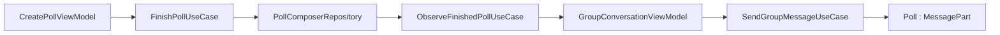

# Polls

Polls are implemented as **Group message parts**, not as a separate conversation/message store. The feature module `:feature:polls` owns creation and poll-specific presentation; `:feature:chats` owns sending, voting, closing and group authorization; shared message-part models live in `:core:base`; protocol operations live in `:protocol`.

## Model

The domain model is `com.cbgm.sparrow.core.messagepart.domain.model.Poll` in `core/base`. A poll contains:

- `id`
- `question`
- optional `description`
- 2–6 `PollOption` entries
- zero or more nested `Image` message parts
- `allowMultipleSelection`
- `allowVoteChange`
- `isAnonymous`
- optional `expiresAtEpochMilliseconds`
- optional `closedAtEpochMilliseconds`

`PollDto` and `PollUi` mirror the same content in data/protocol and presentation form. `PollUi` additionally carries `canClose` and `voterDisplayNames`, because those are presentation permissions/projections rather than wire fields.



## Creation flow

`CreatePollViewModel` owns editor state in `CreatePollUiState`. It does **not** send a group message directly. It builds the domain `Poll` through `CreatePollMapper.toPoll(...)` and publishes it through `FinishPollUseCase`. `GroupConversationViewModel` observes `ObserveFinishedPollUseCase` and sends the finished poll through the existing group message path. `ClearFinishedPollUseCase` clears the composer handoff after a successful send.

Poll media selection is gallery-only and images-only. `CreatePollViewModel.isValidPollMedia(...)` enforces the attachment policy and `MessageAttachmentPolicy.MAX_TOTAL_ATTACHMENT_BYTES`.

## Expiry input and countdown

The create screen accepts the open duration as **minutes**. `CreatePollUiState.expiryMinutes` is parsed by `CreatePollMapper`, which converts it once into an absolute `expiresAtEpochMilliseconds`:

```text
expiresAt = creationTime + minutes * 60_000
```

The UI can show a human-readable conversion while editing (for example `3600` minutes = `2 days 12 hours`).

Expiry does **not** broadcast an automatic `PollClose` operation. Instead, `PollPolicy.isClosedAt(...)` defines the effective terminal state:

```text
closedAt is present OR now >= expiresAt
```

`rememberPollNowEpochMilliseconds(...)` updates the display clock while the poll is visible and refreshes immediately on lifecycle `ON_START`/`ON_RESUME`, so reopening the app recalculates the state from the absolute expiry time. `PollMessageUiMapper` exposes a single `isClosed` flag and `remainingOpenMinutes`; there is no separate persisted `expired` state.

## Voting

Voting is immediate when an option is clicked. There is no separate Vote/Change Vote submit button. `GroupConversationViewModel` handles `GroupConversationUiEvent.PollVoteSubmitted` and calls `VoteInGroupPollUseCase`.

`GroupOutgoingMessageProcessor.votePoll(...)`:

1. verifies active membership;
2. loads the target poll;
3. applies `PollPolicy.vote(...)` locally using `PollPolicy.LOCAL_VOTER_ID`;
4. persists the updated message part;
5. sends `MessageOperation.PollVote` to current active recipients.

`PollPolicy.vote(...)` validates selected options, multiple-selection rules, vote-change rules and the effective closed state.

## Closing

Manual close is the only close that writes `closedAtEpochMilliseconds` and is synchronized. The creator or a current group admin can close a poll. `CloseGroupPollUseCase` delegates to `GroupOutgoingMessageProcessor.closePoll(...)`, which applies `PollPolicy.close(...)` and sends `MessageOperation.PollClose`.

An elapsed `expiresAtEpochMilliseconds` simply makes `PollPolicy.isClosedAt(...)` true locally and prevents further voting; it does not create a network operation.

## Operation protocol

Poll operations are part of the general `OperationMessage` protocol:

```text
OperationMessage
└── MessageOperation
    ├── Edit
    ├── Delete
    ├── Reaction
    ├── PollVote
    └── PollClose
```

Direct chat explicitly rejects `PollVote` and `PollClose`; poll operations are group-only.

## Voters and anonymity

`PollMessageUiMapper` resolves voter IDs through `PollUi.voterDisplayNames`. The local vote marker is mapped to the saved local identity name by the group presentation mapping. Unresolved IDs fall back to `Unknown contact` rather than exposing raw IDs.

Anonymous polls retain vote counts but do not expose voter lists. Non-anonymous polls can open `PollVotersScreen`, grouped by option.

## Media

`PollMessageUiState` owns `media`, `mediaPreview` and `remainingMediaCount`. `PollMessageMedia` is a renderer; attachment loading/caching is not implemented inside the leaf media tile. Poll images are persisted as nested `ImageDto`/`Image` message parts and use the same blob/cache infrastructure as ordinary image parts.

`MessagePartPersistenceMapper.flattenForPersistence()` flattens `PollDto` plus its nested images for persistence. The poll itself stores its structured payload on `MessagePartEntity.payload`; nested image blobs are represented by `MessageBlobEntity` rows.

## Pinned polls

A group pin stores a snapshot of `GroupMessageContent`, so polls can be pinned like other group user messages. `GroupPinnedMessage` renders `PollMessageContent` and forwards poll vote/close events. `GroupPinRepositoryImpl` can locate nested `PollDto.images` when loading a detached pinned image.

When the original message is available in current conversation state, presentation can use the live message so vote totals/closed state are not permanently frozen at the original pin snapshot.
