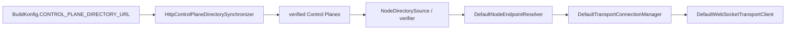

# Transport and failover

`:feature:transport` is responsible for getting opaque application payloads to/from the server edge. It does not own Direct/Group conversation rules.

## Discovery chain



`AppViewModel` synchronizes the configured directory during startup. The directory response body is read as raw text and decoded as JSON, so `text/plain` and `application/json` both work.

The directory format is:

```json
{
  "controlPlanes": [
    "https://plane-a.example.com",
    "https://plane-b.example.com"
  ]
}
```

Settings can also accept either a single Control Plane URL or a directory URL in the same Add field.

## Important transport classes

### Control Plane

- `HttpControlPlaneDirectorySynchronizer`
- `HttpControlPlaneHealthMonitor`
- `ControlPlaneCandidateVerifier`
- `ControlPlaneRequestRouter`
- `NodeControlPlaneDirectorySource`
- `NodeControlPlaneDiscoverySynchronizer`

### Node discovery/failover

- `NodeDirectorySource`
- `NodeDirectoryVerifier`
- `NodeDirectoryCache`
- `DefaultNodeEndpointResolver`
- `FailedNodeTracker`
- `TransportDiagnosticsState`

### WebSocket/routing

- `DefaultTransportConnectionManager`
- `DefaultWebSocketTransportClient`
- `WebSocketOutgoingWireSender`
- `ClientPresenceRouteManager`
- `ClientRouteRegistrationFactory`
- `Sha256RoutingIdGenerator`

### Offline/push

- `HttpMailboxGateway`
- `HttpPushTokenRegistrationGateway`
- `HttpPendingEnvelopeGateway`

## WebSocket connection

The selected node exposes `/v1/gateway`. `DefaultWebSocketTransportClient` first obtains gateway information, opens the WebSocket, registers/refreshes the signed presence route, then sends/receives envelopes, acknowledgements and ephemeral typing data.

The server-side counterpart is `GatewayWebSocketHandler`/`GatewaySessionHandler`.

## Failover and cooldown

When a node fails, `FailedNodeTracker` temporarily excludes it from endpoint selection. A new verified node is selected and the connection manager reconnects.

Developer diagnostics preserve a recently disappeared node as `COOLDOWN` so the operator can see what happened. A cooldown node always reports **0 connections** in the client diagnostics even if the most recent directory snapshot contained an older non-zero count.

Dead nodes are excluded from actual routing immediately; retaining a diagnostics row does not make them eligible again.

## Route refresh

Presence routes are signed and expire. Refresh timestamps/expiry must advance with time. `DefaultWebSocketTransportClient` maintains a server-clock baseline plus monotonic elapsed time so a later refresh does not reuse the original absolute server timestamp. Reusing the original timestamp would eventually make the gateway reject a refresh as `INVALID_ROUTE_REFRESH`.

## Control Plane/node health freshness

The Settings network screen probes Control Plane health frequently for human-visible status. Community Nodes heartbeat healthy state frequently as well; unavailable planes are retried on a slower interval to avoid unnecessary request spam.

## What transport does not do

Transport must not:

- load a conversation and decide Direct vs Group semantics;
- implement membership rules;
- decide whether a member is allowed to see Group history;
- turn a delivery receipt into a UI state by itself;
- decrypt application packet meaning for the server.
