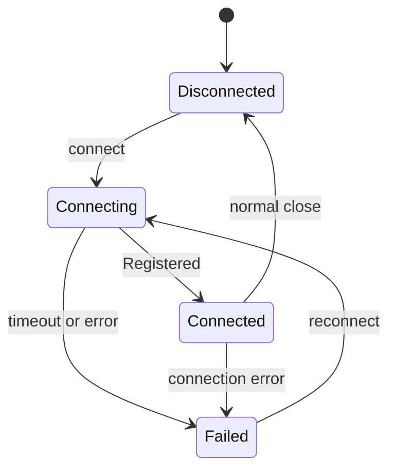

# Transport

`:feature:transport` owns relay and WebSocket mechanics. It does not own conversations, contacts,
message delivery rules, crypto policy, or persistent outbox orchestration.

For the complete direct and group application flow, see
[Conversation, Messaging, and Delivery Flow](message-transport-flow.md).

## Boundary

| Transport owns | Owned elsewhere |
|---|---|
| Ktor `HttpClient` creation | Packet definitions in `:core:protocol` |
| Relay JSON and frame models | Encryption and payload codec in `:core:crypto` |
| Local and remote relay IDs | Contact-to-relay mapping in `:feature:messaging` |
| WebSocket registration and frames | Persistent outbox in `:data:database` |
| Connection state and reconnect loop | Send/receive orchestration in `:feature:messaging` |
| `OutgoingWireSender` implementation | Message and receipt behavior in `:feature:chats` |

The payload of `RelayEnvelope` is opaque to this module.

## Package map

```text
feature/transport/.../feature/transport/
├── connection/
│   ├── RelayConnectionManager.kt
│   ├── DefaultRelayConnectionManager.kt
│   └── TransportConnectionState.kt
├── relay/
│   ├── codec/RelayJson.kt
│   ├── config/RelayTransportConfig.kt
│   ├── identity/
│   │   ├── LocalRelayIdProvider.kt
│   │   ├── DefaultLocalRelayIdProvider.kt
│   │   ├── RelayIdGenerator.kt
│   │   └── Sha256RelayIdGenerator.kt
│   └── model/
│       ├── RelayClientMessage.kt
│       ├── RelayEnvelope.kt
│       ├── RelayServerMessage.kt
│       └── RelayTypingEvent.kt
├── sender/
│   └── WebSocketOutgoingWireSender.kt
├── websocket/
│   ├── WebsocketTransportClient.kt
│   ├── DefaultWebSocketTransportClient.kt
│   └── platform HTTP-client implementations
└── di/TransportModule.kt
```

The interface filename is currently `WebsocketTransportClient.kt`; the declared interface is
`WebSocketTransportClient`.

## Connection lifecycle

`DefaultRelayConnectionManager` implements `RelayConnectionManager`. It:

1. gets the local relay ID from `LocalRelayIdProvider`;
2. resolves compatible gateway endpoints from the signed node registry;
3. skips nodes that are currently in the failed-node cooldown;
4. connects `WebSocketTransportClient` to the selected gateway;
5. waits up to 15 seconds for `Connected` or `Failed`;
6. reconnects through another discovered node after failure or closure.

A static WebSocket endpoint is not part of client configuration. The signed registry is the only
source of gateway WebSocket endpoints.

The observable states are:



`DefaultWebSocketTransportClient` owns the active Ktor session and publishes its state as a
`StateFlow<TransportConnectionState>`.

## Registration

After opening the socket, `DefaultWebSocketTransportClient` sends
`RelayClientMessage.Register(localRelayId)`. It changes to `Connected` only after receiving a
matching `RelayServerMessage.Registered`. A different returned relay ID changes the state to
`Failed`.

## Outgoing envelopes

`WebSocketOutgoingWireSender` implements the `OutgoingWireSender` port declared by
`:core:protocol`.

It:

1. validates the relay recipient and payload;
2. obtains the local relay ID;
3. creates a version-1 `RelayEnvelope` with a new `envelopeId`;
4. calls `sendEnvelopeAndAwaitAcceptance()` using the timeout from `RelayTransportConfig`.

`DefaultWebSocketTransportClient` tracks one `CompletableDeferred` per envelope ID. Receiving
`RelayServerMessage.EnvelopeAccepted` completes that deferred. Socket closure fails every pending
deferred.

Success means relay acceptance, not recipient delivery.

## Incoming envelopes

`RelayServerMessage.IncomingEnvelope` is emitted through:

```kotlin
WebSocketTransportClient.incomingEnvelopes: Flow<RelayEnvelope>
```

Transport does not decode `RelayEnvelope.payload`. `WebSocketIncomingRelayGateway` maps it to the
transport-neutral `IncomingRelayEnvelope`, which `DefaultIncomingRelayRunner` consumes.

After application handling succeeds, messaging calls `IncomingRelayGateway.acknowledge()`. The
WebSocket adapter delegates to `WebSocketTransportClient.acknowledgeIncomingEnvelope()`, which
sends `RelayClientMessage.AcknowledgeEnvelope`.

## Typing state

Typing state uses:

- `RelayClientMessage.TypingState` from client to relay;
- `RelayServerMessage.TypingState` from relay to recipient;
- `RelayTypingEvent` on the client's `incomingTypingEvents` flow.

Typing events are transient, require a live connection, and are not part of the persistent outbox.

## Relay JSON

`createRelayJson()` supplies a dedicated `Json` instance qualified as `RelayJson` in
`transportModule`. Relay client/server messages use Kotlin serialization sealed types and serial
names such as `register`, `send_envelope`, `incoming_envelope`, and `envelope_accepted`.

Do not use the protocol `Json` instance for relay frames. Relay frames and SecureChat packets have
different sealed hierarchies and compatibility boundaries.

## Dependency injection

`transportModule` provides:

| Contract/type | Production implementation |
|---|---|
| `HttpClient` | `createPlatformHttpClient()` |
| qualified relay `Json` | `createRelayJson()` |
| `RelayIdGenerator` | `Sha256RelayIdGenerator` |
| `LocalRelayIdProvider` | `DefaultLocalRelayIdProvider` |
| `WebSocketTransportClient` | `DefaultWebSocketTransportClient` |
| `RelayConnectionManager` | `DefaultRelayConnectionManager` |
| `OutgoingWireSender` | `WebSocketOutgoingWireSender` |

`messagingModule` consumes these interfaces and connects them to contacts, crypto, the protocol
outbox, and incoming handlers.

## Extension rules

- Add a new relay frame to `RelayClientMessage` or `RelayServerMessage`, update both client and
  server models, and define compatibility behavior.
- Replace the WebSocket wire by implementing `OutgoingWireSender`; do not modify chat repositories
  to know the new transport.
- Supply an `IncomingRelayGateway` adapter for another incoming wire; do not modify
  `DefaultIncomingRelayRunner`.
- Replace relay ID derivation behind `RelayIdGenerator` and migrate persisted mappings.
- Keep payload inspection out of this module. If transport needs to branch on packet meaning, that
  decision belongs in `:feature:messaging` or the packet-owning feature.
- Do not interpret `EnvelopeAccepted` as `DELIVERED`.
