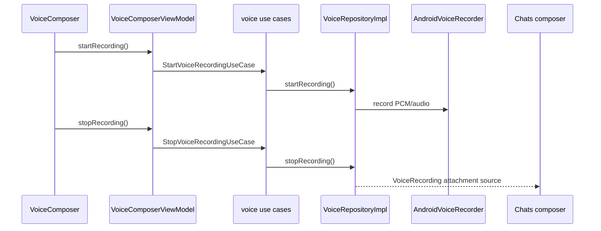
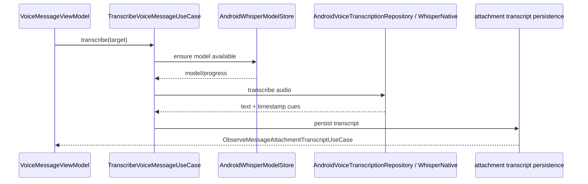

# Voice messages and local transcription

Voice is implemented as attachment-backed message content in `:feature:voice`; it is not a separate transport/message protocol.

## Main classes

Recording/playback abstraction:

- `VoiceRepository` / `VoiceRepositoryImpl`
- `VoiceRecorder`, `VoicePlayer`
- `AndroidVoiceRecorder`, `AndroidVoicePlayer`
- iOS adapters `IosVoiceRecorder`, `IosVoicePlayer`
- `PcmWaveAudio`

Composer:

- `VoiceComposer`
- `VoiceComposerViewModel`
- `VoiceComposerUiState`
- `StartVoiceRecordingUseCase`
- `StopVoiceRecordingUseCase`
- `CancelVoiceRecordingUseCase`
- `ToggleVoicePreviewUseCase`
- `ObserveVoiceComposerUseCase`

Message playback:

- `VoiceMessageContent`
- `VoiceMessageViewModel`
- `VoiceMessageTarget`
- `ObserveVoicePlaybackUseCase`
- `ToggleVoiceMessagePlaybackUseCase`
- `StartVoiceMessageScrubUseCase`
- `FinishVoiceMessageScrubUseCase`

Transcription:

- `TranscribeVoiceMessageUseCase`
- `VoiceTranscriptionState`
- `VoiceTranscript`, `VoiceTranscriptCue`
- `AndroidVoiceTranscriptionRepository`
- `AndroidWhisperModelStore`
- `WhisperNative`
- `VoiceTranscriptionSettingsRepositoryImpl`
- `ObserveVoiceTranscriptionEnabledUseCase`
- attachment-owned `ObserveMessageAttachmentTranscriptUseCase`

## Recording flow

The resulting recording is passed through the existing encrypted attachment/message path.

## Playback isolation

`VoiceRepository.observePlaybackState(attachmentId)` is keyed per attachment. `VoiceMessageViewModel` owns the UI state for one `VoiceMessageTarget`; this prevents unrelated voice bubbles from sharing the wrong duration/playback state.

## Transcription flow

Transcription is local. Persisted transcript state is combined with live transcription progress and playback state in `VoiceMessageViewModel`.
